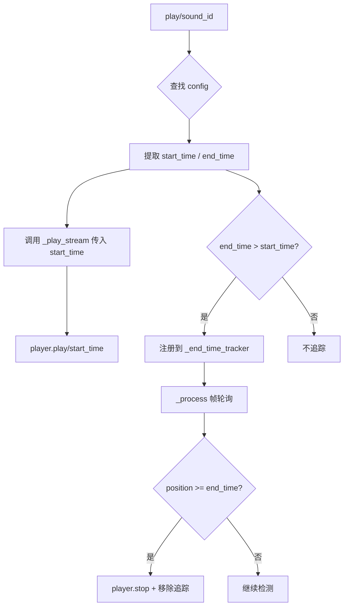

# 设计文档：音频裁剪播放（Audio Trim Playback）

## 概述

本功能为现有 SoundManager 系统添加 per-sound 的 `start_time` / `end_time` 裁剪播放支持。设计原则是零侵入——所有现有音效配置无需修改即可保持原有行为，仅在显式配置了非零值时才启用裁剪逻辑。

实现方案：
- CSV 配置层：在 4 个 CSV 文件的表头中追加 `start_time,end_time` 两列，现有数据行追加 `0.0,0.0`
- 播放层：修改 `_play_stream()` 方法签名，接受 `start_time` 参数并传递给 `AudioStreamPlayer.play()`
- 停止层：新增 `_end_time_tracker` 字典和 `_process()` 方法，通过帧轮询检测播放位置并在到达 `end_time` 时停止播放器

## 架构



整体架构不变，SoundManager 仍然是单一自动加载节点。变更仅涉及：
1. 配置解析路径中多提取两个字段
2. 播放路径中传递 `start_time`
3. 新增一条 `_process()` 轮询路径用于 `end_time` 检测

## 组件与接口

### 修改的组件

#### SoundManager（autoloads/sound_manager.gd）

**新增成员变量：**

```gdscript
# end_time 追踪：player_index → end_time（秒）
var _end_time_tracker: Dictionary = {}
```

**修改的方法：**

1. `play(sound_id: String) -> void`
   - 从 config 中提取 `start_time` 和 `end_time`
   - 将 `start_time` 和 `end_time` 传递给 `_play_stream()`

2. `play_character_q_closure(player_id: String) -> void`
   - 调用 `_play_stream()` 时传入默认的 `start_time=0.0` 和 `end_time=0.0`

3. `_play_stream(stream, min_pitch, max_pitch, volume_db, start_time, end_time) -> void`
   - 新增 `start_time: float = 0.0` 和 `end_time: float = 0.0` 参数
   - 调用 `audio_player.play(start_time)` 替代 `audio_player.play()`
   - 当 `end_time > start_time` 时，将当前播放器索引注册到 `_end_time_tracker`

**新增方法：**

4. `_process(_delta: float) -> void`
   - 当 `_end_time_tracker` 为空时立即返回
   - 遍历追踪字典，检查每个播放器的 `get_playback_position()`
   - 播放器已停止或位置 >= end_time 时，停止播放器并从字典中移除

### 修改的配置文件

4 个 CSV 文件均追加两列：

| 文件 | 变更 |
|------|------|
| config/audio/ui_sounds.csv | 表头追加 `start_time,end_time`，注释行追加中文说明，数据行追加 `0.0,0.0` |
| config/audio/combat_sounds.csv | 同上 |
| config/audio/skill_sounds.csv | 同上 |
| config/audio/environment_sounds.csv | 同上 |

### 接口变更

`_play_stream()` 方法签名变更：

```gdscript
# 变更前
func _play_stream(stream: AudioStream, min_pitch: float, max_pitch: float, volume_db: float) -> void

# 变更后
func _play_stream(stream: AudioStream, min_pitch: float, max_pitch: float, volume_db: float, start_time: float = 0.0, end_time: float = 0.0) -> void
```

新参数使用默认值 `0.0`，因此所有现有调用点无需修改即可兼容。

## 数据模型

### 音效配置字典（_sound_configs 中每条记录）

现有字段不变，新增两个字段：

| 字段 | 类型 | 默认值 | 说明 |
|------|------|--------|------|
| start_time | float | 0.0 | 播放起始时间偏移（秒） |
| end_time | float | 0.0 | 播放截止时间（秒），0.0 表示播放到自然结束 |

### _end_time_tracker 字典

```
Dictionary: { int → float }
  key: 对象池中播放器的索引（0-31）
  value: 该播放器需要停止的 end_time（秒）
```

生命周期：
- 在 `_play_stream()` 中当 `end_time > start_time` 时写入
- 在 `_process()` 中当播放器停止或位置到达 end_time 时移除

### CSV 格式变更

```csv
# 变更前
sound_id,sound_path,volume_db,min_pitch,max_pitch,cooldown,group,description

# 变更后
sound_id,sound_path,volume_db,min_pitch,max_pitch,cooldown,group,description,start_time,end_time
```

注释行（第二行）追加：`起始时间(秒),截止时间(秒)`


## 正确性属性

*正确性属性是一种在系统所有有效执行中都应成立的特征或行为——本质上是关于系统应该做什么的形式化陈述。属性是人类可读规范与机器可验证正确性保证之间的桥梁。*

### Property 1: CSV 解析一致性（Round-trip）

*For any* 有效的 `start_time` 和 `end_time` 浮点数值对写入 CSV 行中，SoundManager 解析后得到的配置字典中 `start_time` 和 `end_time` 的浮点值应与原始写入值相等。

**Validates: Requirements 1.1**

### Property 2: start_time 传递正确性

*For any* 音效配置，当调用 `play()` 时，`AudioStreamPlayer.play()` 接收到的参数应等于该配置的 `start_time` 值（包括默认值 `0.0` 的情况）。

**Validates: Requirements 1.4, 2.1, 2.2**

### Property 3: 追踪器注册正确性

*For any* 音效配置，在 `_play_stream()` 执行后，当且仅当 `end_time > start_time` 时，该播放器索引存在于 `_end_time_tracker` 中；否则不存在。

**Validates: Requirements 3.2, 4.1**

### Property 4: end_time 停止与清理

*For any* 被追踪的播放器，当其 `get_playback_position() >= end_time` 或播放器已自然停止时，该播放器应被停止并从 `_end_time_tracker` 中移除。

**Validates: Requirements 3.1, 4.2**

## 错误处理

| 场景 | 处理方式 |
|------|----------|
| CSV 中 `start_time` / `end_time` 字段缺失 | 使用默认值 `0.0`，通过 `config.get("start_time", 0.0)` 实现 |
| `start_time` 或 `end_time` 为非数字字符串 | `float()` 转换会返回 `0.0`，等同于默认行为 |
| `start_time` 超过音频文件长度 | Godot 的 `AudioStreamPlayer.play(offset)` 会静默处理，不会崩溃 |
| `end_time` 超过音频文件长度 | 音频自然结束，`_process()` 检测到 `player.playing == false` 后清理追踪 |
| 播放器被轮询覆盖（新音效占用同一 slot） | `_process()` 检测到 `player.playing == false`（旧音效已被覆盖）或新音效的 position 不匹配，自动清理旧追踪条目 |
| `start_time` 为负数 | `float()` 转换后传入 `play()`，Godot 会将其 clamp 到 0 |

## 测试策略

### 单元测试

针对具体示例和边界情况：

1. **默认值测试**：加载不含 `start_time`/`end_time` 列的 CSV，验证配置默认为 `0.0`
2. **CSV 表头验证**：检查 4 个 CSV 文件的表头包含新增列
3. **空追踪器早返回**：验证 `_end_time_tracker` 为空时 `_process()` 不执行遍历
4. **边界值**：`end_time == start_time` 时不追踪，`end_time` 略大于 `start_time` 时追踪

### 属性测试

使用 GDScript 测试框架（GUT - Godot Unit Testing），配置每个属性测试最少运行 100 次迭代：

- **Property 1**：生成随机浮点数对，写入 CSV 格式字符串，解析后验证值一致
- **Property 2**：生成随机 `start_time` 值，mock AudioStreamPlayer，验证 `play()` 参数
- **Property 3**：生成随机 `start_time`/`end_time` 组合，验证追踪器注册逻辑的正确性
- **Property 4**：生成随机追踪状态，模拟播放位置变化，验证停止和清理行为

每个属性测试必须以注释标注对应的设计属性：
```
# Feature: audio-trim-playback, Property N: <property_text>
```

### 测试注意事项

- 由于 SoundManager 依赖 Godot 引擎的 AudioStreamPlayer，属性测试需要在 Godot 运行时环境中执行
- 对于纯逻辑部分（CSV 解析、追踪器注册判断），可以提取为独立函数进行单元测试
- `_process()` 的轮询行为测试需要模拟播放器状态
