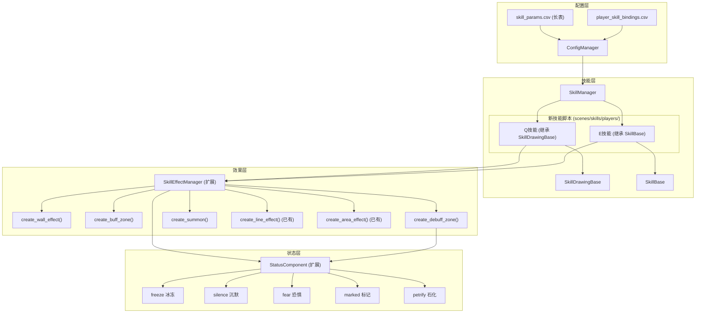

# 设计文档：批量角色技能系统

## 概述

本设计为 PolyLash 游戏实现 30 套新角色技能系统。核心设计原则：

1. **数据驱动**: 将 skill_params.csv 重构为长表格式，所有技能参数通过 CSV 配置，不硬编码
2. **效果独立**: 通过扩展 SkillEffectManager 管理墙体、Buff 区域、召唤物，确保角色切换后效果持续
3. **模板化开发**: 为每种效果类型（墙体、Buff 区域、Debuff 区域、召唤物）提供工厂方法，新技能只需组合调用
4. **状态系统扩展**: 在 StatusComponent 中新增冰冻、沉默、恐惧、标记、石化状态，支持优先级和互斥

技能按 A-E 五组组织，共 26 套新技能。保留 6 个原始角色（butcher、pyro、sapper、herder、weaver、wind/tempest），删除其余 20 个旧角色，然后根据技能主题创建 20 个全新角色并绑定对应技能，剩余 6 套（D 组）存入技能库。

## 架构

### 整体架构图



### 技能开发流程

每套新技能的开发遵循以下流程：

1. 在 `skill_params.csv` 长表中添加技能参数行
2. 创建 Q 技能脚本（继承 SkillDrawingBase），实现 `_spawn_line_effect()` 和 `_spawn_area_effect()`
3. 创建 E 技能脚本（继承 SkillBase），实现 `execute()`
4. 在 `player_skill_bindings.csv` 中绑定技能到角色
5. 测试技能效果和角色切换兼容性

### 关键设计决策

| 决策 | 选择 | 理由 |
|------|------|------|
| CSV 格式 | 长表（skill_id, param_name, param_value） | 新增参数无需改表结构，维护成本低 |
| Q 技能合并 | 每个角色一个 Q 脚本同时处理 line 和 circle | 复用 SkillDrawingBase 的闭合检测逻辑 |
| 效果管理 | 全部通过 SkillEffectManager | 角色切换后效果持续，生命周期统一管理 |
| 视觉占位 | 彩色几何形状（Line2D, Polygon2D） | 美术资源未就绪，后续替换方便 |
| 状态优先级 | 硬编码优先级表 | 状态种类有限且固定，无需配置化 |

## 组件与接口

### 1. ConfigManager 扩展 - 长表加载

```gdscript
# 新增方法：加载长表格式的 skill_params
func load_skill_params_long_format(path: String) -> Dictionary:
    # 返回: {skill_id: {param_name: param_value, ...}, ...}
    # 每行格式: skill_id, param_name, param_value, description
    pass

# 修改 load_all_configs() 中的加载逻辑
# skill_params = load_skill_params_long_format(SKILL_PARAMS)
# 接口 get_skill_params(skill_id) 保持不变
```

### 2. SkillEffectManager 扩展

```gdscript
# === 新增：墙体效果 ===
func create_wall_effect(config: Dictionary) -> int:
    # config 参数:
    #   - start: Vector2 (必需) - 墙体起点
    #   - end: Vector2 (必需) - 墙体终点
    #   - width: float (可选, 默认 16) - 墙体宽度
    #   - duration: float (可选, 默认 5.0) - 持续时间
    #   - health: int (可选, 默认 -1) - 墙体生命值，-1 为不可破坏
    #   - block_enemies: bool (可选, 默认 true) - 是否阻挡敌人
    #   - block_bullets: bool (可选, 默认 false) - 是否阻挡子弹
    #   - reflect_bullets: bool (可选, 默认 false) - 是否反射子弹
    #   - contact_damage: int (可选, 默认 0) - 接触伤害
    #   - contact_interval: float (可选, 默认 0.5) - 接触伤害间隔
    #   - color: Color (可选) - 墙体颜色
    # 返回: effect_id
    pass

# === 新增：Buff 区域 ===
func create_buff_zone(config: Dictionary) -> int:
    # config 参数:
    #   - polygon: PackedVector2Array 或 center+radius
    #   - start/end: Vector2 (线段型 Buff 区域)
    #   - width: float (线段型宽度)
    #   - duration: float - 持续时间
    #   - buff_type: String - Buff 类型 ("attack_boost", "speed_boost", "heal", "lifesteal", "invincible", "cooldown_reduction", "ignore_collision")
    #   - buff_value: float - Buff 数值
    #   - tick_interval: float - 效果触发间隔
    #   - color: Color - 区域颜色
    #   - target_group: String (默认 "players") - 目标组
    # 返回: effect_id
    pass

# === 新增：Debuff 区域 ===
func create_debuff_zone(config: Dictionary) -> int:
    # config 参数:
    #   - polygon: PackedVector2Array 或 start/end
    #   - duration: float - 持续时间
    #   - debuff_type: String - Debuff 类型 ("slow", "damage_amp", "poison", "freeze", "fear")
    #   - debuff_value: float - Debuff 数值
    #   - debuff_duration: float - 单次 Debuff 持续时间
    #   - tick_interval: float - 效果触发间隔
    #   - damage: int (可选) - 区域伤害
    #   - damage_interval: float (可选) - 伤害间隔
    #   - color: Color - 区域颜色
    # 返回: effect_id
    pass

# === 新增：召唤物管理 ===
func create_summon(config: Dictionary) -> int:
    # config 参数:
    #   - position: Vector2 - 生成位置
    #   - summon_type: String - 召唤物类型 ("turret", "beetle", "slime", "phantom")
    #   - duration: float - 存活时间
    #   - health: int (可选) - 生命值
    #   - damage: int (可选) - 攻击伤害
    #   - attack_interval: float (可选) - 攻击间隔
    #   - attack_range: float (可选) - 攻击范围
    #   - max_count: int (可选, 默认 5) - 同类型最大数量
    #   - owner_skill_id: String - 所属技能 ID
    #   - color: Color - 占位颜色
    # 返回: effect_id
    pass

# === 新增：召唤物指令 ===
func command_summons(owner_skill_id: String, command: String, target: Node2D = null) -> void:
    # command: "focus_fire", "self_destruct", "return"
    pass
```

### 3. StatusComponent 扩展

```gdscript
# 状态优先级表（数值越高优先级越高）
const STATUS_PRIORITY = {
    "petrify": 5,   # 石化 - 最高优先级
    "freeze": 4,    # 冰冻
    "fear": 3,      # 恐惧
    "silence": 2,   # 沉默
    "slow": 1,      # 减速
    "burn": 0,      # 燃烧（DOT，不影响行动）
    "curse": 0,     # 诅咒（DOT，不影响行动）
    "poison": 0,    # 中毒（DOT，不影响行动）
    "marked": 0,    # 标记（不影响行动）
}

# 新增状态处理
func _on_status_applied(status_name: String) -> void:
    match status_name:
        "freeze":
            _apply_freeze_effect()      # 停止移动和攻击
        "silence":
            _apply_silence_effect()     # 阻止特殊技能
        "fear":
            _apply_fear_effect()        # 逃跑行为
        "marked":
            _apply_marked_effect()      # 受伤增加
        "petrify":
            _apply_petrify_effect()     # 完全不可行动
        "poison":
            _apply_poison_effect()      # DOT

func _on_status_removed(status_name: String) -> void:
    match status_name:
        "freeze":
            _remove_freeze_effect()
        "silence":
            _remove_silence_effect()
        "fear":
            _remove_fear_effect()
        "marked":
            _remove_marked_effect()
        "petrify":
            _remove_petrify_effect()
        "poison":
            _remove_poison_effect()
```

### 4. 新技能脚本模板

每个角色的 Q 技能继承 SkillDrawingBase，只需实现两个方法：

```gdscript
# 示例：skill_glacier_q.gd
extends SkillDrawingBase
class_name SkillGlacierQ

# 参数从 CSV 加载
var wall_duration: float = 5.0
var freeze_duration: float = 2.0
var wall_width: float = 16.0

func _get_line_color() -> Color:
    return Color(0.5, 0.8, 1.0, 1.0)  # 冰蓝色

func _spawn_line_effect(start: Vector2, end: Vector2) -> void:
    # 创建冰墙（StaticBody2D）
    SkillEffectManager.create_wall_effect({
        "start": start, "end": end,
        "width": wall_width,
        "duration": _get_line_duration(),
        "block_enemies": true, "block_bullets": true,
        "color": Color(0.5, 0.8, 1.0, 0.7)
    })

func _spawn_area_effect(polygon: PackedVector2Array) -> void:
    # 冰冻区域内敌人
    var damage = int(_calculate_closed_shape_damage(0))
    SkillEffectManager.create_debuff_zone({
        "polygon": polygon,
        "duration": freeze_duration,
        "debuff_type": "freeze",
        "debuff_value": freeze_duration,
        "debuff_duration": freeze_duration,
        "tick_interval": 999.0,  # 只触发一次
        "color": Color(0.3, 0.6, 1.0, 0.5)
    })
```

每个角色的 E 技能继承 SkillBase：

```gdscript
# 示例：skill_glacier_e.gd
extends SkillBase
class_name SkillGlacierE

var knockback_force: float = 500.0
var shield_amount: int = 3
var explosion_radius: float = 150.0

func execute() -> void:
    if not can_execute():
        return
    consume_energy()
    
    # 击退附近敌人
    var enemies = get_tree().get_nodes_in_group("enemies")
    for enemy in enemies:
        if is_instance_valid(enemy):
            var dist = skill_owner.global_position.distance_to(enemy.global_position)
            if dist < explosion_radius:
                var dir = (enemy.global_position - skill_owner.global_position).normalized()
                enemy.global_position += dir * knockback_force * 0.1
    
    # 添加护盾
    if "armor" in skill_owner:
        skill_owner.armor = min(skill_owner.armor + shield_amount, skill_owner.max_armor)
    
    start_cooldown()
```

### 5. 技能分组与文件命名

| 组 | 角色 | Q 技能文件 | E 技能文件 |
|----|------|-----------|-----------|
| A | glacier (冰河) | skill_glacier_q.gd | skill_glacier_e.gd |
| A | tesla (特斯拉) | skill_tesla_q.gd | skill_tesla_e.gd |
| A | new_pyro (新火法) | skill_new_pyro_q.gd | skill_new_pyro_e.gd |
| A | plague (瘟疫) | skill_plague_q.gd | skill_plague_e.gd |
| A | jailer (狱警) | skill_jailer_q.gd | skill_jailer_e.gd |
| A | new_tempest (新风暴) | skill_new_tempest_q.gd | skill_new_tempest_e.gd |
| B | blacksmith (铁匠) | skill_blacksmith_q.gd | skill_blacksmith_e.gd |
| B | medic (军医) | skill_medic_q.gd | skill_medic_e.gd |
| B | ammo (弹药) | skill_ammo_q.gd | skill_ammo_e.gd |
| B | paladin (圣骑士) | skill_paladin_q.gd | skill_paladin_e.gd |
| B | vampire (血族) | skill_vampire_q.gd | skill_vampire_e.gd |
| B | banner (旗手) | skill_banner_q.gd | skill_banner_e.gd |
| C | train (火车王) | skill_train_q.gd | skill_train_e.gd |
| C | swarm (虫母) | skill_swarm_q.gd | skill_swarm_e.gd |
| C | new_totem (萨满) | skill_new_totem_q.gd | skill_new_totem_e.gd |
| C | turret (工程) | skill_turret_q.gd | skill_turret_e.gd |
| C | goo (软泥) | skill_goo_q.gd | skill_goo_e.gd |
| C | necro (死灵) | skill_necro_q.gd | skill_necro_e.gd |
| D | merchant (商人) | skill_merchant_q.gd | skill_merchant_e.gd |
| D | midas (炼金) | skill_midas_q.gd | skill_midas_e.gd |
| D | vacuum (吸尘器) | skill_vacuum_q.gd | skill_vacuum_e.gd |
| D | executioner (处刑) | skill_executioner_q.gd | skill_executioner_e.gd |
| D | gambler (赌徒) | skill_gambler_q.gd | skill_gambler_e.gd |
| D | hunter (猎人) | skill_hunter_q.gd | skill_hunter_e.gd |
| E | illusionist (魔术师) | skill_illusionist_q.gd | skill_illusionist_e.gd |
| E | voodoo (巫毒) | skill_voodoo_q.gd | skill_voodoo_e.gd |

## 数据模型

### 1. skill_params.csv 长表格式

```csv
skill_id,param_name,param_value,description
-1,参数名,参数值,说明
skill_glacier_q,energy_per_10px,0.4,每10像素能量消耗
skill_glacier_q,energy_threshold_distance,1800,能量递增阈值
skill_glacier_q,energy_scale_multiplier,0.0005,能量递增系数
skill_glacier_q,wall_duration,5.0,冰墙持续时间
skill_glacier_q,wall_width,16.0,冰墙宽度
skill_glacier_q,freeze_duration,2.0,冰冻持续时间
skill_glacier_q,base_line_duration,5.0,线条基础持续时间
skill_glacier_q,cooldown,0,冷却时间
skill_glacier_e,energy_cost,40,能量消耗
skill_glacier_e,cooldown,8,冷却时间
skill_glacier_e,knockback_force,500,击退力度
skill_glacier_e,shield_amount,3,护盾值
skill_glacier_e,explosion_radius,150,爆炸半径
```

### 2. 现有宽表数据迁移

现有 13 个技能的参数将从宽表迁移到长表。迁移规则：
- 宽表中值为 0 的参数不迁移（减少数据量）
- 保留 skill_id、energy_cost、cooldown 等通用参数
- 保留各技能特有的非零参数

示例迁移（skill_saw_path）：
```csv
skill_saw_path,energy_cost,10,能量消耗
skill_saw_path,cooldown,0,冷却时间
skill_saw_path,fixed_segment_length,400,线段长度
skill_saw_path,saw_fly_speed,1100,锯条速度
skill_saw_path,saw_damage_tick,3,锯条伤害(闪)
skill_saw_path,saw_damage_open,1,锯条伤害(开)
skill_saw_path,chain_radius,250,链条半径
skill_saw_path,energy_per_10px,0.4,每10像素能量
skill_saw_path,energy_threshold_distance,1800,能量阈值
skill_saw_path,energy_scale_multiplier,0.001,能量递增
skill_saw_path,stake_duration,6,肉桩持续
skill_saw_path,saw_rotation_speed,25,锯条旋转速度
skill_saw_path,saw_push_force,1000,锯条击退力
skill_saw_path,dismember_damage,200,肢解伤害
skill_saw_path,saw_max_distance,900,锯条最大距离
```

### 3. 删除旧角色与创建新角色

#### 3a. 需要删除的 20 个旧角色

以下旧角色将从所有配置文件和脚本中完全删除：

| 旧 player_id | 旧中文名 | 需删除的脚本文件 |
|---|---|---|
| technology_hurricane | 科技飓风 | player_technology_hurricane.gd |
| tankman | 坦克手 | player_tankman.gd |
| heavy_support | 重型援兵 | player_heavy_support.gd |
| warrior | 武士 | player_warrior.gd |
| electric_shock | 电击 | player_electric_shock.gd |
| wizard | 巫师 | player_wizard.gd |
| fortune_teller | 占卜师 | player_fortune_teller.gd |
| tarot_reader | 塔罗师 | player_tarot_reader.gd |
| necromancer | 死灵法师 | player_necromancer.gd |
| magician | 魔法师 | player_magician.gd |
| witch_doctor | 巫医 | player_witch_doctor.gd |
| lovely | 小可爱 | player_lovely.gd |
| camouflage | 迷彩 | player_camouflage.gd |
| the_flash | 闪电侠 | player_the_flash.gd |
| information_Support | 信息支援 | player_information_Support.gd |
| technical_support | 科技援兵 | player_technical_support.gd |
| light_support | 轻型援兵 | player_light_support.gd |
| dryad | 德鲁伊 | player_dryad.gd |
| doctor | 医生 | player_doctor.gd |
| nurse | 护士 | player_nurse.gd |

删除涉及的文件：
- `config/player/player_config.csv` - 删除对应行
- `config/player/player_visual.csv` - 删除对应行
- `config/player/player_weapons.csv` - 删除对应行
- `config/player/player_skill_bindings.csv` - 删除对应行
- `config/player/ult_config.csv` - 删除对应行
- `config/player/player_available_weapons.csv` - 删除对应行
- `scenes/unit/players/player_xxx.gd` - 删除脚本文件及 .uid 文件

#### 3b. 需要创建的 20 个新角色

根据技能主题创建全新角色，每个角色使用模板化的 GDScript 脚本（参考 player_technology_hurricane.gd 的模板结构）。新角色的属性值参考原始六角色的平均值进行合理分配。

| 新 player_id | 中文名 | 分配技能组 | 身世标签 | 职能标签 | 战术标签 |
|---|---|---|---|---|---|
| glacier | 冰河 | A 组 | colossus | architect | vanguard |
| tesla | 特斯拉 | A 组 | nomad | blaster | vanguard |
| new_pyro | 新火法 | A 组 | inkborn | blaster | vanguard |
| plague | 瘟疫 | A 组 | alchemist | hexer | commander |
| jailer | 狱警 | A 组 | colossus | architect | vanguard |
| new_tempest | 新风暴 | A 组 | nomad | geometrist | commander |
| blacksmith | 铁匠 | B 组 | colossus | blaster | assist |
| medic | 军医 | B 组 | alchemist | hexer | assist |
| ammo | 弹药 | B 组 | alchemist | blaster | assist |
| paladin | 圣骑士 | B 组 | colossus | geometrist | assist |
| vampire | 血族 | B 组 | inkborn | hexer | vanguard |
| banner | 旗手 | B 组 | nomad | geometrist | commander |
| train | 火车王 | C 组 | colossus | blaster | commander |
| swarm | 虫母 | C 组 | alchemist | hexer | commander |
| new_totem | 萨满 | C 组 | inkborn | architect | commander |
| turret_eng | 工程 | C 组 | nomad | blaster | assist |
| goo | 软泥 | C 组 | inkborn | hexer | assist |
| necro | 死灵 | C 组 | inkborn | architect | vanguard |
| illusionist | 魔术师 | E 组 | nomad | geometrist | assist |
| voodoo | 巫毒 | E 组 | colossus | geometrist | vanguard |

新角色创建涉及的文件：
- `config/player/player_config.csv` - 添加新角色行（属性值合理分配）
- `config/player/player_visual.csv` - 添加新角色行（使用通用占位视觉）
- `config/player/player_weapons.csv` - 添加新角色行（使用通用武器配置）
- `config/player/player_skill_bindings.csv` - 添加新角色行 + 绑定新技能
- `config/player/ult_config.csv` - 添加新角色行（使用通用大招配置）
- `config/player/player_available_weapons.csv` - 添加新角色行
- `scenes/unit/players/player_xxx.gd` - 创建新脚本文件（使用模板）

#### 3c. 新角色属性参考值

新角色的基础属性根据其定位分配：

| 定位 | 生命值 | 血量恢复 | 最大能量 | 最大护甲 | 移动速度 | 能量恢复 |
|------|--------|---------|---------|---------|---------|---------|
| 坦克型（glacier, jailer, paladin） | 140-160 | 0.5-1.0 | 1000 | 5-7 | 350-450 | 0.4-0.6 |
| 法师型（tesla, new_pyro, plague, new_tempest, necro, voodoo） | 85-100 | 0-0.3 | 1000 | 1-2 | 480-520 | 0.8-1.2 |
| 辅助型（blacksmith, medic, ammo, banner） | 95-110 | 0.3-0.5 | 1000 | 2-3 | 480-520 | 0.6-1.0 |
| 召唤型（swarm, new_totem, turret_eng, goo） | 90-110 | 0.2-0.5 | 1000 | 2-3 | 480-510 | 0.6-0.8 |
| 特殊型（train, vampire, illusionist） | 90-120 | 0.2-0.5 | 1000 | 2-3 | 480-550 | 0.6-1.0 |

### 3d. 羁绊系统重设计

#### 设计理念

旧的羁绊标签分配是基于 26 个角色（含 20 个旧角色）设计的，删除旧角色并创建新角色后，需要重新平衡标签分布。设计目标：

1. 每个标签类别内各标签的角色数量尽量均衡（±1 的差异可接受）
2. 标签分配应与角色的技能主题和定位吻合
3. 保持原始六角色的标签不变
4. 激活阈值保持 2/4/6 不变（适配 4-6 人队伍）

#### 原始六角色标签（不可修改）

| player_id | origin_tag | mastery_tag | tactic_tag |
|-----------|-----------|-------------|------------|
| butcher | colossus | architect | vanguard |
| pyro | inkborn | blaster | vanguard |
| sapper | alchemist | architect | assist |
| herder | alchemist | architect | commander |
| weaver | inkborn | hexer | assist |
| wind | nomad | geometrist | commander |

#### 新 20 角色标签重新分配

目标分布（26 角色总计）：
- Origin: colossus=7, inkborn=7, nomad=6, alchemist=6
- Mastery: architect=7, blaster=7, hexer=6, geometrist=6
- Tactic: vanguard=9, assist=9, commander=8

| 新 player_id | 中文名 | origin_tag | mastery_tag | tactic_tag | 设计理由 |
|---|---|---|---|---|---|
| glacier | 冰河 | colossus | architect | vanguard | 冰墙=筑墙，重装前排 |
| tesla | 特斯拉 | nomad | blaster | vanguard | 电弧机动，游侠突击 |
| new_pyro | 新火法 | inkborn | blaster | vanguard | 火焰爆破，魔法突击 |
| plague | 瘟疫 | alchemist | hexer | commander | 炼金毒素，诅咒指挥 |
| jailer | 狱警 | colossus | architect | vanguard | 电网筑墙，重装前排 |
| new_tempest | 新风暴 | nomad | geometrist | commander | 风带机动，几何指挥 |
| blacksmith | 铁匠 | colossus | blaster | assist | 锻造强化，重装辅助 |
| medic | 军医 | alchemist | hexer | assist | 炼金治疗，咒术辅助 |
| ammo | 弹药 | alchemist | blaster | assist | 后勤弹药，爆破辅助 |
| paladin | 圣骑士 | colossus | geometrist | assist | 重装护盾，几何辅助 |
| vampire | 血族 | inkborn | hexer | vanguard | 魔法血族，诅咒突击 |
| banner | 旗手 | nomad | geometrist | commander | 游侠旗手，几何指挥 |
| train | 火车王 | colossus | blaster | commander | 重装冲击，爆破指挥 |
| swarm | 虫母 | alchemist | hexer | commander | 炼金虫群，咒术指挥 |
| new_totem | 萨满 | inkborn | architect | commander | 魔法图腾，筑墙指挥 |
| turret_eng | 工程 | nomad | blaster | assist | 游侠工程，爆破辅助 |
| goo | 软泥 | inkborn | hexer | assist | 魔法软泥，咒术辅助 |
| necro | 死灵 | inkborn | architect | vanguard | 魔法骨墙，筑墙突击 |
| illusionist | 魔术师 | nomad | geometrist | assist | 游侠幻术，几何辅助 |
| voodoo | 巫毒 | colossus | geometrist | vanguard | 巫毒重装，几何突击 |

#### 标签分布验证

| 标签 | 类型 | 数量 | 角色列表 |
|------|------|------|---------|
| colossus | origin | 7 | butcher, glacier, jailer, blacksmith, paladin, train, voodoo |
| inkborn | origin | 7 | pyro, weaver, new_pyro, vampire, new_totem, goo, necro |
| nomad | origin | 6 | wind, tesla, new_tempest, banner, turret_eng, illusionist |
| alchemist | origin | 6 | sapper, herder, plague, medic, ammo, swarm |
| architect | mastery | 7 | butcher, sapper, herder, glacier, jailer, new_totem, necro |
| blaster | mastery | 7 | pyro, new_pyro, tesla, blacksmith, ammo, train, turret_eng |
| hexer | mastery | 6 | weaver, plague, medic, vampire, swarm, goo |
| geometrist | mastery | 6 | wind, new_tempest, paladin, banner, illusionist, voodoo |
| vanguard | tactic | 9 | butcher, pyro, glacier, jailer, new_pyro, tesla, vampire, necro, voodoo |
| assist | tactic | 9 | sapper, weaver, blacksmith, medic, ammo, paladin, turret_eng, goo, illusionist |
| commander | tactic | 8 | herder, wind, plague, new_tempest, banner, train, swarm, new_totem |

> 注：所有标签均衡分布，每个标签至少 6 个角色，4 人队伍能凑出 2 级羁绊、6 人队伍能凑出 3 级羁绊。

#### 羁绊效果重设计

保持现有 bond_config.csv 的结构和效果不变，因为：
- 现有效果设计已经很成熟，与画线/闭合的核心玩法紧密结合
- 标签重新分配后，各标签角色数量均衡，不需要调整激活阈值
- BondManager 代码无需修改，只需更新 player_config.csv 中的标签列

### 4. player_skill_bindings.csv 更新

```csv
player_id,slot_q,slot_e,slot_lmb,slot_rmb
glacier,skill_glacier_q,skill_glacier_e,skill_dash,
tesla,skill_tesla_q,skill_tesla_e,skill_dash,
new_pyro,skill_new_pyro_q,skill_new_pyro_e,skill_dash,
plague,skill_plague_q,skill_plague_e,skill_dash,
jailer,skill_jailer_q,skill_jailer_e,skill_dash,
new_tempest,skill_new_tempest_q,skill_new_tempest_e,skill_dash,
blacksmith,skill_blacksmith_q,skill_blacksmith_e,skill_dash,
medic,skill_medic_q,skill_medic_e,skill_dash,
ammo,skill_ammo_q,skill_ammo_e,skill_dash,
paladin,skill_paladin_q,skill_paladin_e,skill_dash,
vampire,skill_vampire_q,skill_vampire_e,skill_dash,
banner,skill_banner_q,skill_banner_e,skill_dash,
train,skill_train_q,skill_train_e,skill_dash,
swarm,skill_swarm_q,skill_swarm_e,skill_dash,
new_totem,skill_new_totem_q,skill_new_totem_e,skill_dash,
turret_eng,skill_turret_q,skill_turret_e,skill_dash,
goo,skill_goo_q,skill_goo_e,skill_dash,
necro,skill_necro_q,skill_necro_e,skill_dash,
illusionist,skill_illusionist_q,skill_illusionist_e,skill_dash,
voodoo,skill_voodoo_q,skill_voodoo_e,skill_dash,
```

未分配的 6 套技能（D 组全部）存入技能库：
- merchant, midas, vacuum, executioner, gambler, hunter（D 组 6 套）

### 4. 效果数据结构

SkillEffectManager 中的 active_effects 字典扩展：

```gdscript
# 墙体效果数据
{
    "type": "wall",
    "static_body": StaticBody2D,  # 物理节点
    "vis_line": Line2D,           # 视觉节点
    "config": Dictionary,
    "elapsed": float,
    "health": int,                # 剩余生命值（-1 = 不可破坏）
}

# Buff 区域数据
{
    "type": "buff_zone",
    "area": Area2D,
    "vis_poly": Polygon2D,        # 或 vis_line: Line2D
    "config": Dictionary,
    "elapsed": float,
    "buff_timer": float,
}

# Debuff 区域数据
{
    "type": "debuff_zone",
    "area": Area2D,
    "vis_poly": Polygon2D,
    "config": Dictionary,
    "elapsed": float,
    "debuff_timer": float,
}

# 召唤物数据
{
    "type": "summon",
    "node": Node2D,               # 召唤物节点
    "config": Dictionary,
    "elapsed": float,
    "attack_timer": float,
    "owner_skill_id": String,
}
```

### 5. 状态数据结构扩展

StatusComponent 中新增状态的数据格式与现有格式一致：

```gdscript
# 冰冻状态
active_statuses["freeze"] = {
    "duration": 2.0,
    "stacks": 1,
    "value": 0.0,          # 冰冻不需要数值
    "tick_interval": 999.0, # 不需要 tick
    "tick_timer": 0.0
}

# 标记状态
active_statuses["marked"] = {
    "duration": 5.0,
    "stacks": 1,
    "value": 0.5,          # 受伤增加 50%
    "tick_interval": 999.0,
    "tick_timer": 0.0
}

# 恐惧状态
active_statuses["fear"] = {
    "duration": 3.0,
    "stacks": 1,
    "value": 300.0,        # 逃跑速度
    "tick_interval": 0.1,  # 每 0.1 秒更新逃跑方向
    "tick_timer": 0.0
}
```

## 正确性属性

*正确性属性是一种在系统所有有效执行中都应成立的特征或行为——本质上是关于系统应该做什么的形式化陈述。属性作为人类可读规范和机器可验证正确性保证之间的桥梁。*

基于需求文档中的验收标准分析，以下属性可通过自动化测试验证：

### Property 1: 长表 CSV 解析与类型转换正确性
*For any* 长表格式的 skill_params.csv 数据（包含 skill_id, param_name, param_value 列），ConfigManager 的 `load_skill_params_long_format()` 方法解析后应返回一个字典，其中每个 skill_id 对应一个参数字典，且所有数值型字符串参数值应被正确转换为 float 或 int 类型。
**Validates: Requirements 1.1, 1.2, 1.4**

### Property 2: 长表与宽表迁移一致性（Round-Trip）
*For any* 宽表格式的技能参数数据，将其转换为长表格式后再通过 `load_skill_params_long_format()` 加载，应产生与直接从宽表加载 `load_csv_as_dict()` 完全相同的参数字典（忽略值为 0 的参数）。
**Validates: Requirements 1.2, 1.3**

### Property 3: 重复参数最后值优先
*For any* 包含重复 skill_id + param_name 组合的长表 CSV 数据，`load_skill_params_long_format()` 应返回每个重复组合中最后出现的 param_value。
**Validates: Requirements 1.5**

### Property 4: 召唤物数量上限不变量
*For any* 技能 ID 和最大召唤物数量 N，连续调用 `create_summon()` 超过 N 次后，该技能 ID 对应的活跃召唤物数量应始终不超过 N。
**Validates: Requirements 2.6**

### Property 5: 标记状态伤害放大计算
*For any* 基础伤害值和标记百分比值，当敌人处于 "marked" 状态时，最终受到的伤害应等于 `base_damage * (1 + marked_value)`。
**Validates: Requirements 3.4**

### Property 6: 状态优先级排序
*For any* 同时存在的控制状态集合，系统应用的有效控制状态应为优先级最高的状态（石化 > 冰冻 > 恐惧 > 沉默 > 减速）。
**Validates: Requirements 3.6**

### Property 7: 非原始角色技能绑定唯一性
*For any* 两个不同的非原始角色，其在 player_skill_bindings.csv 中的 Q 技能绑定应互不相同。
**Validates: Requirements 10.6**

## 错误处理

### ConfigManager 错误处理

| 场景 | 处理方式 |
|------|---------|
| skill_params.csv 文件不存在 | 输出警告日志，返回空字典 |
| CSV 行格式不正确（列数不足） | 跳过该行，输出警告 |
| param_value 无法转换为数值 | 保留为字符串类型 |
| skill_id 为空 | 跳过该行 |
| 重复的 skill_id + param_name | 使用最后出现的值，输出警告 |

### SkillEffectManager 错误处理

| 场景 | 处理方式 |
|------|---------|
| create_wall_effect 缺少 start/end | 输出错误日志，返回 -1 |
| create_buff_zone 缺少 polygon 和 start/end | 输出错误日志，返回 -1 |
| 效果节点在生命周期内被外部删除 | 从 active_effects 中移除，不崩溃 |
| 召唤物超过最大数量 | 自动移除最早的召唤物 |
| 角色切换时技能实例被销毁 | 效果继续由 SkillEffectManager 管理 |

### StatusComponent 错误处理

| 场景 | 处理方式 |
|------|---------|
| 对已有状态重复应用 | 刷新持续时间，叠加层数 |
| owner_unit 被销毁 | 停止状态更新，不崩溃 |
| 未知状态名称 | 仍然存储和管理，但无特殊效果 |
| 恐惧状态下无法计算逃跑方向 | 使用随机方向 |

### 技能脚本错误处理

| 场景 | 处理方式 |
|------|---------|
| skill_owner 为 null | 输出错误日志，不执行技能 |
| CSV 中缺少技能参数 | 使用代码中的默认值 |
| 能量不足 | 显示 "No Energy!" 提示，不执行 |
| 冷却中 | 不执行，SkillManager 输出调试日志 |

## 测试策略

### 双重测试方法

本项目采用单元测试和属性测试相结合的方式：

- **单元测试**: 验证具体示例、边界情况和错误条件
- **属性测试**: 验证跨所有输入的通用属性

### 属性测试配置

- **测试框架**: GDScript 内置测试 + GUT (Godot Unit Testing) 框架
- **属性测试库**: 使用 GUT 的参数化测试功能模拟属性测试，每个属性至少运行 100 次迭代
- **标签格式**: `# Feature: batch-character-skills, Property {number}: {property_text}`

### 测试范围

| 测试类型 | 覆盖范围 |
|---------|---------|
| 属性测试 | CSV 解析正确性、类型转换、重复处理、召唤物上限、伤害计算、状态优先级、绑定唯一性 |
| 单元测试 | 现有技能迁移验证、原始角色绑定不变、技能文件存在性检查 |
| 集成测试 | 技能加载→执行→效果创建完整流程（需 Godot 运行时） |

### 不可自动化测试的需求

以下需求需要在 Godot 编辑器中手动测试：
- 所有技能的视觉效果和游戏体验（需求 4-8）
- 角色切换后效果持续性（需求 11）
- StaticBody2D 物理碰撞行为（需求 2.1）
- 状态视觉反馈（需求 3）
