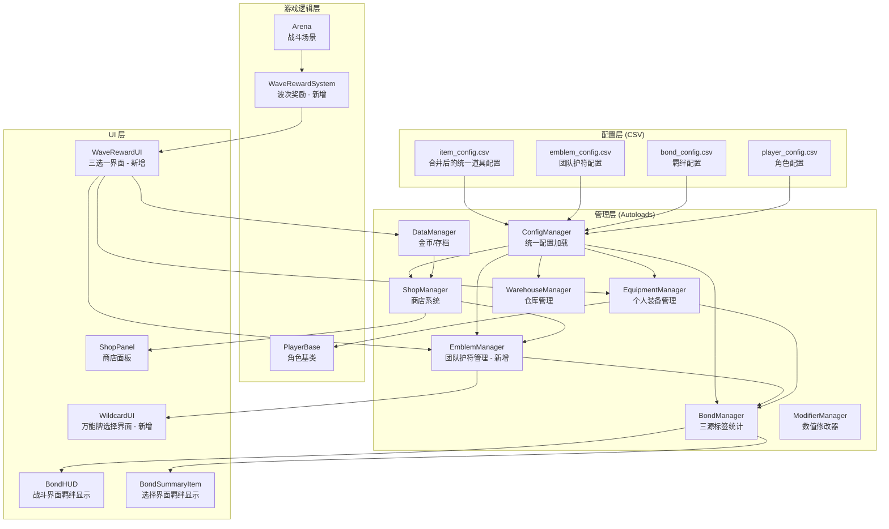
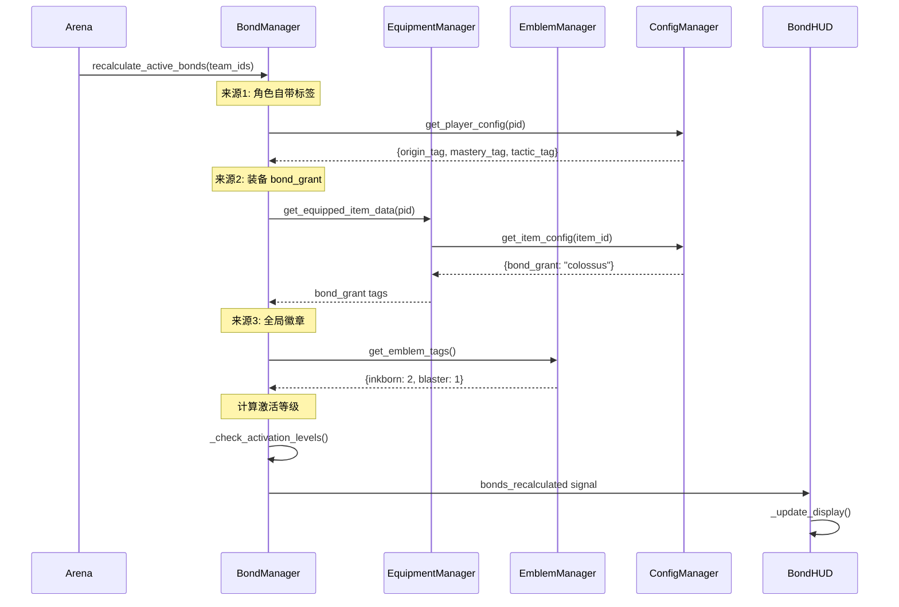

# 设计文档：羁绊与道具系统重构 (Bond & Item System Overhaul)

## 概述

本设计文档描述 PolyLash 羁绊与道具系统的全面重构方案。核心架构采用"双轨制"：个人装备 (Equipment) 提供纵向数值成长，团队护符 (Artifacts/Emblems) 提供横向策略构建。BondManager 升级为三源标签统计（角色 + 装备 + 徽章），配置文件合并消除硬编码映射，UI 全链路统一显示逻辑。

技术栈：Godot 4 / GDScript，CSV 配置驱动，Autoload 单例模式，信号驱动通信。

## 架构

### 系统架构图



### 数据流



## 组件与接口

### 1. ConfigManager 扩展

新增加载 emblem_config.csv 和新格式 item_config.csv 的能力。

```gdscript
# 新增配置缓存
var item_configs_new: Dictionary = {}      # {item_id: config_dict}
var emblem_configs: Dictionary = {}         # {emblem_id: config_dict}

# 新增常量
const ITEM_CONFIG_NEW = CONFIG_DIR + "item/item_config.csv"
const EMBLEM_CONFIG = CONFIG_DIR + "item/emblem_config.csv"

# 新增接口
func get_item_config_by_id(item_id: String) -> Dictionary
func get_emblem_config(emblem_id: String) -> Dictionary
func get_all_emblem_configs() -> Dictionary
func get_emblems_by_bond_tag(bond_tag: String) -> Array[Dictionary]
```

### 2. EmblemManager（新增 Autoload）

```gdscript
extends Node

signal emblem_added(emblem_data: Dictionary)
signal emblem_removed(emblem_data: Dictionary)
signal wildcard_assignment_requested(emblem_data: Dictionary)

# 当前局内持有的护符列表
var held_emblems: Array[Dictionary] = []
# 格式: [{emblem_id, display_name, bond_tag, artifact_type, is_wildcard, rarity}]

func add_emblem(emblem_id: String) -> bool  # 返回是否成功（唯一遗物检查）
func add_wildcard() -> void
func assign_wildcard(emblem_index: int, target_bond_tag: String) -> void
func remove_emblem(index: int) -> void
func get_emblem_tags() -> Dictionary  # {bond_tag: count}
func get_emblems_for_bond(bond_id: String) -> int
func get_all_emblems() -> Array[Dictionary]
func has_unique_relic(emblem_id: String) -> bool  # 唯一遗物检查
func clear_all() -> void  # 局结束时调用
func get_emblem_count() -> int

# 局内存档/读档支持
func serialize() -> Dictionary  # 序列化为可存储的字典
func deserialize(data: Dictionary) -> void  # 从存档恢复
```

#### 持久化与恢复策略

EmblemManager 的数据为局内临时数据，但需要支持中途存档/恢复（防止崩溃丢失）：

```gdscript
func serialize() -> Dictionary:
    return {
        "held_emblems": held_emblems.duplicate(true)
    }

func deserialize(data: Dictionary) -> void:
    held_emblems = data.get("held_emblems", [])
    # 恢复后触发 BondManager 重算
    for emblem in held_emblems:
        emblem_added.emit(emblem)
```

DataManager 在局内自动存档点（如每波结束）调用 `EmblemManager.serialize()` 保存到 `user://session_data.json`。万能鬼牌的已选择目标羁绊（bond_tag 字段）也会被序列化保存。

#### 唯一遗物约束

emblem_config.csv 中 artifact_type 为 "relic" 的护符默认为唯一（同一局内不可重复持有）。artifact_type 为 "emblem" 的徽章可叠加（同一种可持有多个）。

```gdscript
func add_emblem(emblem_id: String) -> bool:
    var config = ConfigManager.get_emblem_config(emblem_id)
    if config.is_empty():
        return false
    # 唯一遗物检查
    if config.get("artifact_type", "") == "relic" and has_unique_relic(emblem_id):
        printerr("[EmblemManager] 已持有唯一遗物: %s" % emblem_id)
        return false
    # ... 添加逻辑
    return true
```

### 3. BondManager 扩展

```gdscript
# 新增：标签来源追踪
var tag_sources: Dictionary = {}
# 格式: {bond_tag: {character: int, equipment: int, emblem: int}}

# 修改签名
func recalculate_active_bonds(team_player_ids: Array) -> void:
    current_bond_counts.clear()
    tag_sources.clear()
    
    # 来源1: 角色自带标签
    _count_character_tags(team_player_ids)
    
    # 来源2: 装备 bond_grant
    _count_equipment_tags(team_player_ids)
    
    # 来源3: 全局徽章
    _count_emblem_tags()
    
    # 添加临时标签
    _add_temp_tags()
    
    # 检查激活状态（含等级变化检测）
    var old_bonds = active_bonds.duplicate(true)
    _check_all_activations()
    _detect_level_changes(old_bonds)
    
    bonds_recalculated.emit(active_bonds)
    stat_modifiers_changed.emit()

# 新增信号
signal bond_level_changed(bond_id: String, old_level: int, new_level: int)

# 新增公开方法
func get_activated_level(bond_id: String, count: int) -> int
func get_tag_sources(bond_tag: String) -> Dictionary
```

#### 羁绊降级回滚逻辑

当装备替换或徽章移除导致标签减少时，羁绊可能从高等级降回低等级。BondManager 必须正确处理降级：

```gdscript
func _detect_level_changes(old_bonds: Dictionary) -> void:
    # 检查升级
    for bond_id in active_bonds.keys():
        var new_level = active_bonds[bond_id].level
        var old_level = old_bonds.get(bond_id, {}).get("level", 0)
        if new_level != old_level:
            bond_level_changed.emit(bond_id, old_level, new_level)
    
    # 检查完全失活（旧有但新没有）
    for bond_id in old_bonds.keys():
        if not active_bonds.has(bond_id):
            bond_level_changed.emit(bond_id, old_bonds[bond_id].level, 0)
```

降级处理规则：
- **stat_mod 效果**: 由于 `apply_stat_modifiers()` 每次都基于基础值重新计算，降级时自动使用新等级的数值，不会残留旧 buff
- **mechanic 效果**: `has_mechanic()` 和 `get_mechanic_value()` 实时查询 active_bonds，降级后自动失效（如霸体开关自动关闭）
- **UI 反馈**: `bond_level_changed` 信号同时处理升级和降级，降级时 BondHUD 显示降级提示

### 4. EquipmentManager 扩展

```gdscript
# 新增接口
func get_equipped_item_data(player_id: String) -> Dictionary:
    """获取角色装备的完整道具数据（含 bond_grant）"""
    var item_type = get_equipped_item(player_id)
    if item_type <= 0:
        return {}
    var item_id = _type_to_id(item_type)
    return ConfigManager.get_item_config_by_id(item_id)

func equip_item_with_replace(player_id: String, new_item_type: int, slot_index: int) -> bool:
    """装备新道具，自动替换旧装备"""
```

#### 局内装备替换经济回收

在 Roguelike 局内，替换装备时旧装备不返回仓库（仓库为局外概念），而是按原价 50% 自动出售为金币：

```gdscript
func equip_or_use_item(player_id: String, item_id: String, slot_index: int = 0) -> bool:
    """统一入口：根据道具类型决定穿戴还是立即使用"""
    var config = ConfigManager.get_item_config_by_id(item_id)
    if config.is_empty():
        return false
    
    # 消耗品分支：立即使用，不存入槽位
    if config.get("type", "") == "consumable":
        var player = _get_player_node(player_id)
        if player and player.has_method("apply_consumable_effect"):
            player.apply_consumable_effect(config)
            print("[EquipmentManager] 消耗品已使用: %s" % config.get("name", item_id))
        return true
    
    # 装备分支：执行穿戴/替换逻辑
    return _equip_item_with_replace(player_id, item_id, slot_index)

func _equip_item_with_replace(player_id: String, new_item_id: String, slot_index: int) -> bool:
    var old_item_type = get_equipped_item(player_id)
    if old_item_type > 0:
        # 旧装备自动出售（50% 回收）
        var old_config = ConfigManager.get_item_config_by_id(_type_to_id(old_item_type))
        var sell_price = int(old_config.get("shop_price", 0) * 0.5)
        if sell_price > 0:
            DataManager.add_gold(sell_price)
            print("[EquipmentManager] 旧装备自动出售: +%d 金币" % sell_price)
    
    # 装备新道具
    var new_item_type = _id_to_type(new_item_id)
    equipped_items[player_id] = new_item_type
    save_equipment_data()
    
    # 触发 BondManager 重算
    BondManager.stat_modifiers_changed.emit()
    return true
```

### 5. ShopManager 扩展

```gdscript
# 新增常量
const EMBLEM_SPAWN_CHANCE: float = 0.25  # 25% 概率刷出徽章

# 新增方法
func _generate_emblem_item() -> Dictionary:
    """生成一个徽章商品（智能权重选择）"""

func _get_smart_emblem_weights() -> Dictionary:
    """根据当前队伍羁绊状态计算徽章权重"""
    # 已拥有但未满级的羁绊权重更高
```

#### 商店去重逻辑

单次商店刷新中，同一种徽章/装备不应重复出现：

```gdscript
func generate_shop_items(count: int = 3) -> void:
    current_shop_items.clear()
    purchased_indices.clear()
    var used_ids: Array[String] = []  # 去重池
    
    for i in range(count):
        var item: Dictionary
        if randf() < EMBLEM_SPAWN_CHANCE:
            item = _generate_emblem_item(used_ids)
        else:
            item = _generate_equipment_item(used_ids)
        
        if not item.is_empty():
            used_ids.append(item.get("item_id", ""))
            current_shop_items.append(item)
    
    shop_items_generated.emit(current_shop_items)
```

### 6. WaveRewardSystem（新增）

```gdscript
extends Node

signal reward_selected(reward_data: Dictionary)

const REWARD_WAVES: Array[int] = [5, 10, 15]  # 可配置

func check_wave_reward(wave_number: int) -> bool:
    """检查当前波次是否触发奖励"""

func generate_reward_options() -> Array[Dictionary]:
    """生成三选一选项"""
    # 选项A: 随机团队徽章/遗物
    # 选项B: 随机 T3 装备
    # 选项C: 大量金币/恢复/属性提升

func select_reward(option_index: int) -> void:
    """玩家选择奖励"""
```

### 7. UI 组件

#### BondHUD / BondSummaryItem 统一格式化

```gdscript
# 共享的格式化工具函数
static func format_bond_status(bond_id: String, count: int, activated_level: int, 
                                max_level: int, next_required: int) -> String:
    if activated_level == 0:
        return "0/%d" % next_required
    elif activated_level >= max_level:
        if count > next_required:
            return "Lv.%d (%d/%d)" % [activated_level, count, next_required]
        return "Lv.MAX"
    else:
        return "Lv.%d (%d/%d)" % [activated_level, count, next_required]
```

#### WaveRewardUI（新增场景）

```
scenes/ui/wave_reward/
├── wave_reward_panel.tscn
├── wave_reward_panel.gd
├── reward_card.tscn
└── reward_card.gd
```

#### WildcardUI（新增场景）

```
scenes/ui/wildcard/
├── wildcard_panel.tscn
└── wildcard_panel.gd
```

WildcardUI 数据源策略：显示所有 12 种羁绊供玩家选择，但将当前队伍已拥有的羁绊置顶并高亮显示。每个选项显示羁绊名称、当前标签数量和下一级需求，帮助玩家做出最优选择。

#### UI 弹窗队列机制

万能鬼牌可能在"波次奖励三选一"或"商店"界面中被获得，此时必须避免多个弹窗重叠。采用 UI 栈机制：

```gdscript
# 在 Arena 或全局 UI 管理器中维护弹窗栈
var ui_panel_stack: Array[Control] = []

func push_panel(panel: Control) -> void:
    """将面板压入栈，隐藏当前栈顶面板"""
    if not ui_panel_stack.is_empty():
        ui_panel_stack.back().hide()
    ui_panel_stack.append(panel)
    panel.show()
    get_tree().paused = true

func pop_panel() -> void:
    """弹出栈顶面板，恢复上一个面板或解除暂停"""
    if ui_panel_stack.is_empty():
        return
    var top = ui_panel_stack.pop_back()
    top.hide()
    if ui_panel_stack.is_empty():
        get_tree().paused = false  # 栈空，恢复游戏
    else:
        ui_panel_stack.back().show()  # 恢复上一个面板
```

万能鬼牌获取流程：
1. 玩家在商店/奖励界面选择了鬼牌
2. 商店/奖励界面关闭（pop_panel）
3. EmblemManager 发出 wildcard_assignment_requested 信号
4. UI 管理器收到信号，push_panel(WildcardUI)，游戏保持暂停
5. 玩家在 WildcardUI 中选择目标羁绊
6. WildcardUI 关闭（pop_panel），栈空则恢复游戏

## 数据模型

### 新 item_config.csv 结构

```csv
id,name,tier,type,slot_type,base_stat,base_value,mod_type,mod_value,bond_grant,icon_path,description
-1,名称,层级,类型,槽位类型,基础属性,基础值,修正类型,修正值,羁绊标签,图标路径,描述
sword_1,铁剑,1,equipment,weapon,attack,10,,,,res://assets/items/sword1.png,基础攻击装备
magic_fire,火焰之心,2,equipment,weapon,attack,20,fire_percent,0.15,,res://assets/items/fire.png,火焰伤害+15%
shield_3,泰坦盾,3,equipment,weapon,hp,500,dmg_reduce,0.1,colossus,res://assets/items/shield3.png,重装神器
berserker_axe,狂战士之斧,3,equipment,weapon,attack,30,attack_percent;attack_speed,0.2;0.1,vanguard,res://assets/items/axe3.png,攻击+20%攻速+10%
potion_heal,生命药水,0,consumable,,hp,100,,,,res://assets/items/potion_hp.png,恢复100点生命
potion_energy,能量药水,0,consumable,,energy,50,,,,res://assets/items/potion_mp.png,恢复50点能量
```

字段说明：
- `id`: 唯一标识符（字符串）
- `name`: 显示名称
- `tier`: 品质层级（0=消耗品, 1/2/3=装备）
- `type`: 道具类型（equipment / consumable）
- `slot_type`: 槽位类型（weapon/armor/accessory，消耗品为空）
- `base_stat`: 基础属性名（attack/hp/speed/energy_regen 等）
- `base_value`: 基础属性值
- `mod_type`: 修正类型，支持分号分隔多修正（如 "attack_percent;attack_speed"）
- `mod_value`: 修正值，与 mod_type 一一对应（如 "0.2;0.1"）
- `bond_grant`: 提供的羁绊标签（仅 Tier 3，可空）
- `icon_path`: 图标资源路径
- `description`: 描述文本

ConfigManager 解析 mod_type/mod_value 时，按分号拆分为数组，支持单个或多个修正：

```gdscript
func _parse_modifiers(mod_type_str: String, mod_value_str: String) -> Array[Dictionary]:
    var modifiers: Array[Dictionary] = []
    if mod_type_str.is_empty():
        return modifiers
    var types = mod_type_str.split(";")
    var values = mod_value_str.split(";")
    for i in range(types.size()):
        modifiers.append({
            "type": types[i].strip_edges(),
            "value": float(values[i].strip_edges()) if i < values.size() else 0.0
        })
    return modifiers
```

注意：ShopManager 保留对 shop_item_config.csv 的读取能力（消耗品仍可从旧配置加载），新的 item_config.csv 同时支持 consumable 类型以实现渐进式迁移。

### emblem_config.csv 结构

```csv
emblem_id,display_name,artifact_type,bond_tag,rarity,shop_price,is_unique,icon_path,description
-1,显示名称,护符类型,羁绊标签,稀有度,商店价格,是否唯一,图标路径,描述
emblem_inkborn,魔导徽章,emblem,inkborn,common,120,0,res://assets/emblems/inkborn.png,全队魔导标签+1
emblem_colossus,重装徽章,emblem,colossus,common,120,0,res://assets/emblems/colossus.png,全队重装标签+1
emblem_nomad,游侠徽章,emblem,nomad,common,120,0,res://assets/emblems/nomad.png,全队游侠标签+1
emblem_alchemist,后勤徽章,emblem,alchemist,common,120,0,res://assets/emblems/alchemist.png,全队后勤标签+1
emblem_blaster,爆破徽章,emblem,blaster,common,120,0,res://assets/emblems/blaster.png,全队爆破标签+1
emblem_architect,筑墙徽章,emblem,architect,common,120,0,res://assets/emblems/architect.png,全队筑墙标签+1
emblem_hexer,咒术徽章,emblem,hexer,common,120,0,res://assets/emblems/hexer.png,全队咒术标签+1
emblem_geometrist,几何徽章,emblem,geometrist,common,120,0,res://assets/emblems/geometrist.png,全队几何标签+1
emblem_assist,支援徽章,emblem,assist,common,120,0,res://assets/emblems/assist.png,全队支援标签+1
emblem_vanguard,突击徽章,emblem,vanguard,common,120,0,res://assets/emblems/vanguard.png,全队突击标签+1
emblem_commander,指挥徽章,emblem,commander,common,120,0,res://assets/emblems/commander.png,全队指挥标签+1
emblem_wildcard,万能鬼牌,emblem,wildcard,legendary,0,1,res://assets/emblems/wildcard.png,可充当任意羁绊标签+1
relic_gold_ink,黄金墨水,relic,,rare,150,1,res://assets/emblems/gold_ink.png,线条持续时间+20%
relic_vampiric,吸血假牙,relic,,rare,150,1,res://assets/emblems/vampiric.png,击杀回血
```

字段说明：
- `is_unique`: 是否唯一（1=唯一，同一局内不可重复持有；0=可叠加）。relic 类型默认唯一，emblem 类型默认可叠加

### EmblemManager 内部数据结构

```gdscript
# 单个护符数据
var emblem_entry: Dictionary = {
    "emblem_id": "emblem_inkborn",
    "display_name": "魔导徽章",
    "bond_tag": "inkborn",       # 对于 wildcard，初始为 "wildcard"，选择后变为实际标签
    "artifact_type": "emblem",   # "emblem" 或 "relic"
    "is_wildcard": false,
    "rarity": "common"
}
```

### BondManager tag_sources 结构

```gdscript
# 标签来源追踪
var tag_sources: Dictionary = {
    "inkborn": {"character": 2, "equipment": 1, "emblem": 1},
    "colossus": {"character": 3, "equipment": 0, "emblem": 0},
    "blaster": {"character": 1, "equipment": 0, "emblem": 2}
}
```

### 调整后的 bond_config.csv 阈值

```csv
# Origin/Mastery 类（调整后）
inkborn,origin,1,2,...   # Lv.1: 2 (不变)
inkborn,origin,2,3,...   # Lv.2: 4→3 (降低)
inkborn,origin,3,5,...   # Lv.3: 6→5 (降低)

# Tactic 类（不变，仅2级）
assist,tactic,1,2,...    # Lv.1: 2
assist,tactic,2,4,...    # Lv.2: 4
```


## 正确性属性 (Correctness Properties)

*正确性属性是一种在系统所有有效执行中都应成立的特征或行为——本质上是关于系统应该做什么的形式化陈述。属性作为人类可读规范与机器可验证正确性保证之间的桥梁。*

### Property 1: 羁绊状态格式化一致性

*For any* 羁绊状态（包含 bond_id、当前标签数量、激活等级、最大等级、下一级需求），format_bond_status 函数应产生符合以下规则的输出：未激活时包含 "0/" 前缀；已激活未满级时包含 "Lv." 前缀和 "(cur/next)" 格式；已满级时包含 "Lv.MAX" 或 "Lv.N" 格式。且 BondSummaryItem 和 BondHUD 对相同输入产生相同输出。

**Validates: Requirements 1.1, 1.2, 1.3, 1.4, 1.6**

### Property 2: 三源标签统计正确性

*For any* 队伍配置（角色列表、每个角色的装备、全局徽章列表），BondManager.recalculate_active_bonds 后的 current_bond_counts 中每个 bond_tag 的计数应等于：该标签在角色自带标签中的出现次数 + 该标签在装备 bond_grant 中的出现次数 + 该标签在 EmblemManager 徽章中的出现次数。

**Validates: Requirements 2.1, 7.1**

### Property 3: 分层装备效果正确性

*For any* 道具和角色，装备该道具后：Tier 1 道具仅改变基础属性值且不添加修改器和羁绊标签；Tier 2 道具改变基础属性值并添加修改器但不添加羁绊标签；Tier 3 道具改变基础属性值、添加修改器并注册 bond_grant 羁绊标签。

**Validates: Requirements 2.2, 4.1, 4.2, 4.3**

### Property 4: 装备替换经济回收一致性

*For any* 已装备道具的角色，当装备新道具时，旧道具应按原价 50% 自动出售为金币（金币增加量 = 旧道具 shop_price * 0.5），角色的当前装备应为新道具，且 BondManager 应重新计算标签。

**Validates: Requirements 4.4**

### Property 5: EmblemManager 添加/计数一致性

*For any* 序列的 add_emblem 操作，get_emblem_tags() 返回的每个 bond_tag 计数应等于 held_emblems 中具有该 bond_tag 的条目数量，且 get_emblems_for_bond(tag) 应返回与 get_emblem_tags()[tag] 相同的值。

**Validates: Requirements 5.1, 5.2, 5.4, 5.5**

### Property 6: EmblemManager 清空幂等性

*For any* EmblemManager 状态（无论持有多少护符），调用 clear_all() 后 held_emblems 应为空数组，get_emblem_tags() 应返回空字典，get_emblem_count() 应返回 0。再次调用 clear_all() 结果不变。

**Validates: Requirements 5.3**

### Property 7: 万能徽章分配往返一致性

*For any* 有效的 bond_tag（存在于 bond_config 中），添加万能徽章后将其分配到该 bond_tag，则 EmblemManager 中该徽章的 bond_tag 应等于分配的目标标签，且 get_emblem_tags() 中该标签的计数应增加 1。

**Validates: Requirements 7.2, 10.1, 10.2**

### Property 8: 商店徽章生成概率

*For any* 足够大的商店生成样本（≥100次），包含 Artifact 类型商品的比例应在 15%-35% 范围内（允许统计波动）。

**Validates: Requirements 8.1**

### Property 9: 智能徽章权重偏向未满级羁绊

*For any* 队伍状态，ShopManager 生成徽章时，已拥有但未满级的羁绊对应徽章的权重应严格大于未拥有的羁绊对应徽章的权重。

**Validates: Requirements 8.2**

### Property 10: 唯一遗物不可重复持有

*For any* 标记为 is_unique=1 的遗物，如果 EmblemManager 已持有该遗物，则再次调用 add_emblem() 应返回 false 且 held_emblems 数量不变。ShopManager 和 WaveRewardSystem 生成选项时不应包含已持有的唯一遗物。

**Validates: Requirements 5.1, 8.2**

### Property 11: 商店去重

*For any* 单次商店刷新，生成的商品列表中不应出现两个相同 item_id 的商品。

**Validates: Requirements 8.1**

### Property 12: 波次奖励选项结构正确性

*For any* 触发波次奖励的波次，generate_reward_options() 应返回恰好 3 个选项，其中选项 A 的 type 为 "artifact"，选项 B 的 type 为 "equipment"，选项 C 的 type 为 "gold" 或 "recovery" 或 "stat_boost"。

**Validates: Requirements 9.2**

### Property 13: ConfigManager 道具配置加载完整性

*For any* item_config.csv 中定义的 item_id，ConfigManager.get_item_config_by_id(item_id) 应返回包含 id、name、tier、type、base_stat、base_value 字段的非空字典。

**Validates: Requirements 3.1, 3.2**

### Property 14: ConfigManager 护符配置加载完整性

*For any* emblem_config.csv 中定义的 emblem_id，ConfigManager.get_emblem_config(emblem_id) 应返回包含 emblem_id、display_name、artifact_type、bond_tag 字段的非空字典。

**Validates: Requirements 6.1, 6.2**

## 错误处理

### 配置加载错误

| 错误场景 | 处理方式 |
|----------|----------|
| item_config.csv 不存在或格式错误 | 打印错误日志，使用空配置，游戏可继续但道具系统不可用 |
| emblem_config.csv 不存在 | 打印警告日志，EmblemManager 使用空配置，徽章功能不可用但不影响核心游戏 |
| bond_config.csv 标签与 item_config.csv 的 bond_grant 不匹配 | 打印警告日志，忽略不匹配的 bond_grant 标签 |
| CSV 字段缺失或类型错误 | 使用默认值，打印警告日志 |

### 运行时错误

| 错误场景 | 处理方式 |
|----------|----------|
| EmblemManager.add_emblem() 传入无效 emblem_id | 打印错误日志，返回 false，不修改状态 |
| EmblemManager.add_emblem() 传入已持有的唯一遗物 | 打印警告日志，返回 false，不修改状态 |
| 万能徽章分配到不存在的 bond_tag | 打印错误日志，不执行分配，保持 wildcard 状态 |
| 购买护符时金币不足 | ShopManager 发出 purchase_failed 信号，UI 显示提示 |
| 装备替换时旧装备出售 | 按原价 50% 自动出售为金币，通知玩家回收金额 |
| BondManager 重算时 EmblemManager 未初始化 | 跳过徽章标签统计，仅使用角色和装备来源 |
| 商店生成时去重池耗尽可选项 | 跳过该商品槽位，生成少于 3 个商品 |

### 边界情况

| 场景 | 处理方式 |
|------|----------|
| 同一 bond_tag 的徽章数量超过合理范围 | 不设上限，但 UI 显示溢出格式 |
| 万能徽章未分配就触发羁绊重算 | 忽略未分配的万能徽章（bond_tag 为 "wildcard" 不匹配任何羁绊） |
| 羁绊降级（装备替换导致标签减少） | BondManager 基于基础值重新计算 stat_mod，mechanic 效果实时查询自动失效，发出 bond_level_changed 信号 |
| 局中途崩溃/退出 | DataManager 在每波结束时自动存档 EmblemManager 数据到 session_data.json，重连后恢复 |
| 商店刷出重复徽章 | 使用去重池确保单次刷新不出现重复的同种徽章/装备 |
| 唯一遗物已持有时出现在商店/奖励中 | ShopManager 和 WaveRewardSystem 生成时检查 EmblemManager.has_unique_relic()，已持有则剔除 |
| 消耗品被当作装备穿戴 | equip_or_use_item() 统一入口根据 type 字段分支：consumable 立即使用不存槽位，equipment 执行穿戴逻辑 |
| 万能鬼牌在商店/奖励界面中获得 | UI 栈机制确保：先关闭当前界面 → 弹出 WildcardUI → 选择完毕后恢复游戏，不会出现弹窗重叠 |

## 测试策略

### 双重测试方法

本系统采用单元测试 + 属性测试的双重测试策略：

- **单元测试**: 验证具体示例、边界情况和错误条件
- **属性测试**: 验证跨所有输入的通用属性

### 属性测试配置

- **测试库**: GDScript 自定义属性测试框架（基于 GUT 测试框架扩展）
- **每个属性测试最少运行 100 次迭代**
- **每个属性测试必须用注释引用设计文档中的属性编号**
- **标签格式**: `Feature: bond-emblem-system, Property N: {property_text}`

### 测试范围

| 测试类型 | 覆盖范围 |
|----------|----------|
| 属性测试 | Property 1-14（核心逻辑正确性） |
| 单元测试 | CSV 加载、边界情况、错误处理、信号发射 |
| 集成测试 | BondManager ↔ EmblemManager ↔ EquipmentManager 交互 |
| UI 测试 | 手动验证（BondHUD 显示、WaveRewardUI 交互、WildcardUI 选择） |

### 关键测试场景

1. **三源统计**: 3个同 Origin 角色 + 1个 T3 装备(bond_grant) + 2个徽章 = 6标签 → 激活 Lv.3
2. **装备替换**: 角色已有 T2 装备 → 装备 T3 → 旧装备回仓库 → 新装备生效 → 羁绊标签更新
3. **万能牌**: 添加万能徽章 → 选择 inkborn → 验证 inkborn 计数 +1
4. **商店智能刷新**: 队伍有 2 个 colossus 角色（Lv.1 激活）→ 商店倾向刷出 colossus 徽章
5. **局结束清理**: 持有 5 个徽章 → 局结束 → EmblemManager 清空 → 羁绊重算 → 标签归零
