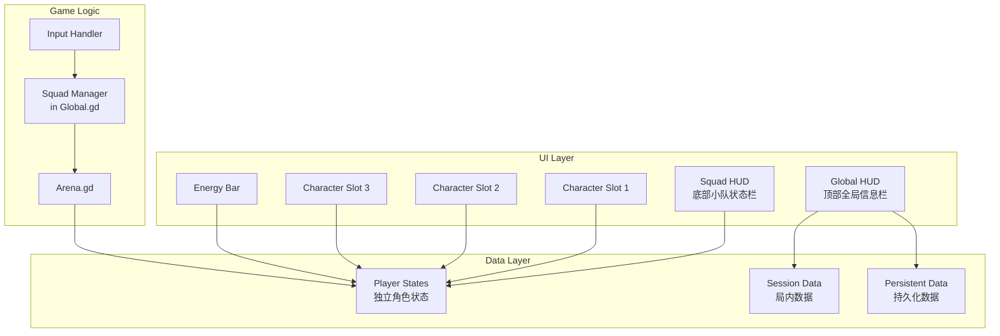

# Design Document: HUD Squad System

## Overview

本设计文档描述了 HUD 重构和小队切换系统的技术实现方案。主要包括：
1. 将现有的左上角 HUD 拆分为顶部全局信息栏和底部小队状态栏
2. 实现 1-2-3 键精准切换机制，替代原有的 TAB 轮切
3. 确保角色独立属性和资源分离的数据结构

## Architecture



## Components and Interfaces

### 1. Global HUD Component (global_hud.tscn / global_hud.gd)

新建的顶部全局信息栏组件。

```gdscript
# global_hud.gd
extends Control
class_name GlobalHUD

# UI 节点引用
@onready var wave_label: Label = $WaveLabel
@onready var xp_label: Label = $XPLabel
@onready var gold_label: Label = $GoldLabel

# 更新波次显示
func update_wave(wave_number: int, wave_time: float) -> void

# 更新 XP 显示
func update_xp(current_xp: int) -> void

# 更新金币显示
func update_gold(total_gold: int) -> void
```

### 2. Squad HUD Component (squad_hud.tscn / squad_hud.gd)

新建的底部小队状态栏组件。

```gdscript
# squad_hud.gd
extends Control
class_name SquadHUD

signal slot_clicked(index: int)

# UI 节点引用
@onready var character_slots: Array[CharacterSlot] = [
    $CharacterSlot1,
    $CharacterSlot2,
    $CharacterSlot3
]
@onready var energy_bar: TextureProgressBar = $EnergyBar

# 初始化小队显示
func init_squad(player_ids: Array[String]) -> void

# 更新角色状态
func update_character_state(index: int, health: float, max_health: float, is_dead: bool) -> void

# 设置当前激活角色
func set_active_character(index: int) -> void

# 更新能量条
func update_energy(current: float, max_energy: float) -> void

# 播放无效操作反馈
func play_invalid_feedback(index: int) -> void
```

### 3. Character Slot Component (character_slot.tscn / character_slot.gd)

单个角色卡槽组件。

```gdscript
# character_slot.gd
extends Control
class_name CharacterSlot

signal clicked()

# UI 节点引用
@onready var portrait: TextureRect = $Portrait
@onready var health_bar: ProgressBar = $HealthBar
@onready var key_label: Label = $KeyLabel
@onready var dead_overlay: ColorRect = $DeadOverlay
@onready var dead_label: Label = $DeadLabel
@onready var highlight: Panel = $Highlight

var player_id: String = ""
var is_dead: bool = false
var is_active: bool = false

# 初始化卡槽
func setup(player_id: String, key_number: int) -> void

# 更新血量显示
func update_health(current: float, max_health: float) -> void

# 设置死亡状态
func set_dead(dead: bool) -> void

# 设置激活状态
func set_active(active: bool) -> void

# 播放抖动动画
func play_shake_animation() -> void
```

### 4. Squad Manager (扩展 Global.gd)

扩展现有的 Global.gd，增加小队管理功能。

```gdscript
# 新增到 Global.gd

# 信号
signal on_squad_state_changed(index: int, state: Dictionary)
signal on_active_character_changed(index: int)
signal on_switch_rejected(index: int, reason: String)

# 通过索引切换角色（1-2-3 键）
func switch_to_player_by_index(index: int) -> bool:
    # 1. 检查索引有效性
    if index < 0 or index >= selected_player_ids.size():
        return false
    
    # 2. 自我屏蔽检查
    if index == current_player_index:
        return false
    
    # 3. 死亡检查
    var target_player_id = selected_player_ids[index]
    var state = player_states.get(target_player_id, {})
    if state.get("health", 0) <= 0:
        emit_signal("on_switch_rejected", index, "dead")
        return false
    
    # 4. 执行切换
    save_current_player_state()
    current_player_index = index
    emit_signal("on_player_switch_requested", target_player_id)
    emit_signal("on_active_character_changed", index)
    return true

# 检查角色是否死亡
func is_player_dead(index: int) -> bool:
    if index < 0 or index >= selected_player_ids.size():
        return true
    var player_id = selected_player_ids[index]
    var state = player_states.get(player_id, {})
    return state.get("health", 0) <= 0

# 获取角色状态（用于 UI 更新）
func get_player_state_by_index(index: int) -> Dictionary:
    if index < 0 or index >= selected_player_ids.size():
        return {}
    var player_id = selected_player_ids[index]
    return player_states.get(player_id, {})
```

### 5. Input Handler (修改 Arena.gd)

修改 Arena.gd 中的输入处理逻辑。

```gdscript
# 修改 Arena.gd 的 _input 函数

func _input(event: InputEvent) -> void:
    # 1-2-3 键切换角色
    if event.is_action_pressed("switch_player_1"):
        _try_switch_to_index(0)
        get_viewport().set_input_as_handled()
    elif event.is_action_pressed("switch_player_2"):
        _try_switch_to_index(1)
        get_viewport().set_input_as_handled()
    elif event.is_action_pressed("switch_player_3"):
        _try_switch_to_index(2)
        get_viewport().set_input_as_handled()
    
    # 移除 TAB 切换逻辑
    # if event.is_action_pressed("switch_player"):
    #     ...

func _try_switch_to_index(index: int) -> void:
    if not Global.switch_to_player_by_index(index):
        # 切换失败，检查原因
        if Global.is_player_dead(index):
            # 播放无效音效
            _play_invalid_switch_sound()
            # 通知 UI 播放抖动
            if squad_hud:
                squad_hud.play_invalid_feedback(index)

func _play_invalid_switch_sound() -> void:
    # 播放拒绝音效
    Global.play_sfx(preload("res://assets/audio/ui_reject.wav"), 1.0, 1.0, 0.0)
```

## Data Models

### 1. Session Data (局内数据)

```gdscript
# 在 Global.gd 或 Arena.gd 中
var session_xp: int = 0  # 局内经验值，每局重置

func add_session_xp(amount: int) -> void:
    session_xp += amount
    emit_signal("on_session_xp_changed", session_xp)

func reset_session_data() -> void:
    session_xp = 0
```

### 2. Persistent Data (持久化数据)

```gdscript
# 在 DataManager.gd 中（已存在）
# save_data.total_gold - 持久化金币

# 确保金币变化时立即保存
func add_gold(amount: int) -> void:
    save_data.total_gold += amount
    save_game()  # 立即持久化
```

### 3. Player State (角色状态)

```gdscript
# 在 Global.gd 中（已存在，需确认结构）
# player_states: Dictionary = {
#     "player_id": {
#         "health": float,
#         "max_health": float,
#         "energy": float,
#         "max_energy": float,
#         "armor": int,
#         "health_regen": float,
#         "energy_regen": float
#     }
# }
```

## Correctness Properties

*A property is a characteristic or behavior that should hold true across all valid executions of a system-essentially, a formal statement about what the system should do. Properties serve as the bridge between human-readable specifications and machine-verifiable correctness guarantees.*


### Property 1: UI Display Updates Correctly

*For any* change to wave number, session XP, or total gold, the corresponding label in Global_HUD SHALL display the updated value.

**Validates: Requirements 1.2, 1.3, 1.4**

### Property 2: Session XP Resets on New Game

*For any* new game session start, session_xp SHALL equal 0 after reset.

**Validates: Requirements 1.5**

### Property 3: Gold Persistence Round-Trip

*For any* gold amount added, serializing to save file then deserializing SHALL produce the same total_gold value.

**Validates: Requirements 1.6, 1.7**

### Property 4: Active Character Highlight

*For any* current_player_index value, exactly one Character_Slot SHALL have is_active = true, and it SHALL be the slot at that index.

**Validates: Requirements 2.5**

### Property 5: Energy Bar Matches Active Character

*For any* active character, the Energy_Bar value SHALL equal the active character's energy from player_states.

**Validates: Requirements 2.6**

### Property 6: Dead Character Visual State

*For any* character with health <= 0, the corresponding Character_Slot SHALL have is_dead = true and display the dead overlay.

**Validates: Requirements 2.7**

### Property 7: Key-to-Index Mapping

*For any* key press of 1, 2, or 3, the system SHALL attempt to switch to index 0, 1, or 2 respectively.

**Validates: Requirements 3.1, 3.2, 3.3**

### Property 8: Self-Blocking on Same Character

*For any* switch request where target index equals current_player_index, switch_to_player_by_index SHALL return false and current_player_index SHALL remain unchanged.

**Validates: Requirements 3.4**

### Property 9: Dead Character Switch Rejection

*For any* switch request where target character's health <= 0, switch_to_player_by_index SHALL return false and current_player_index SHALL remain unchanged.

**Validates: Requirements 3.5, 3.8**

### Property 10: Independent Character Attributes

*For any* two different player_ids in player_states, modifying one player's health/energy SHALL NOT affect the other player's health/energy.

**Validates: Requirements 4.1, 4.2, 4.3**

### Property 11: State Preservation During Switch

*For any* character switch, the previous character's state in player_states SHALL match its state before the switch, and the new character instance SHALL have values matching player_states.

**Validates: Requirements 4.4, 4.5**

### Property 12: Session vs Persistent Data Separation

*For any* game session end, session_xp SHALL be reset to 0, total_gold SHALL be persisted, and session_xp SHALL NOT appear in the save file.

**Validates: Requirements 5.2, 5.3, 5.4, 5.5**

### Property 13: TAB Key Disabled

*For any* TAB key press, current_player_index SHALL remain unchanged.

**Validates: Requirements 6.1, 6.2, 6.3**

## Error Handling

### 1. Invalid Index Handling

```gdscript
func switch_to_player_by_index(index: int) -> bool:
    # 检查索引有效性
    if index < 0 or index >= selected_player_ids.size():
        push_warning("[Global] 无效的角色索引: %d" % index)
        return false
    # ...
```

### 2. Missing Player State

```gdscript
func get_player_state_by_index(index: int) -> Dictionary:
    if index < 0 or index >= selected_player_ids.size():
        return {}
    var player_id = selected_player_ids[index]
    if not player_states.has(player_id):
        push_warning("[Global] 角色状态不存在: %s" % player_id)
        return {}
    return player_states[player_id]
```

### 3. UI Node Missing

```gdscript
func update_character_state(index: int, health: float, max_health: float, is_dead: bool) -> void:
    if index < 0 or index >= character_slots.size():
        push_error("[SquadHUD] 无效的卡槽索引: %d" % index)
        return
    if not is_instance_valid(character_slots[index]):
        push_error("[SquadHUD] 卡槽节点无效: %d" % index)
        return
    # ...
```

## Testing Strategy

### Unit Tests

由于 Godot 项目的特殊性，单元测试主要通过以下方式进行：

1. **手动测试场景** - 创建测试场景验证 UI 布局和交互
2. **Debug 输出** - 使用 print 语句验证逻辑流程
3. **断言检查** - 在关键位置添加 assert 语句

### Property-Based Tests

由于 GDScript 没有成熟的属性测试框架，建议：

1. **状态验证函数** - 创建验证函数检查不变量
2. **随机测试脚本** - 编写脚本随机执行操作并验证状态

```gdscript
# test_squad_system.gd
extends Node

func run_tests() -> void:
    test_self_blocking()
    test_dead_character_rejection()
    test_state_preservation()
    print("All tests passed!")

func test_self_blocking() -> void:
    # 设置初始状态
    Global.current_player_index = 0
    
    # 尝试切换到当前角色
    var result = Global.switch_to_player_by_index(0)
    
    # 验证
    assert(result == false, "Self-blocking should return false")
    assert(Global.current_player_index == 0, "Index should not change")

func test_dead_character_rejection() -> void:
    # 设置角色为死亡状态
    var player_id = Global.selected_player_ids[1]
    Global.player_states[player_id].health = 0
    Global.current_player_index = 0
    
    # 尝试切换到死亡角色
    var result = Global.switch_to_player_by_index(1)
    
    # 验证
    assert(result == false, "Dead character switch should return false")
    assert(Global.current_player_index == 0, "Index should not change")

func test_state_preservation() -> void:
    # 设置初始状态
    var player_id_0 = Global.selected_player_ids[0]
    var player_id_1 = Global.selected_player_ids[1]
    Global.player_states[player_id_0].health = 50
    Global.player_states[player_id_1].health = 100
    Global.current_player_index = 0
    
    # 切换角色
    Global.switch_to_player_by_index(1)
    
    # 验证状态保持独立
    assert(Global.player_states[player_id_0].health == 50, "Player 0 health should be preserved")
    assert(Global.player_states[player_id_1].health == 100, "Player 1 health should be preserved")
```

### Integration Tests

1. **完整流程测试** - 从角色选择到战斗场景的完整流程
2. **UI 交互测试** - 验证 UI 更新和用户反馈
3. **持久化测试** - 验证金币保存和加载

## File Structure

```
scenes/
├── arena/
│   ├── arena.tscn          # 修改：移除旧 HUD，添加新 HUD
│   └── arena.gd            # 修改：更新输入处理和 HUD 连接
└── ui/
    ├── global_hud/
    │   ├── global_hud.tscn # 新建：顶部全局信息栏
    │   └── global_hud.gd   # 新建：全局 HUD 逻辑
    ├── squad_hud/
    │   ├── squad_hud.tscn  # 新建：底部小队状态栏
    │   ├── squad_hud.gd    # 新建：小队 HUD 逻辑
    │   ├── character_slot.tscn  # 新建：角色卡槽
    │   └── character_slot.gd    # 新建：卡槽逻辑
    └── ...

autoloads/
├── global.gd               # 修改：添加小队管理方法
└── data_manager.gd         # 确认：金币持久化逻辑

config/
└── system/
    └── input_config.csv    # 确认：1-2-3 键配置已存在
```
