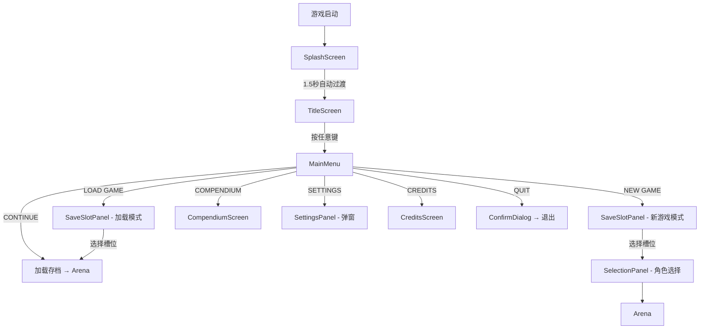

# 设计文档：PolyLash 主菜单系统

## 概述

本设计为 PolyLash 实现完整的游戏启动与主菜单系统。系统采用 Godot 4 的场景树架构，通过新建独立场景和自动加载单例来实现。核心设计原则：

1. **与现有架构一致**：沿用项目已有的 Autoload 单例模式（如 ConfigManager、SoundManager、DataManager）、CSV 驱动配置、JSON 持久化存储
2. **场景独立性**：每个主要界面（标题、主菜单、存档管理、图鉴、致谢）为独立场景或子场景，通过 `get_tree().change_scene_to_file()` 或子节点切换进行导航
3. **深色极简风格**：统一使用 #1a1a1a 背景、#4CAF50 主色调、#B08D55 次色调的配色方案

## 架构

### 场景流程图



### 场景结构

主菜单系统采用单根场景 + 子场景切换的架构，避免频繁的全场景切换：

```
scenes/ui/main_menu/
├── splash_screen.tscn          # 启动画面（独立场景，项目入口）
├── splash_screen.gd
├── main_menu_root.tscn         # 主菜单根场景（包含所有子界面）
├── main_menu_root.gd
├── title_screen.tscn           # 标题界面（子场景）
├── title_screen.gd
├── main_menu.tscn              # 主菜单按钮列表（子场景）
├── main_menu.gd
├── save_slot_panel.tscn        # 存档槽位面板（子场景）
├── save_slot_panel.gd
├── save_slot_card.tscn         # 单个存档槽位卡片（预制体）
├── save_slot_card.gd
├── compendium_screen.tscn      # 图鉴界面（子场景）
├── compendium_screen.gd
├── compendium_detail_panel.tscn # 图鉴详情面板
├── compendium_detail_panel.gd
├── settings_panel.tscn         # 设置弹窗（子场景）
├── settings_panel.gd
├── credits_screen.tscn         # 致谢界面（子场景）
├── credits_screen.gd
├── credits_item.tscn           # 致谢条目预制体
├── credits_item.gd
└── menu_button.tscn            # 主菜单按钮预制体
    menu_button.gd
```

### 自动加载单例

新增一个 `SaveManager` 自动加载单例，负责存档的读写和管理：

```
autoloads/
└── save_manager.gd             # 新增：存档管理单例
```

同时扩展现有的 `ConfigManager`，增加 credits_config.csv 的加载支持。

## 组件与接口

### 1. SaveManager（自动加载单例）

负责存档数据的序列化、反序列化、读写和管理。

```gdscript
extends Node

const SAVE_DIR = "user://saves/"
const SAVE_FILE_TEMPLATE = "save_slot_%d.json"
const SETTINGS_PATH = "user://settings.json"
const MAX_SLOTS = 3
const CURRENT_VERSION = 1

signal save_slot_updated(slot_index: int)
signal settings_changed()

# 存档槽位缓存
var save_slots: Array[Dictionary] = [{}, {}, {}]

# 设置数据
var settings: Dictionary = {}

func _ready() -> void:
    _ensure_save_dir()
    _load_all_slots()
    _load_settings()

# --- 存档管理 ---
func get_slot_data(slot_index: int) -> Dictionary
func is_slot_empty(slot_index: int) -> bool
func is_slot_corrupted(slot_index: int) -> bool
func create_new_save(slot_index: int, leader_id: String, selected_players: Array) -> bool
func save_game_progress(slot_index: int, data: Dictionary) -> bool
func load_game_save(slot_index: int) -> Dictionary
func delete_save(slot_index: int) -> bool
func get_most_recent_slot() -> int  # 返回最近游玩的槽位索引，无则返回 -1
func has_any_save() -> bool

# --- 序列化 ---
func serialize_save_data(data: Dictionary) -> String  # Dictionary → JSON String
func deserialize_save_data(json_string: String) -> Dictionary  # JSON String → Dictionary
func validate_save_data(data: Dictionary) -> bool  # 验证必要字段

# --- 设置管理 ---
func get_setting(key: String, default_value = null)
func set_setting(key: String, value) -> void
func save_settings() -> void
func load_settings() -> void
func get_default_settings() -> Dictionary
func apply_display_settings() -> void
func apply_audio_settings() -> void
```

### 2. SplashScreen（启动画面场景）

项目的主入口场景，替换当前的 `run/main_scene`。

```gdscript
extends Control

func _ready() -> void:
    # 显示 Logo，1.5秒后淡出过渡到 MainMenuRoot
    var tween = create_tween()
    tween.tween_interval(1.5)
    tween.tween_property(self, "modulate:a", 0.0, 0.5)
    tween.tween_callback(_go_to_main_menu)

func _go_to_main_menu() -> void:
    get_tree().change_scene_to_file("res://scenes/ui/main_menu/main_menu_root.tscn")
```

### 3. MainMenuRoot（主菜单根场景）

管理所有子界面的容器场景，负责子界面之间的切换和过渡动画。

```gdscript
extends Control

@onready var title_screen: Control = $TitleScreen
@onready var main_menu: Control = $MainMenu
@onready var save_slot_panel: Control = $SaveSlotPanel
@onready var compendium_screen: Control = $CompendiumScreen
@onready var settings_panel: Control = $SettingsPanel
@onready var credits_screen: Control = $CreditsScreen

var current_screen: Control = null

func _ready() -> void:
    _hide_all()
    _show_screen(title_screen)

func switch_to(screen: Control, transition: String = "fade") -> void
    # 淡入淡出或滑动过渡，0.3秒动画
func _show_screen(screen: Control) -> void
func _hide_all() -> void
func go_to_main_menu() -> void
func go_to_save_slots(mode: String) -> void  # "new_game" 或 "load"
func go_to_compendium() -> void
func go_to_credits() -> void
func open_settings() -> void
func close_settings() -> void
```

### 4. TitleScreen（标题界面）

```gdscript
extends Control

signal any_key_pressed

@onready var logo: TextureRect = $Logo
@onready var prompt_label: Label = $PromptLabel
@onready var bg_lines: Node2D = $BackgroundLines  # 几何线条动画节点

var prompt_visible: bool = true
var blink_timer: float = 0.0

func _ready() -> void:
    _start_blink_animation()
    _start_background_animation()

func _input(event: InputEvent) -> void:
    if event is InputEventKey or event is InputEventMouseButton:
        if event.pressed:
            any_key_pressed.emit()

func play_transition_out() -> void:
    # Logo 上移缩小，0.5秒
    # 返回 Signal 或 await
```

### 5. MainMenu（主菜单按钮列表）

```gdscript
extends Control

signal menu_action(action: String)

@onready var button_container: VBoxContainer = $ButtonContainer
@onready var continue_info_card: PanelContainer = $ContinueInfoCard

var buttons: Array[Button] = []

func _ready() -> void:
    _build_menu_buttons()
    _update_continue_visibility()

func _build_menu_buttons() -> void:
    # 根据 SaveManager.has_any_save() 决定是否显示 CONTINUE
    # 创建按钮：CONTINUE, NEW GAME, LOAD GAME, COMPENDIUM, SETTINGS, CREDITS, QUIT

func _update_continue_visibility() -> void:
    # 检查 SaveManager.has_any_save()

func _on_button_hovered(button: Button) -> void:
    # Scale 1.05 + 文字变色 #4CAF50 + SoundManager.play("ui_hover")
    
func _on_button_pressed(action: String) -> void:
    # Y+2px 下沉 + SoundManager.play("ui_click")
    menu_action.emit(action)

func _show_continue_info() -> void:
    # 从 SaveManager 获取最近存档信息，显示浮动卡片
```

### 6. SaveSlotPanel（存档槽位面板）

```gdscript
extends Control

signal slot_selected(slot_index: int)
signal back_pressed

var mode: String = "new_game"  # "new_game" 或 "load"

const SAVE_SLOT_CARD = preload("res://scenes/ui/main_menu/save_slot_card.tscn")

func setup(panel_mode: String) -> void:
    mode = panel_mode
    _refresh_slots()

func _refresh_slots() -> void:
    # 遍历 3 个槽位，实例化 SaveSlotCard 并填充数据

func _on_slot_clicked(slot_index: int) -> void:
    match mode:
        "new_game":
            if SaveManager.is_slot_empty(slot_index):
                # 直接创建新存档，跳转角色选择
            else:
                # 显示覆盖确认对话框
        "load":
            if not SaveManager.is_slot_empty(slot_index):
                # 加载存档
```

### 7. SaveSlotCard（存档槽位卡片预制体）

```gdscript
extends PanelContainer

signal clicked(slot_index: int)
signal delete_requested(slot_index: int)

@onready var slot_label: Label = $VBox/SlotLabel
@onready var leader_icon: TextureRect = $VBox/HBox/LeaderIcon
@onready var info_label: Label = $VBox/HBox/InfoVBox/InfoLabel
@onready var time_label: Label = $VBox/HBox/InfoVBox/TimeLabel
@onready var bond_container: HBoxContainer = $VBox/HBox/InfoVBox/BondContainer
@onready var delete_button: Button = $DeleteButton
@onready var status_label: Label = $VBox/StatusLabel

func setup(slot_index: int, data: Dictionary) -> void:
    # 填充卡片数据或显示空槽位状态

func _format_play_time(seconds: int) -> String:
    # 转换为 HH:MM:SS 格式

func _format_last_played(timestamp: int) -> String:
    # 转换为 YYYY-MM-DD HH:MM 格式
```

### 8. CompendiumScreen（图鉴界面）

```gdscript
extends Control

signal back_pressed

@onready var tab_characters: Button = $TopBar/TabCharacters
@onready var tab_relics: Button = $TopBar/TabRelics
@onready var tab_monsters: Button = $TopBar/TabMonsters
@onready var content_grid: GridContainer = $ScrollContainer/ContentGrid
@onready var detail_panel: Control = $DetailPanel
@onready var progress_label: Label = $TopBar/ProgressLabel

var current_tab: String = "characters"
var unlocked_data: Dictionary = {}  # 从存档/全局数据读取解锁状态

func _ready() -> void:
    _load_unlock_data()
    _show_tab("characters")

func _show_tab(tab: String) -> void:
    current_tab = tab
    _clear_grid()
    match tab:
        "characters": _populate_characters()
        "relics": _populate_relics()
        "monsters": _populate_monsters()
    _update_progress()

func _populate_characters() -> void:
    # 从 ConfigManager.player_configs 读取，检查解锁状态
    # 未解锁：黑色剪影 + 锁图标 + "???"
    # 已解锁：完整头像 + 名称

func _populate_relics() -> void:
    # 从 ConfigManager.item_configs_new 读取，按 tier 分组
    # Tier 1 白色标题、Tier 2 蓝色、Tier 3 紫色

func _populate_monsters() -> void:
    # 从 ConfigManager.enemy_configs 读取，检查遭遇状态

func _on_card_clicked(id: String, type: String) -> void:
    # 显示详情面板
```

### 9. SettingsPanel（设置弹窗）

```gdscript
extends CanvasLayer

signal closed

@onready var tab_container: TabContainer = $Panel/TabContainer
@onready var close_button: Button = $Panel/CloseButton

# 显示设置控件
@onready var resolution_dropdown: OptionButton
@onready var display_mode_dropdown: OptionButton
@onready var vsync_toggle: CheckButton
@onready var fps_dropdown: OptionButton
@onready var shake_slider: HSlider

# 音频设置控件
@onready var master_volume_slider: HSlider
@onready var bgm_volume_slider: HSlider
@onready var sfx_volume_slider: HSlider
@onready var ui_volume_slider: HSlider

# 游戏性设置控件
@onready var sensitivity_slider: HSlider
@onready var smart_cast_toggle: CheckButton
@onready var skill_mode_dropdown: OptionButton
@onready var damage_number_toggle: CheckButton

func _ready() -> void:
    _load_settings_to_ui()
    _connect_signals()
    process_mode = PROCESS_MODE_ALWAYS

func _load_settings_to_ui() -> void:
    # 从 SaveManager.settings 读取并设置所有 UI 控件状态

func _on_setting_changed(key: String, value) -> void:
    SaveManager.set_setting(key, value)
    # 立即应用变更

func _on_close() -> void:
    SaveManager.save_settings()
    closed.emit()

func _input(event: InputEvent) -> void:
    if event.is_action_pressed("ui_cancel"):
        _on_close()
```

### 10. CreditsScreen（致谢界面）

```gdscript
extends Control

signal back_pressed

const CREDITS_ITEM = preload("res://scenes/ui/main_menu/credits_item.tscn")

@onready var filter_container: VBoxContainer = $LeftPanel/FilterContainer
@onready var content_list: VBoxContainer = $RightPanel/ScrollContainer/ContentList

var all_credits: Array[Dictionary] = []
var current_filter: String = "All"

func _ready() -> void:
    all_credits = ConfigManager.get_credits_configs()
    _build_filter_buttons()
    _show_filtered("All")

func _show_filtered(category: String) -> void:
    current_filter = category
    _clear_list()
    for entry in all_credits:
        if category == "All" or entry.get("category", "") == category:
            var item = CREDITS_ITEM.instantiate()
            content_list.add_child(item)
            item.setup(entry)

func _build_filter_buttons() -> void:
    # 创建 All, Art, Audio, Font, Code, Special 按钮
```

### 11. CreditsItem（致谢条目预制体）

```gdscript
extends PanelContainer

var _url: String = ""

@onready var category_label: Label = $HBox/CategoryLabel
@onready var name_label: Label = $HBox/VBox/NameLabel
@onready var author_label: Label = $HBox/VBox/AuthorLabel
@onready var link_button: Button = $HBox/LinkButton

func setup(data: Dictionary) -> void:
    category_label.text = "[%s]" % data.get("category", "")
    name_label.text = data.get("asset_name", "")
    author_label.text = "by %s • %s" % [data.get("author", ""), data.get("license_type", "")]
    _url = data.get("url", "")
    link_button.visible = _url != ""
    tooltip_text = data.get("description", "")

func _on_link_button_pressed() -> void:
    if _url != "":
        OS.shell_open(_url)
```

## 数据模型

### Save_Data 结构

```json
{
    "version": 1,
    "slot_index": 0,
    "leader_id": "player_herder",
    "selected_players": [
        {"player_id": "player_herder", "weapon_type": "punch"},
        {"player_id": "player_tesla", "weapon_type": "laser"}
    ],
    "current_floor": 3,
    "current_wave": 5,
    "play_time_seconds": 3600,
    "last_played_timestamp": 1700000000,
    "bond_summary": ["colossus", "inkborn"],
    "gold": 1500,
    "upgrades": {},
    "inventory": [],
    "game_state": "in_progress"
}
```

### Settings 结构

```json
{
    "general": {
        "language": "zh",
        "cloud_save": false
    },
    "display": {
        "resolution": "1920x1080",
        "display_mode": "fullscreen",
        "vsync": true,
        "fps_limit": 0,
        "shake_intensity": 100
    },
    "audio": {
        "master_volume": 100,
        "bgm_volume": 80,
        "sfx_volume": 100,
        "ui_volume": 100
    },
    "gameplay": {
        "draw_sensitivity": 2,
        "smart_cast": false,
        "skill_mode": "press_release",
        "show_damage_numbers": true
    }
}
```

### Credits CSV 结构 (config/system/credits_config.csv)

```csv
id,category,asset_name,author,license_type,url,description
-1,分类,素材名称,作者,协议类型,链接,描述
art_relics,Art,Necromancer Item Pack,Penzilla,CC-BY 4.0,https://penzilla.itch.io/,Tier 3 Relic Icons
audio_bgm,Audio,Dark Ambient Vol.1,GhostWolf,CC0,https://ghostwolf.itch.io/,Main Menu Theme
font_main,Font,Bake Soda,Unknown,Free,,,Main UI Font
engine,Special,Godot Engine,Godot Community,MIT,https://godotengine.org/,Game Engine
```

### Compendium 解锁数据结构

图鉴解锁数据存储在全局存档中（跨存档共享）：

```json
{
    "unlocked_characters": ["player_herder", "player_tesla"],
    "unlocked_relics": ["relic_colossus", "potion_heal"],
    "encountered_monsters": ["enemy_skeleton", "enemy_ghost"]
}
```

存储路径：`user://compendium_data.json`


## 正确性属性 (Correctness Properties)

*正确性属性是一种在系统所有有效执行中都应成立的特征或行为——本质上是关于系统应该做什么的形式化陈述。属性作为人类可读规范与机器可验证正确性保证之间的桥梁。*

Property 1: 存档数据往返一致性 (Save Data Round-Trip)
*For any* 有效的 Save_Data 字典对象，将其序列化为 JSON 字符串后再反序列化回字典，所得结果 SHALL 与原始对象在所有必要字段上等价。
**Validates: Requirements 8.3, 8.1, 8.2, 3.6, 3.10**

Property 2: 存档数据验证完整性 (Save Data Validation)
*For any* 字典对象，当且仅当该字典包含所有必要字段（version、slot_index、leader_id、selected_players、current_floor、current_wave、play_time_seconds、last_played_timestamp、bond_summary）且各字段类型正确时，validate_save_data 函数 SHALL 返回 true；否则返回 false。
**Validates: Requirements 3.11, 3.12, 8.4, 8.5**

Property 3: 存档创建后槽位非空 (Save Creation Produces Non-Empty Slot)
*For any* 有效的槽位索引（0-2）和有效的角色选择数据，调用 create_new_save 后，is_slot_empty 对该槽位 SHALL 返回 false，且 get_slot_data 返回的数据 SHALL 通过 validate_save_data 验证。
**Validates: Requirements 3.3, 3.5**

Property 4: 存档删除后槽位为空 (Save Deletion Produces Empty Slot)
*For any* 包含有效存档数据的槽位，调用 delete_save 后，is_slot_empty 对该槽位 SHALL 返回 true。
**Validates: Requirements 3.9**

Property 5: CONTINUE 按钮可见性与存档状态一致 (Continue Visibility Matches Save State)
*For any* 存档槽位状态组合（3个槽位各自为空或非空），has_any_save 的返回值 SHALL 等于"至少有一个槽位非空"的布尔值，且 get_most_recent_slot 在无存档时 SHALL 返回 -1。
**Validates: Requirements 2.2, 2.3**

Property 6: 设置数据往返一致性 (Settings Round-Trip)
*For any* 有效的设置字典对象，将其序列化为 JSON 并写入文件后再读取并反序列化，所得结果 SHALL 与原始设置对象等价。
**Validates: Requirements 5.8, 5.9**

Property 7: 图鉴解锁状态一致性 (Compendium Unlock State Consistency)
*For any* 角色 ID 和解锁集合，当角色 ID 存在于解锁集合中时查询函数 SHALL 返回已解锁状态，当角色 ID 不存在于解锁集合中时 SHALL 返回未解锁状态。
**Validates: Requirements 4.3, 4.4**

Property 8: 圣物按 Tier 分组正确性 (Relic Grouping By Tier)
*For any* 圣物配置集合，按 Tier 分组后，每个分组内的所有圣物的 tier 值 SHALL 相同，且所有圣物 SHALL 恰好出现在一个分组中（不遗漏、不重复）。
**Validates: Requirements 4.7**

Property 9: 图鉴解锁进度计算 (Compendium Progress Calculation)
*For any* 总项目集合和已解锁子集，解锁进度 SHALL 等于已解锁子集与总集合的交集大小除以总集合大小，且已解锁数量 SHALL 不超过总数量。
**Validates: Requirements 4.12**

Property 10: 致谢分类筛选正确性 (Credits Category Filtering)
*For any* 致谢数据集合和分类筛选值，当筛选值为 "All" 时 SHALL 返回全部条目，当筛选值为特定分类时 SHALL 仅返回该分类的条目且不遗漏任何匹配条目。
**Validates: Requirements 6.3**

Property 11: 游戏时长格式化正确性 (Play Time Formatting)
*For any* 非负整数秒数，格式化函数 SHALL 产生 "HH:MM:SS" 格式的字符串，其中 HH*3600 + MM*60 + SS 等于原始秒数，且 MM 和 SS 的值 SHALL 在 0-59 范围内。
**Validates: Requirements 3.2**

## 错误处理

### 存档系统错误处理

| 错误场景 | 处理策略 |
|---------|---------|
| 存档文件不存在 | 将槽位标记为空，正常显示空槽位卡片 |
| JSON 解析失败 | 将槽位标记为"存档损坏"，显示警告图标和红色边框，保留原始文件 |
| 必要字段缺失 | 同 JSON 解析失败处理 |
| 字段类型不匹配 | 同 JSON 解析失败处理 |
| 文件写入失败 | 在控制台输出错误日志，通过 push_error 报告 |
| saves 目录不存在 | 自动创建 user://saves/ 目录 |

### 设置系统错误处理

| 错误场景 | 处理策略 |
|---------|---------|
| 设置文件不存在 | 使用 get_default_settings() 返回的默认值 |
| 设置文件 JSON 解析失败 | 使用默认值，删除损坏文件 |
| 单个设置项缺失 | 对缺失项使用默认值，保留其他有效设置 |
| 分辨率值无效 | 回退到 1920x1080 |

### 致谢系统错误处理

| 错误场景 | 处理策略 |
|---------|---------|
| CSV 文件不存在 | 显示空列表，控制台输出警告 |
| CSV 行格式错误 | 跳过该行，继续解析后续行 |
| URL 为空 | 隐藏链接按钮 |

### 图鉴系统错误处理

| 错误场景 | 处理策略 |
|---------|---------|
| 解锁数据文件不存在 | 初始化为全部未解锁状态 |
| 角色配置缺失头像路径 | 使用占位符纹理 |
| 解锁数据 JSON 解析失败 | 重置为全部未解锁状态 |

## 测试策略

### 属性测试 (Property-Based Testing)

使用 GDScript 的测试框架（GdUnit4 或 GUT）配合自定义的随机数据生成器实现属性测试。

每个属性测试运行最少 100 次迭代。

每个属性测试必须以注释标注对应的设计文档属性编号：
```gdscript
# Feature: main-menu-system, Property 1: Save Data Round-Trip
```

属性测试重点覆盖：
- **Property 1**: 存档数据往返一致性 — 生成随机 Save_Data 字典，测试 serialize → deserialize 等价性
- **Property 2**: 存档数据验证 — 生成随机字典（包含有效和无效数据），测试验证函数的正确性
- **Property 5**: CONTINUE 可见性 — 生成随机槽位状态组合，测试 has_any_save 逻辑
- **Property 6**: 设置数据往返一致性 — 生成随机设置字典，测试序列化往返
- **Property 10**: 致谢筛选 — 生成随机致谢数据和分类，测试筛选结果
- **Property 11**: 时间格式化 — 生成随机秒数，测试格式化结果的数学正确性

### 单元测试

单元测试覆盖具体示例和边界情况：
- 存档创建、加载、删除的具体场景
- 设置默认值回退
- 损坏文件处理
- 空数据边界情况
- 时间格式化的边界值（0秒、86399秒、超大值）
- 图鉴进度计算的边界（0/N、N/N）

### 测试文件组织

```
tests/
├── test_save_manager.gd        # SaveManager 单元测试和属性测试
├── test_settings.gd            # 设置系统测试
├── test_compendium_logic.gd    # 图鉴逻辑测试
├── test_credits_filter.gd      # 致谢筛选测试
└── test_time_format.gd         # 时间格式化测试
```
