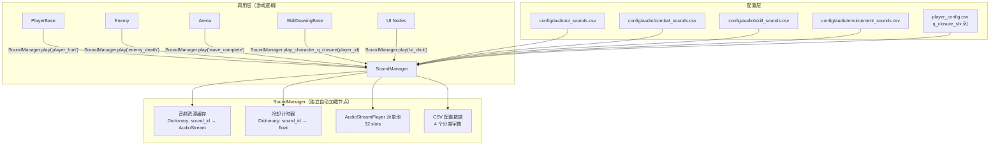
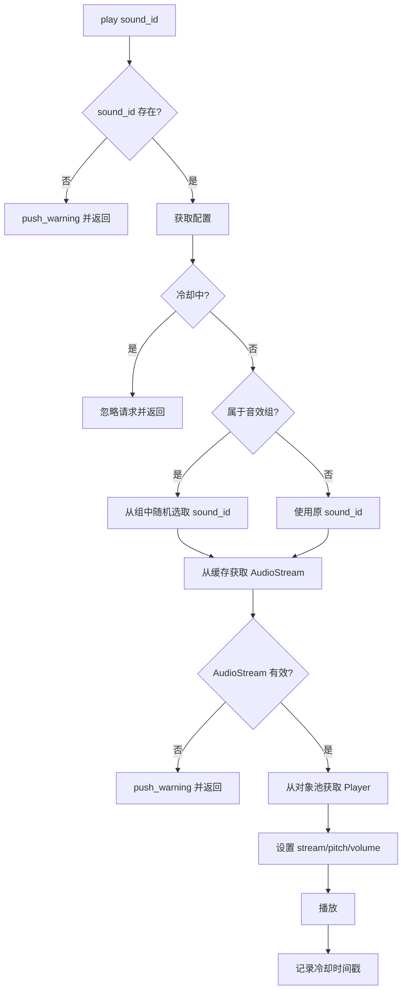

# 设计文档：PolyLash 音效系统

## 概述

本设计为 PolyLash 引入一个独立的、CSV 驱动的音效管理系统。核心是新建 `SoundManager` 自动加载节点，拥有自己的 AudioStreamPlayer 对象池，通过分类 CSV 配置文件管理所有音效参数。系统设计遵循低耦合、高复用原则：SoundManager 仅接收 `sound_id` 字符串即可完成播放，不依赖任何游戏业务节点。

迁移完成后，`Global.gd` 中的所有音效相关代码将被移除，所有音效播放统一通过 `SoundManager.play()` 调用。

## 架构

### 系统架构图



### 设计决策

1. **独立对象池**：SoundManager 自建 32 槽 AudioStreamPlayer 对象池，不依赖 Global 的对象池。这样 Global 迁移后可以完全移除音效代码，SoundManager 完全自治。

2. **统一入口 `play(sound_id)`**：所有音效播放通过一个主方法 `play(sound_id: String)` 调用。分类方法 `play_ui()`、`play_combat()` 等仅是语义别名，内部都调用 `play()`。这保证了接口简洁且调用方无需了解音效分类。

3. **CSV 自加载**：SoundManager 在 `_ready()` 中直接使用 `ConfigManager.load_csv_as_dict()` 加载 4 个分类 CSV，不需要 ConfigManager 新增额外方法。

4. **冷却防刷**：使用 Dictionary 记录每个 sound_id 的上次播放时间戳，在 `play()` 中比较当前时间与上次时间差是否超过冷却值。

5. **音效组随机**：同一 `group` 的多条 CSV 记录在加载时建立 `group → [sound_id]` 映射表，播放时随机选取。

## 组件与接口

### SoundManager（`autoloads/sound_manager.gd`）

```gdscript
extends Node

# ============================================================================
# 常量
# ============================================================================
const POOL_SIZE: int = 32

const CSV_PATHS: Dictionary = {
    "ui": "res://config/audio/ui_sounds.csv",
    "combat": "res://config/audio/combat_sounds.csv",
    "skill": "res://config/audio/skill_sounds.csv",
    "environment": "res://config/audio/environment_sounds.csv"
}

# ============================================================================
# 内部数据
# ============================================================================

# 音频对象池
var _pool: Array[AudioStreamPlayer] = []
var _next_idx: int = 0

# 音效配置：sound_id → {sound_path, volume_db, min_pitch, max_pitch, cooldown, group, description}
var _sound_configs: Dictionary = {}

# 音频资源缓存：sound_path → AudioStream
var _audio_cache: Dictionary = {}

# 冷却追踪：sound_id → 上次播放时间（msec）
var _cooldown_tracker: Dictionary = {}

# 音效组映射：group → [sound_id, sound_id, ...]
var _group_map: Dictionary = {}

# ============================================================================
# 公开接口
# ============================================================================

## 播放音效（核心方法）
func play(sound_id: String) -> void

## 播放音效组中的随机音效
func play_group(group: String) -> void

## 播放角色专属 Q 闭合音效
func play_character_q_closure(player_id: String) -> void

## 分类播放（语义别名）
func play_ui(sound_id: String) -> void      # 内部调用 play()
func play_combat(sound_id: String) -> void   # 内部调用 play()
func play_skill(sound_id: String) -> void    # 内部调用 play()
func play_environment(sound_id: String) -> void  # 内部调用 play()

## 获取音效配置
func get_sound_config(sound_id: String) -> Dictionary

## 检查音效是否存在
func has_sound(sound_id: String) -> bool
```

### play() 方法流程



### play_character_q_closure() 方法流程

```gdscript
func play_character_q_closure(player_id: String) -> void:
    # 1. 从 ConfigManager 获取角色配置
    var config = ConfigManager.get_player_config(player_id)
    var sfx_path = config.get("q_closure_sfx", "")
    
    # 2. 如果路径为空或文件不存在，回退到通用音效
    if sfx_path == "" or not _audio_cache.has(sfx_path):
        play("skill_q_closure_generic")
        return
    
    # 3. 播放角色专属音效
    var stream = _audio_cache[sfx_path]
    _play_stream(stream, 0.9, 1.1, 0.0)
```

### ConfigManager 集成

ConfigManager 不需要大幅修改。SoundManager 在 `_ready()` 中直接调用 `ConfigManager.load_csv_as_dict()` 加载 CSV 文件。唯一的变更是：

1. 移除 `ConfigManager` 中旧的 `SOUND_CONFIG` 常量和 `sound_configs` 字典（因为音效配置完全由 SoundManager 管理）
2. `player_config.csv` 新增 `q_closure_sfx` 列（ConfigManager 自动解析，无需代码改动）

### Global.gd 迁移

迁移后 Global.gd 中移除的内容：

```gdscript
# 移除以下 preload 变量：
# var sfx_enemy_pop = preload(...)
# var sfx_player_shatter = preload(...)
# var sfx_loop_kill = preload(...)
# var sfx_player_dash = preload(...)
# var sfx_player_explosion = preload(...)

# 移除以下方法：
# func play_sfx(...)
# func play_enemy_death()
# func play_loop_kill_impact()
# func play_player_death()
# func play_player_dash()
# func play_player_explosion()

# 移除对象池相关代码：
# const POOL_SIZE = 32
# var pool: Array[AudioStreamPlayer] = []
# var next_idx = 0
# 以及 _ready() 中的对象池初始化循环
```

### 调用方迁移映射表

| 旧调用 | 新调用 | 调用位置 |
|--------|--------|---------|
| `Global.play_enemy_death()` | `SoundManager.play("enemy_death")` | `enemy.gd: destroy_enemy()` |
| `Global.play_player_death()` | `SoundManager.play("player_death")` | `player_base.gd: _on_death()` |
| `Global.play_player_dash()` | `SoundManager.play("player_dash")` | `skill_dash.gd`, `skill_fire_path.gd`, `skill_mine_path.gd`, `skill_herder_loop.gd`, `skill_wind_path.gd` |
| `Global.play_player_explosion()` | `SoundManager.play("player_explosion")` | `explosion_area.gd`, `skill_herder_explosion.gd` |
| `Global.play_loop_kill_impact()` | `SoundManager.play("loop_kill")` | `skill_herder_loop.gd` (2处) |
| `Global.play_sfx(Global.sfx_player_shatter, ...)` | `SoundManager.play("ui_error")` | `arena.gd: _on_switch_rejected()` |

## 数据模型

### CSV 配置格式

所有 4 个分类 CSV 文件使用统一格式：

```csv
sound_id,sound_path,volume_db,min_pitch,max_pitch,cooldown,group,description
-1,音效文件路径,音量(dB),最小音调,最大音调,冷却时间(秒),音效组,描述
```

| 列名 | 类型 | 说明 |
|------|------|------|
| `sound_id` | String | 主键，全局唯一标识符 |
| `sound_path` | String | 音频文件路径（`res://assets/audio/...`） |
| `volume_db` | Float | 音量（分贝），0 为默认 |
| `min_pitch` | Float | 最小音调倍率 |
| `max_pitch` | Float | 最大音调倍率 |
| `cooldown` | Float | 冷却时间（秒），0 表示无冷却 |
| `group` | String | 音效组标识，空字符串表示不属于任何组 |
| `description` | String | 中文描述 |

### ui_sounds.csv 示例

```csv
sound_id,sound_path,volume_db,min_pitch,max_pitch,cooldown,group,description
-1,音效文件路径,音量(dB),最小音调,最大音调,冷却时间(秒),音效组,描述
ui_click,res://assets/audio/ui/click.wav,-5,0.95,1.05,0.05,,按钮点击
ui_hover,res://assets/audio/ui/hover.wav,-10,0.9,1.1,0.03,,按钮悬停
ui_panel_open,res://assets/audio/ui/panel_open.wav,-3,0.95,1.05,0.1,,面板打开
ui_panel_close,res://assets/audio/ui/panel_close.wav,-3,0.95,1.05,0.1,,面板关闭
ui_purchase,res://assets/audio/ui/purchase.wav,0,1.0,1.0,0.2,,商店购买
ui_upgrade_select,res://assets/audio/ui/upgrade_select.wav,0,0.95,1.05,0.1,,升级选择
ui_error,res://assets/audio/ui/error.wav,-5,1.0,1.0,0.2,,无效操作
ui_pause,res://assets/audio/ui/pause.wav,-3,1.0,1.0,0.5,,暂停
ui_resume,res://assets/audio/ui/resume.wav,-3,1.0,1.0,0.5,,恢复
ui_game_start,res://assets/audio/ui/game_start.wav,0,1.0,1.0,1.0,,游戏开始
ui_char_select,res://assets/audio/ui/char_select.wav,0,0.95,1.05,0.2,,角色选择确认
ui_tab_switch,res://assets/audio/ui/tab_switch.wav,-8,0.9,1.1,0.05,,标签切换
```

### combat_sounds.csv 示例

```csv
sound_id,sound_path,volume_db,min_pitch,max_pitch,cooldown,group,description
-1,音效文件路径,音量(dB),最小音调,最大音调,冷却时间(秒),音效组,描述
enemy_hit,res://assets/audio/EnemyHit.wav,-8,0.9,1.2,0.02,,敌人受击
enemy_death,res://assets/audio/pop_squish.wav,-10,0.9,1.4,0,,敌人死亡
enemy_charge_warning,res://assets/audio/combat/charge_warning.wav,-3,1.0,1.0,0.5,,冲锋预警
enemy_charge,res://assets/audio/combat/charge.wav,0,0.9,1.1,0.3,,冲锋
crit_hit,res://assets/audio/combat/crit_hit.wav,2,0.9,1.1,0.05,,暴击
loop_kill,res://assets/audio/magic_chord.wav,5,0.6,0.8,0,,闭环绞杀
player_explosion,res://assets/audio/magical_explosion.wav,2,1.0,1.0,0.1,,爆炸
debuff_burn,res://assets/audio/combat/debuff_burn.wav,-5,0.9,1.1,0.3,debuff,燃烧
debuff_curse,res://assets/audio/combat/debuff_curse.wav,-5,0.9,1.1,0.3,debuff,诅咒
debuff_poison,res://assets/audio/combat/debuff_poison.wav,-5,0.9,1.1,0.3,debuff,中毒
debuff_slow,res://assets/audio/combat/debuff_slow.wav,-5,0.9,1.1,0.3,debuff,减速
debuff_freeze,res://assets/audio/combat/debuff_freeze.wav,-5,0.9,1.1,0.3,debuff,冰冻
debuff_stun,res://assets/audio/combat/debuff_stun.wav,-5,0.9,1.1,0.3,debuff,眩晕
poison_pool_spawn,res://assets/audio/combat/poison_pool.wav,-3,0.9,1.1,0.5,,毒池生成
```

### skill_sounds.csv 示例

```csv
sound_id,sound_path,volume_db,min_pitch,max_pitch,cooldown,group,description
-1,音效文件路径,音量(dB),最小音调,最大音调,冷却时间(秒),音效组,描述
skill_q_planning,res://assets/audio/skill/q_planning.wav,-3,1.0,1.0,0.5,,Q规划模式进入
skill_q_draw_start,res://assets/audio/skill/q_draw_start.wav,-5,0.9,1.1,0.1,,画线开始
skill_q_closure_detected,res://assets/audio/skill/q_closure_detected.wav,0,1.0,1.0,0.1,,闭合检测
skill_q_closure_generic,res://assets/audio/skill/q_closure_generic.wav,0,0.9,1.1,0,,Q闭合执行(通用)
skill_q_open_execute,res://assets/audio/skill/q_open_execute.wav,-3,0.9,1.1,0,,Q开放路径执行
skill_q_energy_depleted,res://assets/audio/skill/q_energy_depleted.wav,-3,1.0,1.0,0.5,,画线能量耗尽
skill_e_instant,res://assets/audio/skill/e_instant.wav,0,0.9,1.1,0.1,,E技能瞬发
skill_e_aoe,res://assets/audio/skill/e_aoe.wav,0,0.9,1.1,0.1,,E技能AOE
skill_ult_activate,res://assets/audio/skill/ult_activate.wav,2,1.0,1.0,0.5,,终极技能激活
skill_ult_deactivate,res://assets/audio/skill/ult_deactivate.wav,0,1.0,1.0,0.5,,终极技能结束
```

### environment_sounds.csv 示例

```csv
sound_id,sound_path,volume_db,min_pitch,max_pitch,cooldown,group,description
-1,音效文件路径,音量(dB),最小音调,最大音调,冷却时间(秒),音效组,描述
wave_start,res://assets/audio/environment/wave_start.wav,0,1.0,1.0,1.0,,波次开始
wave_complete,res://assets/audio/environment/wave_complete.wav,0,1.0,1.0,1.0,,波次完成
shop_open,res://assets/audio/environment/shop_open.wav,-3,1.0,1.0,0.5,,商店开启
shop_close,res://assets/audio/environment/shop_close.wav,-3,1.0,1.0,0.5,,商店关闭
chest_spawn,res://assets/audio/environment/chest_spawn.wav,0,1.0,1.0,0.5,,宝箱出现
chest_open,res://assets/audio/environment/chest_open.wav,0,0.95,1.05,0.3,,宝箱打开
game_over,res://assets/audio/environment/game_over.wav,2,1.0,1.0,2.0,,游戏结束
player_hurt,res://assets/audio/player/hurt.wav,-5,0.8,1.2,0.1,,玩家受击
player_armor_break,res://assets/audio/player/armor_break.wav,0,1.0,1.0,0.2,,护甲破碎
player_death,res://assets/audio/glass_shatter.wav,5,1.0,1.0,0,,玩家死亡
player_dash,res://assets/audio/dash.wav,-2,1.0,1.0,0,,玩家冲刺
player_energy_gain,res://assets/audio/player/energy_gain.wav,-8,0.9,1.2,0.05,,能量获取
player_energy_low,res://assets/audio/player/energy_low.wav,-3,1.0,1.0,0.5,,能量不足
player_level_up,res://assets/audio/player/level_up.wav,2,1.0,1.0,1.0,,升级
gold_pickup,res://assets/audio/player/gold_pickup.wav,-8,0.8,1.3,0.02,,金币拾取
char_switch_success,res://assets/audio/player/switch_success.wav,0,0.95,1.05,0.3,,角色切换成功
char_switch_fail,res://assets/audio/player/switch_fail.wav,-5,1.0,1.0,0.3,,角色切换失败
super_armor_trigger,res://assets/audio/player/super_armor.wav,0,1.0,1.0,0.3,,超级护甲触发
bond_trigger_generic,res://assets/audio/environment/bond_generic.wav,-5,0.9,1.1,0.2,,羁绊触发(通用)
bond_chain_reaction,res://assets/audio/environment/bond_chain.wav,0,0.9,1.1,0.3,,连锁反应
bond_permanent_cage,res://assets/audio/environment/bond_cage.wav,0,1.0,1.0,0.3,,永久牢笼
bond_soul_attach,res://assets/audio/environment/bond_soul.wav,-3,0.9,1.1,0.3,,灵魂附着
bond_gold_trail,res://assets/audio/environment/bond_gold.wav,-8,0.9,1.2,0.1,,金币轨迹
bond_thorns_wall,res://assets/audio/environment/bond_thorns.wav,-3,0.9,1.1,0.2,,反伤墙
bond_small_shape_crit,res://assets/audio/environment/bond_crit.wav,0,0.9,1.1,0.1,,小图形暴击
```

### player_config.csv 新增列

在现有 `player_config.csv` 的列末尾新增 `q_closure_sfx` 列：

```
player_id,...,q_closure_sfx
-1,...,Q闭合专属音效路径
butcher,...,res://assets/audio/skill/q_closure/butcher.wav
pyro,...,res://assets/audio/skill/q_closure/pyro.wav
weaver,...,res://assets/audio/skill/q_closure/weaver.wav
```

### 音频资源目录结构

```
assets/audio/
├── ui/                          # UI 音效
│   ├── click.wav
│   ├── hover.wav
│   ├── panel_open.wav
│   ├── panel_close.wav
│   ├── purchase.wav
│   ├── upgrade_select.wav
│   ├── error.wav
│   ├── pause.wav
│   ├── resume.wav
│   ├── game_start.wav
│   ├── char_select.wav
│   └── tab_switch.wav
├── player/                      # 玩家音效
│   ├── hurt.wav
│   ├── armor_break.wav
│   ├── energy_gain.wav
│   ├── energy_low.wav
│   ├── level_up.wav
│   ├── gold_pickup.wav
│   ├── switch_success.wav
│   ├── switch_fail.wav
│   └── super_armor.wav
├── combat/                      # 战斗音效
│   ├── charge_warning.wav
│   ├── charge.wav
│   ├── crit_hit.wav
│   ├── debuff_burn.wav
│   ├── debuff_curse.wav
│   ├── debuff_poison.wav
│   ├── debuff_slow.wav
│   ├── debuff_freeze.wav
│   ├── debuff_stun.wav
│   └── poison_pool.wav
├── skill/                       # 技能音效
│   ├── q_planning.wav
│   ├── q_draw_start.wav
│   ├── q_closure_detected.wav
│   ├── q_closure_generic.wav
│   ├── q_open_execute.wav
│   ├── q_energy_depleted.wav
│   ├── e_instant.wav
│   ├── e_aoe.wav
│   ├── ult_activate.wav
│   ├── ult_deactivate.wav
│   └── q_closure/               # 每角色 Q 闭合音效
│       ├── butcher.wav
│       ├── pyro.wav
│       ├── weaver.wav
│       └── ... (27 个角色)
├── enemy/                       # 敌人音效（预留）
├── environment/                 # 环境/游戏状态音效
│   ├── wave_start.wav
│   ├── wave_complete.wav
│   ├── shop_open.wav
│   ├── shop_close.wav
│   ├── chest_spawn.wav
│   ├── chest_open.wav
│   ├── game_over.wav
│   ├── bond_generic.wav
│   ├── bond_chain.wav
│   ├── bond_cage.wav
│   ├── bond_soul.wav
│   ├── bond_gold.wav
│   ├── bond_thorns.wav
│   └── bond_crit.wav
├── Bg Music.mp3                 # 现有文件保留
├── dash.wav
├── EnemyDeath.wav
├── EnemyHit.wav
├── glass_shatter.wav
├── magic_chord.wav
├── magic_chord1.wav
├── magic_chord2.wav
├── magical_explosion.wav
├── pop_squish.wav
├── Punch.mp3
├── ShotgunFire.wav
└── UI Pop.mp3
```


## 正确性属性

*正确性属性是一种在系统所有有效执行中都应成立的特征或行为——本质上是关于系统应该做什么的形式化陈述。属性是人类可读规范与机器可验证正确性保证之间的桥梁。*

> **注意**：本项目为 Godot 4.5 GDScript 项目，没有成熟的属性测试框架可用。以下属性作为设计规范记录，实现时通过单元测试和手动验证覆盖。Godot 的 GdUnit4 测试框架可用于编写参数化测试来近似属性测试。

### Property 1: CSV 加载完整性

*对于任意*有效的音效 CSV 文件，其中包含 N 条数据行（排除表头和注释行），加载后 SoundManager 的配置字典中应恰好包含 N 条对应记录。

**验证: 需求 1.3, 2.4**

### Property 2: 音频缓存一致性

*对于任意*已加载的音效配置条目，如果其 `sound_path` 指向一个存在的音频文件，则 SoundManager 的音频缓存中应包含该路径对应的 AudioStream 资源。

**验证: 需求 1.4**

### Property 3: 配置查询完整性

*对于任意*存在于配置中的 `sound_id`，调用 `get_sound_config(sound_id)` 返回的字典应包含所有必需字段：`sound_id`、`sound_path`、`volume_db`、`min_pitch`、`max_pitch`、`cooldown`、`group`。

**验证: 需求 2.3**

### Property 4: 音调范围约束

*对于任意*音效播放请求，实际使用的音调值应始终在该音效配置的 `[min_pitch, max_pitch]` 闭区间内。

**验证: 需求 3.1**

### Property 5: 冷却防刷

*对于任意*冷却时间大于 0 的音效，在冷却时间窗口内的第二次播放请求应被忽略（不产生实际音频播放）。

**验证: 需求 3.2**

### Property 6: 音效组成员约束

*对于任意*音效组播放请求，实际选中的 `sound_id` 应始终是该组成员列表中的一个元素。

**验证: 需求 3.3**

### Property 7: 角色 Q 闭合音效回退

*对于任意* `player_id`，调用 `play_character_q_closure(player_id)` 时：如果该角色在 `player_config.csv` 中配置了有效的 `q_closure_sfx` 路径且文件存在，则播放该专属音效；否则回退到通用的 `skill_q_closure_generic` 音效。

**验证: 需求 8.2, 8.3**

## 错误处理

| 错误场景 | 处理方式 |
|---------|---------|
| CSV 文件不存在或无法打开 | `push_warning()` 输出警告，跳过该文件，SoundManager 继续正常运行 |
| CSV 中 `sound_path` 指向不存在的音频文件 | `push_warning()` 输出警告，跳过该条目的预加载，播放时静默忽略 |
| 调用 `play()` 传入不存在的 `sound_id` | `push_warning()` 输出警告，不播放任何音频 |
| 对象池耗尽（所有 32 个 Player 都在播放） | 循环覆盖最早的 Player（round-robin），不会阻塞 |
| `player_config.csv` 中 `q_closure_sfx` 列缺失 | `get()` 返回空字符串，回退到通用闭合音效 |
| `play_character_q_closure()` 传入无效 `player_id` | ConfigManager 返回空字典，回退到通用闭合音效 |

## 测试策略

### 测试方法

由于本项目是 Godot 4.5 GDScript 项目，没有原生的属性测试（Property-Based Testing）框架。测试策略采用以下方式：

1. **GdUnit4 单元测试**：使用 GdUnit4 测试框架编写参数化测试，覆盖上述正确性属性
2. **手动集成测试**：在游戏运行时验证音效播放的正确性
3. **CSV 验证脚本**：编写 GDScript 工具脚本验证 CSV 格式和引用完整性

### 单元测试覆盖

| 测试项 | 对应属性 | 测试方法 |
|-------|---------|---------|
| CSV 加载后条目数量正确 | Property 1 | 创建测试 CSV，加载后验证字典大小 |
| 音频缓存包含所有有效路径 | Property 2 | 加载后遍历配置，检查缓存 |
| 配置查询返回完整字段 | Property 3 | 遍历所有 sound_id，检查返回字典的 keys |
| 音调值在范围内 | Property 4 | 多次调用 play，记录实际 pitch，验证范围 |
| 冷却期内不重复播放 | Property 5 | 连续调用 play，验证第二次被忽略 |
| 音效组选择结果在组内 | Property 6 | 多次调用 play_group，验证结果 |
| Q 闭合音效回退逻辑 | Property 7 | 测试有配置和无配置两种情况 |

### 集成测试清单

- 所有迁移的音效（enemy_death, player_death, player_dash, player_explosion, loop_kill）播放行为与迁移前一致
- UI 交互（按钮点击、面板开关、购买、升级）触发正确音效
- 战斗事件（敌人受击、死亡、冲锋、异常状态）触发正确音效
- 技能事件（Q 规划、画线、闭合、E 施放、F 激活/结束）触发正确音效
- 环境事件（波次开始/完成、商店开关、宝箱、游戏结束）触发正确音效
- 每角色 Q 闭合音效正确播放对应角色的专属音效
- 羁绊触发音效正确播放
