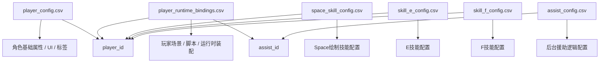
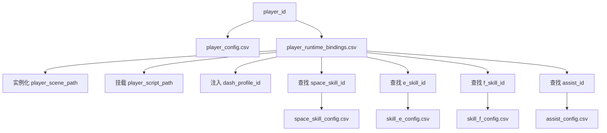

# 新正式 CSV 结构草案 v1

日期：2026-04-05

适用背景：

- 本文档基于《项目底层架构与数据流现状报告》整理。
- 目标不是兼容旧 `Q/E/F` 技能主链，而是为新的正式角色体系建立干净的数据驱动入口。
- 适配对象为即将正式注入主工程的 3 个新角色，以及后续扩展到完整角色库时的长期维护需求。

对应审计文档：

- `docs/AI记忆/项目底层架构与数据流现状报告_2026-04-05.md`

---

## 设计目标

这 6 张表的设计目标如下：

1. 彻底切断旧 `skill_q / skill_e / slot_q / skill_params_wide` 的历史语义污染。
2. 明确“角色本体数据”和“技能数据”的边界。
3. 让 `BasePlayer` 只承担宿主职责，不再承担角色技能细节。
4. 让 `Space`、`E`、`F`、`Assist` 都能独立演进。
5. 让后台小队逻辑从硬编码角色识别切换到 `assist_id` 数据驱动。
6. 为后续增加更多角色时保留 schema 稳定性。

---

## 总体表结构

建议正式保留以下 6 张表：

- `player_config.csv`
- `player_runtime_bindings.csv`
- `space_skill_config.csv`
- `skill_e_config.csv`
- `skill_f_config.csv`
- `assist_config.csv`

表之间的职责划分如下：



---

## 设计原则

### 原则 1：角色本体表不再承载技能细节

`player_config.csv` 只保留：

- 身份
- 基础属性
- UI 展示
- 标签
- 少量通用宿主参数

它不应再保存：

- `skill_q_cost`
- `skill_e_cost`
- `close_threshold`
- `q_closure_sfx`
- 各种角色技能半径 / 伤害 / 逻辑阈值

### 原则 2：Space / E / F 必须独立成表

因为这 3 类技能的数据结构天然不同：

- `Space` 是绘制态 + 几何结算 + 实时预览
- `E` 多为即时主动技能
- `F` 多为窗口态 / 变身态 / 大招态

如果强行混在一个总表里，字段会迅速失控。

### 原则 3：运行时装配必须独立

`player_runtime_bindings.csv` 的职责是：

- 告诉工厂该实例化哪个场景
- 给角色挂哪段脚本
- 使用哪个 Dash Profile
- 绑定哪个 Assist 定义

这样 `player_config.csv` 保持干净，`BasePlayer` 也不会再背负旧技能注入职责。

### 原则 4：Assist 必须脱离角色名硬编码

当前后台援助逻辑是按 `_is_parasite_role()`、`_is_collapse_role()` 这种方式写死的，这在 32 角色规模下不可维护。

新体系中应改为：

- `player_runtime_bindings.csv` 提供 `assist_id`
- `assist_config.csv` 定义触发条件和载荷

---

## 1. player_config.csv

### 1.1 表职责

用于描述角色“本体”信息，不包含具体技能细节。

负责内容：

- 角色唯一身份
- 基础战斗数值
- UI 展示
- 羁绊标签
- 少量宿主级通用参数

### 1.2 推荐表头

```text
player_id,display_name,display_order,enabled,description,portrait_sprite_path,world_sprite_path,ui_theme_color_hex,health,max_health_override,health_regen,max_energy,initial_energy,energy_regen,max_armor,base_speed,pickup_range,external_force_decay,knockback_scale,origin_tag,mastery_tag,tactic_tag
```

### 1.3 字段说明

| 字段 | 类型 | 是否必填 | 说明 |
| --- | --- | --- | --- |
| `player_id` | string | 是 | 角色主键，全局唯一 |
| `display_name` | string | 是 | 中文显示名 |
| `display_order` | int | 是 | 角色排序 |
| `enabled` | int/bool | 是 | 是否在正式角色池启用 |
| `description` | string | 否 | 角色简介，用于图鉴 / 选择界面 |
| `portrait_sprite_path` | string | 否 | UI 头像资源路径 |
| `world_sprite_path` | string | 否 | 世界内基础贴图路径 |
| `ui_theme_color_hex` | string | 否 | 角色主题色 |
| `health` | float | 是 | 默认生命值 |
| `max_health_override` | float | 否 | 若为空则与 `health` 相同；保留扩展空间 |
| `health_regen` | float | 是 | 血量恢复 |
| `max_energy` | float | 是 | 最大能量 |
| `initial_energy` | float | 是 | 初始能量 |
| `energy_regen` | float | 是 | 能量恢复 |
| `max_armor` | int | 是 | 最大护甲 |
| `base_speed` | float | 是 | 基础移动速度 |
| `pickup_range` | float | 否 | 吸附范围 |
| `external_force_decay` | float | 否 | 外力衰减 |
| `knockback_scale` | float | 否 | 被击退缩放 |
| `origin_tag` | string | 是 | 身世标签 |
| `mastery_tag` | string | 是 | 职能标签 |
| `tactic_tag` | string | 是 | 战术标签 |

### 1.4 与旧表的迁移关系

建议从旧 `player_config.csv` 迁移并保留的字段：

- `player_id`
- `display_name`
- `display_order`
- `enabled`
- `description`
- `health`
- `health_regen`
- `max_energy`
- `initial_energy`
- `energy_regen`
- `max_armor`
- `base_speed`
- `external_force_decay`
- `knockback_scale`
- `origin_tag`
- `mastery_tag`
- `tactic_tag`

建议移除出本表的旧字段：

- `skill_q_cost`
- `skill_e_cost`
- `close_threshold`
- `ties`
- `q_closure_sfx`
- `q_closure_volume_db`
- `q_closure_sfx_enabled`

说明：

- `ties` 旧字段本质是旧时代将三个羁绊文本混成一个展示字符串，不适合作为正式数据源。
- 正式展示应从 `origin_tag / mastery_tag / tactic_tag` 和羁绊表实时拼装。

---

## 2. player_runtime_bindings.csv

### 2.1 表职责

这是新的“角色运行时装配表”。

用于定义：

- 这个角色实例化哪个场景
- 挂哪段角色脚本
- 使用哪个 Dash 配置
- 对应哪个 Space / E / F / Assist 配置

### 2.2 推荐表头

```text
player_id,player_scene_path,player_script_path,dash_profile_id,space_skill_id,e_skill_id,f_skill_id,assist_id,default_front_slot,notes
```

### 2.3 字段说明

| 字段 | 类型 | 是否必填 | 说明 |
| --- | --- | --- | --- |
| `player_id` | string | 是 | 外键，关联 `player_config.player_id` |
| `player_scene_path` | string | 是 | 玩家场景路径 |
| `player_script_path` | string | 是 | 角色主脚本路径 |
| `dash_profile_id` | string | 是 | Dash 行为配置 ID |
| `space_skill_id` | string | 是 | 外键，关联 `space_skill_config.space_skill_id` |
| `e_skill_id` | string | 是 | 外键，关联 `skill_e_config.e_skill_id` |
| `f_skill_id` | string | 是 | 外键，关联 `skill_f_config.f_skill_id` |
| `assist_id` | string | 否 | 外键，关联 `assist_config.assist_id` |
| `default_front_slot` | int | 否 | 开局默认前台排序偏好 |
| `notes` | string | 否 | 备注 |

### 2.4 设计原因

这张表的意义非常关键：

- 让 `PlayerFactory` 不再写死“只实例化 `player_generic.tscn`”
- 让 `BasePlayer` 不再默认假设旧 `SkillManager`
- 让未来某些角色可用独立场景 / 独立脚本，但基础数据仍共享 `player_config`

### 2.5 未来可扩展字段

如后续需要，可以加：

- `input_mode_id`
- `camera_profile_id`
- `hitbox_profile_id`
- `vfx_profile_id`

但第一版不建议过度设计。

---

## 3. space_skill_config.csv

### 3.1 表职责

这是新体系里最重要的一张表。

它负责正式定义：

- `Space` 绘制态
- 实时预览
- 绘制长度限制
- 资源消耗
- 几何结算模式
- 释放逻辑
- 生成资产的逻辑标签 / 物理标签

### 3.2 推荐表头

```text
space_skill_id,player_id,skill_name,draw_mode,allow_self_intersection,max_total_length,min_release_length,max_segment_gap,point_sample_step,energy_mode,base_energy_cost,energy_cost_per_unit,energy_cost_unit_px,preview_style_id,preview_width_base,preview_width_max,preview_color_hex,release_shape_mode,release_delay,release_asset_lifetime,open_logic_tags,closed_logic_tags,open_physics_tags,closed_physics_tags,payload_schema_id,sfx_start_id,sfx_loop_id,sfx_release_id,sfx_fail_id,notes
```

### 3.3 字段说明

| 字段 | 类型 | 说明 |
| --- | --- | --- |
| `space_skill_id` | string | 主键 |
| `player_id` | string | 外键，便于直接反查所属角色 |
| `skill_name` | string | 技能显示名 |
| `draw_mode` | enum | 例如 `free_draw`, `drag_from_player`, `hold_and_trace` |
| `allow_self_intersection` | bool/int | 是否允许自交 |
| `max_total_length` | float | 最大长度限制 |
| `min_release_length` | float | 最短释放长度 |
| `max_segment_gap` | float | 相邻采样点可接受最大间隔 |
| `point_sample_step` | float | 采样步长 |
| `energy_mode` | enum | 例如 `flat`, `per_unit`, `flat_plus_unit`, `percent` |
| `base_energy_cost` | float | 固定能量消耗 |
| `energy_cost_per_unit` | float | 单位长度能量消耗 |
| `energy_cost_unit_px` | float | 每多少像素算一个单位 |
| `preview_style_id` | string | 预览样式 profile |
| `preview_width_base` | float | 预览基础宽度 |
| `preview_width_max` | float | 预览最大宽度 |
| `preview_color_hex` | string | 预览主色 |
| `release_shape_mode` | enum | `open_line`, `closed_shape`, `dynamic_polygon`, `singularity`, `seed_only` 等 |
| `release_delay` | float | 松开到结算间的时延 |
| `release_asset_lifetime` | float | 释放后残留资产时长 |
| `open_logic_tags` | string | 逗号分隔逻辑标签 |
| `closed_logic_tags` | string | 逗号分隔逻辑标签 |
| `open_physics_tags` | string | 逗号分隔物理标签 |
| `closed_physics_tags` | string | 逗号分隔物理标签 |
| `payload_schema_id` | string | 指向固定 payload schema 版本 |
| `sfx_start_id` | string | 开始画线音效 |
| `sfx_loop_id` | string | 持续画线音效 |
| `sfx_release_id` | string | 释放音效 |
| `sfx_fail_id` | string | 失败音效 |
| `notes` | string | 备注 |

### 3.4 为什么这张表必须独立

因为 `Space` 技能和旧 `Q` 技能本质已经不是一回事了。

`Space` 现在需要处理的维度包括：

- 输入手感
- 采样
- 预览
- 资源
- 几何
- 闭合/非闭合
- 物理标签
- 资产 payload

这些内容如果塞回旧 `skill_params_wide.csv`，表头会继续腐坏。

### 3.5 建议的枚举口径

#### `draw_mode`

- `free_draw`
- `drag_from_player`
- `hold_and_trace`
- `hold_then_click_trace`

#### `energy_mode`

- `flat`
- `per_unit`
- `flat_plus_unit`
- `percent`
- `none`

#### `release_shape_mode`

- `open_line`
- `closed_shape`
- `dynamic_polygon`
- `seed_only`
- `singularity`
- `band_slash`

---

## 4. skill_e_config.csv

### 4.1 表职责

用于描述角色的 E 技能。

E 技能通常偏即时主动，因此结构上比 `Space` 简单。

### 4.2 推荐表头

```text
e_skill_id,player_id,skill_name,cast_mode,energy_cost,cooldown,cast_range,targeting_mode,execution_profile_id,effect_radius,effect_duration,damage_formula_id,logic_tags,physics_tags,payload_schema_id,sfx_cast_id,sfx_hit_id,vfx_profile_id,notes
```

### 4.3 字段说明

| 字段 | 类型 | 说明 |
| --- | --- | --- |
| `e_skill_id` | string | 主键 |
| `player_id` | string | 外键 |
| `skill_name` | string | 技能名 |
| `cast_mode` | enum | `instant`, `target_point`, `self_centered`, `stored_release` |
| `energy_cost` | float | 能量消耗 |
| `cooldown` | float | 冷却 |
| `cast_range` | float | 施法范围 |
| `targeting_mode` | enum | `none`, `cursor_world`, `nearest_enemy`, `selected_asset` |
| `execution_profile_id` | string | 指向具体执行逻辑 profile |
| `effect_radius` | float | 影响半径 |
| `effect_duration` | float | 持续时间 |
| `damage_formula_id` | string | 伤害公式 ID |
| `logic_tags` | string | 逻辑标签 |
| `physics_tags` | string | 物理标签 |
| `payload_schema_id` | string | 统一 payload schema |
| `sfx_cast_id` | string | 施法音效 |
| `sfx_hit_id` | string | 命中音效 |
| `vfx_profile_id` | string | 视觉配置 profile |
| `notes` | string | 备注 |

### 4.4 为什么不继续复用旧 `skill_e_cost`

因为 `skill_e_cost` 放在角色本体表里，会导致：

- 角色本体数据和技能数据混杂
- 同一角色未来若存在 E 技能变体时无法扩展
- 无法为不同 E profile 做独立驱动

---

## 5. skill_f_config.csv

### 5.1 表职责

用于描述角色的 F 技能，也就是：

- 大招
- 窗口态
- 强化态
- 变身态
- 资源过载态

### 5.2 推荐表头

```text
f_skill_id,player_id,skill_name,activation_mode,energy_cost_mode,energy_cost,cooldown,duration,execution_profile_id,window_profile_id,damage_formula_id,buff_profile_id,logic_tags,physics_tags,payload_schema_id,bench_runtime_mode,bench_runtime_share_rule,sfx_cast_id,sfx_loop_id,sfx_end_id,vfx_profile_id,ui_profile_id,notes
```

### 5.3 字段说明

| 字段 | 类型 | 说明 |
| --- | --- | --- |
| `f_skill_id` | string | 主键 |
| `player_id` | string | 外键 |
| `skill_name` | string | 技能名 |
| `activation_mode` | enum | `instant`, `window`, `transform`, `charge_release` |
| `energy_cost_mode` | enum | `flat`, `percent`, `all` |
| `energy_cost` | float | 能量消耗 |
| `cooldown` | float | 冷却 |
| `duration` | float | 持续时间 |
| `execution_profile_id` | string | 执行逻辑 profile |
| `window_profile_id` | string | F窗口表现 profile |
| `damage_formula_id` | string | 伤害公式 |
| `buff_profile_id` | string | 强化 / buff 配置 |
| `logic_tags` | string | 逻辑标签 |
| `physics_tags` | string | 物理标签 |
| `payload_schema_id` | string | payload schema |
| `bench_runtime_mode` | enum | 后台运行模式，例如 `pause`, `countdown`, `share`, `persist` |
| `bench_runtime_share_rule` | string | 切后台后的运行规则 |
| `sfx_cast_id` | string | 开启音效 |
| `sfx_loop_id` | string | 持续音效 |
| `sfx_end_id` | string | 结束音效 |
| `vfx_profile_id` | string | VFX profile |
| `ui_profile_id` | string | HUD/F窗口 profile |
| `notes` | string | 备注 |

### 5.4 为什么这张表要保留 bench runtime 字段

因为当前正式底盘已经有：

- `Global.player_states`
- `f_runtime`
- 后台切人持续计时
- HUD F 窗口显示

也就是说 F 技能天生会和“前后台切换”绑定。  
这块如果不在表头层预留，后面一定还会回到硬编码。

---

## 6. assist_config.csv

### 6.1 表职责

用于定义后台援助被动。

这是从当前硬编码 `AssistRuntimeService` 进化出来的正式数据表。

### 6.2 推荐表头

```text
assist_id,display_name,owner_player_id,trigger_event,trigger_condition_json,internal_cooldown,proc_chance,execution_profile_id,targeting_mode,target_limit,effect_radius,effect_duration,damage_formula_id,logic_tags,physics_tags,payload_schema_id,sfx_trigger_id,vfx_profile_id,ui_hint_text,notes
```

### 6.3 字段说明

| 字段 | 类型 | 说明 |
| --- | --- | --- |
| `assist_id` | string | 主键 |
| `display_name` | string | 援助被动显示名 |
| `owner_player_id` | string | 外键，所属角色 |
| `trigger_event` | enum | 例如 `enemy_killed`, `space_released`, `dash_finished`, `f_activated` |
| `trigger_condition_json` | string/json | 触发条件，可表达面积、闭合、长度、命中数等 |
| `internal_cooldown` | float | 内置冷却 |
| `proc_chance` | float | 触发概率 |
| `execution_profile_id` | string | 具体执行逻辑 |
| `targeting_mode` | enum | `origin_point`, `nearest_enemy`, `payload_centroid`, `front_player` 等 |
| `target_limit` | int | 目标上限 |
| `effect_radius` | float | 作用半径 |
| `effect_duration` | float | 持续时间 |
| `damage_formula_id` | string | 伤害公式 |
| `logic_tags` | string | 逻辑标签 |
| `physics_tags` | string | 物理标签 |
| `payload_schema_id` | string | payload schema |
| `sfx_trigger_id` | string | 触发音效 |
| `vfx_profile_id` | string | 视觉表现 |
| `ui_hint_text` | string | HUD提示文本 |
| `notes` | string | 备注 |

### 6.4 这张表解决什么问题

它会把当前这类硬编码判断替掉：

- `_is_parasite_role()`
- `_is_collapse_role()`
- `_is_minimalist_role()`

未来改成：

- 前台事件广播 `trigger_event`
- 后台角色根据自己的 `assist_id` 查表
- 再根据 `execution_profile_id` 触发对应援助逻辑

这才是可扩展到完整角色库的结构。

---

## 主键 / 外键建议

### 主键

- `player_config.player_id`
- `player_runtime_bindings.player_id`
- `space_skill_config.space_skill_id`
- `skill_e_config.e_skill_id`
- `skill_f_config.f_skill_id`
- `assist_config.assist_id`

### 外键关系

| 来源字段 | 指向字段 |
| --- | --- |
| `player_runtime_bindings.player_id` | `player_config.player_id` |
| `player_runtime_bindings.space_skill_id` | `space_skill_config.space_skill_id` |
| `player_runtime_bindings.e_skill_id` | `skill_e_config.e_skill_id` |
| `player_runtime_bindings.f_skill_id` | `skill_f_config.f_skill_id` |
| `player_runtime_bindings.assist_id` | `assist_config.assist_id` |
| `space_skill_config.player_id` | `player_config.player_id` |
| `skill_e_config.player_id` | `player_config.player_id` |
| `skill_f_config.player_id` | `player_config.player_id` |
| `assist_config.owner_player_id` | `player_config.player_id` |

---

## 推荐的运行时装配流程



---

## 迁移建议

### 第一阶段：建立新表，不急着删旧表

建议先新增这 6 张新表，并让正式 3 个新角色只吃新表。

旧表暂时保留：

- `player_skill_bindings.csv`
- `skill_params_wide.csv`
- `player_weapons.csv`
- `ult_config.csv`

但明确降级为：

- 旧兼容
- UI 展示
- 调试用途

### 第二阶段：正式工厂切换到 bindings 表

让 `PlayerFactory` 从：

- 固定 `player_generic.tscn`
- 固定禁用脚本注入

切换为：

- 读 `player_runtime_bindings.csv`
- 实例化 `player_scene_path`
- 绑定 `player_script_path`

### 第三阶段：BasePlayer 正式接口化

建议新增或明确这些正式接口：

- `setup_space_skill(config: Dictionary)`
- `setup_e_skill(config: Dictionary)`
- `setup_f_skill(config: Dictionary)`
- `setup_assist_binding(config: Dictionary)`
- `setup_dash_profile(profile_id: String)`

### 第四阶段：AssistRuntimeService 改造成事件驱动

建议把当前直连接口升级成事件驱动：

- `enemy_killed`
- `space_draw_released`
- `dash_finished`
- `skill_e_cast`
- `skill_f_cast`

后台角色不再按角色名识别，而是按 `assist_id` 识别。

---

## 建议废弃的旧字段与旧表

### 建议退出正式主链的旧字段

- `player_config.skill_q_cost`
- `player_config.skill_e_cost`
- `player_config.close_threshold`
- `player_config.q_closure_sfx`
- `player_config.q_closure_volume_db`
- `player_config.q_closure_sfx_enabled`

### 建议退出正式主链的旧表

- `player_skill_bindings.csv`
- `skill_params_wide.csv`
- `player_weapons.csv`
- `input_config.csv`

说明：

- `input_config.csv` 如果后续要保留，也应改造成“启动时同步到 `InputMap`”的正式系统；否则建议只保留 `project.godot` 为真源。

---

## 第一版推荐最小可落地实现

如果你希望以最小成本先跑通 3 个新正式角色，建议优先这样落地：

### 必做

- `player_config.csv`
- `player_runtime_bindings.csv`
- `space_skill_config.csv`
- `skill_e_config.csv`
- `skill_f_config.csv`
- `assist_config.csv`

### 可以先继续沿用旧系统的部分

- 羁绊表
- 共鸣表
- 敌人表
- 波次表
- 音效总表
- 地图 / 游戏配置表

### 可以先不做成独立表的部分

- `dash_profile` 可以第一版先内嵌在 `player_runtime_bindings.csv`
- `damage_formula_id` 对应的公式系统也可以第一版先用脚本分派

---

## 最终建议

这 6 张表是足够干净、也足够现实的一版正式起点。

它们的优点是：

- 不再依赖旧 `skill_q` 语义
- 不再让 `player_config` 承担技能细节
- 不再让 `AssistRuntimeService` 硬编码角色名
- 能直接接入你现在已经保留下来的 `ArenaCore / Global / BasePlayer` 底盘

一句话结论：

> 这 6 张表足以作为“新正式角色体系”的第一版主配置骨架，后续可以在不破坏核心结构的前提下继续加 profile 表和公式表。

---

## 下一步建议

如果你确认这份表结构方向成立，下一步最合理的是：

1. 先把这 6 张 CSV 空表真正建出来。
2. 选 3 个正式新角色，先各填 1 行样例数据。
3. 我再帮你把 `PlayerFactory / BasePlayer / AssistRuntimeService` 改成正式吃这 6 张表的链路。
