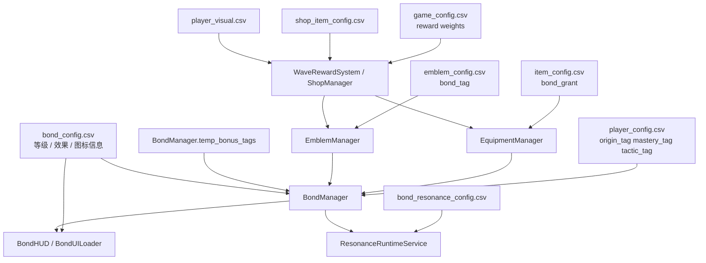

# 羁绊系统现状整理

日期：2026-04-05  
范围：正式主工程当前仍在生效的羁绊系统链路  
目的：给后续羁绊系统重构、标签重命名、随机羁绊设计与 3 人小队后台联动提供一份可落地的现状基线

---

## 1. 系统总览

当前羁绊系统的正式主入口是：

- `autoloads/bond_manager.gd`
- `autoloads/bond_ui_loader.gd`
- `scenes/ui/bond_hud/bond_hud.gd`
- `autoloads/resonance_runtime_service.gd`

它们与以下系统发生直接耦合：

- `ConfigRepository` / `ConfigManager`
- `EmblemManager`
- `EquipmentManager`
- `Global`
- `ArenaCore`
- `WaveRewardSystem`
- `ShopManager`

当前系统的核心特征不是“纯队伍人数羁绊”，而是一个“四源汇总”的标签系统：

1. 角色自带标签  
   来自角色配置中的 `origin_tag / mastery_tag / tactic_tag`
2. 装备赋予标签  
   来自装备或遗物配置中的 `bond_grant`
3. 护符赋予标签  
   来自 `EmblemManager.get_emblem_tags()`
4. 战斗内临时标签  
   来自 `BondManager.temp_bonus_tags`

最终所有来源都会汇总到：

- `BondManager.current_bond_counts`
- `BondManager.active_bonds`

然后再驱动：

- 属性重算
- 机制开关
- HUD 图标与升级反馈
- 共鸣触发
- 存档读写

---

## 2. 当前架构分层

### 2.1 运行时核心：BondManager

文件：

- [bond_manager.gd](/D:/Godot/Production/PolyLash_Project/autoloads/bond_manager.gd)

职责：

- 读取羁绊配置
- 汇总羁绊标签来源
- 计算每个羁绊的当前层级
- 输出激活效果
- 提供机制查询接口
- 发信号通知 UI 与属性系统

关键运行时数据：

- `bond_configs`
- `active_bonds`
- `current_bond_counts`
- `tag_sources`
- `temp_bonus_tags`
- `is_overdrive_mode`

关键信号：

- `bonds_recalculated(active_bonds)`
- `stat_modifiers_changed()`
- `bond_level_changed(bond_id, old_level, new_level)`

### 2.2 UI 装载层：BondUILoader

文件：

- [bond_ui_loader.gd](/D:/Godot/Production/PolyLash_Project/autoloads/bond_ui_loader.gd)

职责：

- 读取羁绊配置的展示字段
- 根据 `bond_type + icon_path_index` 拼图标路径
- 给角色选择或道具 Tooltip 提供羁绊图标、名称、描述
- 计算“队伍羁绊统计”的轻量展示版

它本质上是 UI 读取助手，不负责正式的激活判定。

### 2.3 战斗 HUD：BondHUD

文件：

- [bond_hud.gd](/D:/Godot/Production/PolyLash_Project/scenes/ui/bond_hud/bond_hud.gd)

职责：

- 订阅 `BondManager` 信号
- 左下角显示已激活/未激活但有进度的羁绊图标
- 在羁绊升降级时播放视觉反馈
- 读取 `BondManager.bond_configs / active_bonds / current_bond_counts`

### 2.4 共鸣运行时：ResonanceRuntimeService

文件：

- [resonance_runtime_service.gd](/D:/Godot/Production/PolyLash_Project/autoloads/resonance_runtime_service.gd)

职责：

- 读取 `bond_resonance_config.csv`
- 监听羁绊等级变化与重算
- 在满足指定角色 + 指定羁绊 + 指定等级时触发共鸣效果

当前它更像“角色与羁绊的额外被动映射层”。

---

## 3. 当前等级设计

### 3.1 通用层级规则

当前羁绊系统采用离散等级制。

大多数羁绊使用：

- `Lv1`: 需要 `2` 个标签
- `Lv2`: 需要 `4` 个标签
- `Lv3`: 需要 `6` 个标签

但不是所有羁绊都完整配置了 3 级。

当前实际情况：

- 有些羁绊只配到 2 级
- 有些新旧羁绊共存，但层级数不一致

### 3.2 三级额外门槛

这是当前系统最关键的一条隐藏规则。

`BondManager._get_activated_level()` 中规定：

- 即使标签数已经达到 `6`
- 如果该羁绊的来源全部来自“角色本体标签”
- 也不能直达 `Lv3`

想上 `Lv3`，必须额外满足：

- 至少有一个运行时来源参与该羁绊

运行时来源包括：

- 装备 `bond_grant`
- 护符 `emblem`
- 临时标签 `temp_bonus_tags`

也就是说，当前系统的真实设计不是简单的 `2/4/6`，而是：

- `Lv1`: 2
- `Lv2`: 4
- `Lv3`: 6，且必须混入至少一个运行时来源

### 3.3 Overdrive 特判

`BondManager.is_overdrive_mode == true` 时：

- 任意羁绊只要 `count >= 1`
- 就可以直接按该羁绊最高级结算

这是一个全局越权开关，不是普通的等级成长规则。

---

## 4. 当前配表结构

### 4.1 核心表：bond_config.csv

文件：

- [bond_config.csv](/D:/Godot/Production/PolyLash_Project/config/player/bond_config.csv)

表头：

```csv
bond_id,type,level,required_count,effect_type,effect_param,effect_value,icon_path_index,display_name,description
```

字段含义：

- `bond_id`: 羁绊唯一 ID
- `type`: 羁绊大类，当前使用 `origin / mastery / tactic`
- `level`: 羁绊等级
- `required_count`: 激活该等级所需标签数
- `effect_type`: 效果类型，当前核心为 `stat_mod / mechanic`
- `effect_param`: 具体机制名或属性名
- `effect_value`: 数值
- `icon_path_index`: UI 图标序号
- `display_name`: 展示名
- `description`: 展示描述

### 4.2 共鸣表：bond_resonance_config.csv

文件：

- [bond_resonance_config.csv](/D:/Godot/Production/PolyLash_Project/config/player/bond_resonance_config.csv)

表头：

```csv
player_id,trigger_bond,trigger_level,resonance_id,params_json,icd,duration
```

字段含义：

- `player_id`: 绑定角色
- `trigger_bond`: 需要达到的羁绊 ID
- `trigger_level`: 需要达到的羁绊等级
- `resonance_id`: 共鸣行为 ID
- `params_json`: 行为参数
- `icd`: 内置冷却
- `duration`: 持续时间

### 4.3 护符表：emblem_config.csv

文件：

- [emblem_config.csv](/D:/Godot/Production/PolyLash_Project/config/item/emblem_config.csv)

表头：

```csv
emblem_id,display_name,artifact_type,bond_tag,rarity,shop_price,is_unique,icon_path,description
```

它负责定义：

- 护符本身是否提供某个 `bond_tag`
- 是否唯一遗物
- 是否为万能鬼牌

### 4.4 装备表：item_config.csv

文件：

- [item_config.csv](/D:/Godot/Production/PolyLash_Project/config/item/item_config.csv)

表头：

```csv
id,name,tier,type,slot_type,base_stat,base_value,mod_type,mod_value,bond_grant,shop_price,icon_path,description
```

当前与羁绊最相关的字段是：

- `bond_grant`

这意味着装备本身也可以给羁绊计数。

### 4.5 角色基础表：player_config.csv

文件：

- [player_config.csv](/D:/Godot/Production/PolyLash_Project/config/player/player_config.csv)

表头：

```csv
player_id,display_name,display_order,enabled,ties,health,health_regen,skill_q_cost,skill_e_cost,close_threshold,energy_regen,max_energy,initial_energy,max_armor,base_speed,description,external_force_decay,knockback_scale,origin_tag,mastery_tag,tactic_tag,q_closure_sfx,q_closure_volume_db,q_closure_sfx_enabled,pickup_range,max_health_override,portrait_sprite_path,world_sprite_path,ui_theme_color_hex
```

与羁绊直接相关的字段：

- `player_id`
- `origin_tag`
- `mastery_tag`
- `tactic_tag`
- `ties`

字段备注：

- `origin_tag / mastery_tag / tactic_tag` 是 `BondManager` 统计角色本体羁绊的第一来源
- `ties` 目前更多用于角色展示或招募描述，不参与 `BondManager` 正式计数
- 这张表是“角色先天羁绊身份”的源头表

### 4.6 角色外观表：player_visual.csv

文件：

- [player_visual.csv](/D:/Godot/Production/PolyLash_Project/config/player/player_visual.csv)

表头：

```csv
player_id,sprite_path,scene_path,scale_x,scale_y,color_r,color_g,color_b,color_a,z_index
```

这张表不直接决定羁绊数值，但它和羁绊系统有间接关系：

- `WaveRewardSystem` 生成招募奖励时，会读取角色显示图和展示数据
- 角色选择、招募、替换界面会把“角色本体标签”和“角色视觉表现”一起展示给玩家

因此它是“羁绊展示链路”的间接依赖表。

### 4.7 商店消耗品表：shop_item_config.csv

文件：

- [shop_item_config.csv](/D:/Godot/Production/PolyLash_Project/config/item/shop_item_config.csv)

表头：

```csv
item_id,item_name,item_type,item_tier,effect_type,effect_target,target_tags,effect_value,icon_path,description,price,shop_weight,is_trade_off
```

这张表本身不直接提供羁绊标签，但它属于“局内随机资源系统”的同一奖励池生态：

- `ShopManager` 在刷不出护符或装备时，会退回到这里的消耗品池
- 它会与“随机护符 / 随机装备”共同竞争局内商店资源位

所以它不是羁绊源头表，但会影响“玩家多高频率获得羁绊来源”。

### 4.8 全局规则表：game_config.csv

文件：

- [game_config.csv](/D:/Godot/Production/PolyLash_Project/config/system/game_config.csv)

表头：

```csv
setting,value,description
```

与羁绊和随机羁绊相关的关键键值包括：

- `reward_weight_bond`
- `reward_weight_recruit`
- `reward_weight_attribute`
- `reward_weight_other`
- `reward_weight_other_equipment`
- `reward_weight_other_gold`
- `reward_icon_bond`
- `recruit_first_wave`
- `recruit_wave_interval`

字段备注：

- 这张表不定义羁绊内容
- 它定义的是“随机羁绊入口出现的频率与外层流程权重”
- 它本质上是羁绊系统的“外层经济控制表”

### 4.9 配表用途分层

可以把目前相关 CSV 分成 4 层：

1. 羁绊定义层
   - `bond_config.csv`
   - `bond_resonance_config.csv`
2. 羁绊来源层
   - `player_config.csv`
   - `emblem_config.csv`
   - `item_config.csv`
3. 羁绊展示层
   - `player_visual.csv`
4. 羁绊入口权重层
   - `game_config.csv`
   - `shop_item_config.csv`

---

## 4A. 配表关系与数据流

### 4A.1 关系总图



### 4A.2 正式激活链路

正式激活链路可以拆成：

1. 角色表提供基础标签
2. 装备表通过 `bond_grant` 提供追加标签
3. 护符表通过 `bond_tag` 提供追加标签
4. `bond_config.csv` 决定这些标签达到多少后转成哪一级效果
5. `BondManager` 输出 `active_bonds`
6. `BondHUD` / 技能脚本 / 敌人脚本消费这个结果

### 4A.3 随机羁绊链路

局内“随机羁绊”不是直接修改 `bond_config.csv`，而是：

1. `game_config.csv` 决定奖励池类型权重
2. `WaveRewardSystem` 或 `ShopManager` 按权重抽出“羁绊相关奖励”
3. 奖励内容落到：
   - `emblem_config.csv` 对应的护符
   - `item_config.csv` 对应的带 `bond_grant` 装备
4. `EmblemManager` / `EquipmentManager` 更新后
5. `BondManager` 自动重算

### 4A.4 配表与代码的主从关系

当前是明显的“代码主导、CSV 提供内容”的结构。

具体表现：

- `bond_config.csv` 决定“有哪些羁绊、每级给什么”
- 但“如何激活 / 如何叠加 / Lv3 特殊门槛 / 同 mechanic 取最高级”全部写死在代码
- `bond_resonance_config.csv` 决定“谁在什么羁绊下触发什么共鸣”
- 但“共鸣何时检查、如何走 ICD、如何记 telemetry”也写死在代码

也就是说，当前系统不是纯数据驱动，而是“半数据驱动”。

---

## 4B. 相关 CSV 审计备注

### 4B.1 直接决定羁绊结果的表

- `player_config.csv`
- `item_config.csv`
- `emblem_config.csv`
- `bond_config.csv`

这些表任意一个改动，都会影响最终 `current_bond_counts` 或 `active_bonds`。

### 4B.2 间接影响羁绊体验的表

- `bond_resonance_config.csv`
- `player_visual.csv`
- `game_config.csv`

这些表不会改写羁绊计数本身，但会影响：

- 共鸣触发
- UI 呈现
- 局内获得羁绊来源的频率

### 4B.3 当前结构上的几个风险点

1. `player_config.csv` 的 `ties` 字段与羁绊展示语义相近，但未进入正式 `BondManager` 计算  
   这很容易让设计误以为 `ties` 也会参与羁绊。

2. `item_config.csv` 里的 `bond_grant` 是单列字符串，并允许 `|` 分隔多标签  
   这虽然灵活，但缺少独立列约束，后期做校验和统计会比较脆。

3. `emblem_config.csv` 的 `bond_tag` 与 `EmblemManager.VALID_BOND_TAGS` 是双处定义  
   一旦表和代码不同步，就会出现表里有、运行时不认的问题。

4. `game_config.csv` 只控制概率和流程，不知道具体羁绊内容  
   所以它适合作为经济层，不适合作为羁绊设计层。

5. `bond_resonance_config.csv` 当前仍是旧角色主导  
   它会让“表存在、服务存在、但新角色没有共鸣”的现象持续发生。

---

## 5. 当前羁绊池内容

### 5.1 Origin 类

当前存在：

- `inkborn`
- `colossus`
- `nomad`
- `alchemist`
- `arsenal`

### 5.2 Mastery 类

当前存在：

- `blaster`
- `architect`
- `hexer`
- `geometrist`
- `sentinel`

### 5.3 Tactic 类

当前存在：

- `assist`
- `vanguard`
- `commander`
- `relay`

### 5.4 现状判断

这套羁绊池目前明显处于“旧命名 + 新命名并存”的过渡状态。

典型问题：

- `inkborn / colossus / nomad / alchemist`
  和你现在希望推行的
  `术理 / 御阵 / 锋芒 / 协律`
  不是同一套命名语义
- `assist / commander / relay`
  也存在旧战术分类与新小队逻辑交错
- `sentinel` 被放在 `mastery`，但语义上已经很像新体系里的“御阵”

所以从数据层看，当前羁绊系统已经不是一套纯净、统一的命名体系，而是一个可运行但明显待清洗的混合版本。

---

## 6. 当前效果设计

### 6.1 效果类型

当前 `bond_config.csv` 中主要有两类效果：

1. `stat_mod`
2. `mechanic`

### 6.2 stat_mod 的处理方式

由 `BondManager.apply_stat_modifiers()` 统一处理。

当前可见的属性修正方向包括：

- `energy_regen_pct`
- `max_health_pct`
- `movement_speed_pct`
- `pickup_range_pct`
- 以及通用的数值加成字段

### 6.3 mechanic 的处理方式

机制类效果通过：

- `BondManager.has_mechanic(mechanic_name)`
- `BondManager.get_mechanic_value(mechanic_name)`

由业务脚本主动查询。

当前重要机制消费点包括：

- `skill_drawing_base.gd`
- `player_base.gd`
- `enemy.gd`
- `status_component.gd`
- `global.gd`
- `arena_core.gd`

### 6.4 当前已被消费的 mechanic 例子

当前代码里实际在读取的机制包括：

- `thorns_wall`
- `ink_inherit`
- `closed_shape_dmg`
- `line_duration`
- `shape_tolerance`
- `gold_trail`
- `chain_reaction`
- `permanent_cage`
- `small_shape_crit`
- `secondary_explode`
- `death_brush`
- `polygon_effect`
- `debuff_duration`
- `kill_regen`
- `soul_attach`
- `dual_order`
- `super_armor`
- `speed_to_damage`
- `bench_cd_reduce`
- `mirror_draw`
- `switch_reset`
- `switch_cd_reduce`
- `stat_share`

注意：

- 同名 mechanic 如果由多个羁绊提供，不叠加
- `BondManager.get_mechanic_value()` 只取“最高等级那条”的数值

这是当前系统避免数值爆炸的重要限制。

---

## 7. 当前运行时数据流

### 7.1 角色进入战场

主流程：

1. `ArenaCore` 创建角色
2. `Global.selected_player_ids` 就位
3. `ArenaCore._init_bond_hud()`
4. 调用 `BondManager.recalculate_active_bonds(Global.selected_player_ids)`
5. 当前角色应用羁绊属性修正
6. `BondHUD` 刷新图标

### 7.2 羁绊重算的四步来源

`BondManager.recalculate_active_bonds()` 的逻辑顺序是：

1. `_count_character_tags(team_player_ids)`
2. `_count_equipment_tags(team_player_ids)`
3. `_count_emblem_tags()`
4. `_add_temp_tags()`

然后根据 `bond_configs` 逐个计算激活等级。

### 7.3 运行时来源追踪

`BondManager.tag_sources` 当前记录：

- `character`
- `equipment`
- `emblem`

临时标签不写进 `tag_sources`，而是单独存在：

- `temp_bonus_tags`

这也是 `Lv3` 判定时额外读取 `temp_bonus_tags` 的原因。

---

## 8. UI 展示链路

### 8.1 HUD 展示逻辑

`BondHUD` 的显示逻辑是：

- 上排：已激活羁绊
- 下排：未激活但已有计数的羁绊

它展示的数据来自：

- `BondManager.active_bonds`
- `BondManager.current_bond_counts`
- `BondManager.bond_configs`

### 8.2 图标解析逻辑

`BondUILoader` 按 `bond_type + icon_path_index` 拼路径：

- `origin -> assets/sprites/Icons/origins/origin%d.png`
- `mastery -> assets/sprites/Icons/masterys/mastery%d.png`
- `tactic -> assets/sprites/Icons/tactics/tactic%d.png`

### 8.3 Tooltip

当前 Tooltip 主要由：

- `BondManager.get_bond_tooltip_text()`
- `BondUILoader.get_bond_display_name()`
- `BondUILoader.get_bond_description()`

共同支撑。

Tooltip 中已经包含：

- 当前 count
- 当前等级
- 下一等级剩余需求
- 当前 mechanic 摘要
- 每一级的描述列表

---

## 9. 存档与恢复链路

### 9.1 保存内容

`SaveFacade._build_progress_payload()` 当前会保存：

- `bond_summary`
- `bond_counts`
- `emblems`

对应文件：

- [save_facade.gd](/D:/Godot/Production/PolyLash_Project/autoloads/save_facade.gd)

### 9.2 恢复内容

读档时：

1. 恢复 `EmblemManager.deserialize()`
2. 恢复 `ModifierManager.deserialize()`
3. 恢复 `BondManager.restore_from_save(bond_counts)`

注意这里的恢复是“直接恢复 count 结果”，并不是重新从角色/装备/护符逐步重算。

这意味着当前存档逻辑偏向“保存计算结果”，不是“只保存来源，运行时重新演算”。

---

## 10. 当前共鸣系统现状

### 10.1 触发方式

`ResonanceRuntimeService` 当前监听：

- `BondManager.bond_level_changed`
- `BondManager.bonds_recalculated`

当玩家激活或重算后，会检查：

- 当前前台角色 `player_id`
- 是否命中该角色对应的 `bond_resonance_config.csv`
- 是否满足指定羁绊等级
- 是否通过 ICD

### 10.2 当前已实现的共鸣行为

从代码可见，当前内置了这些 `resonance_id`：

- `resonance_switch_overdrive`
- `resonance_draw_echo`
- `resonance_pulse_burst`
- `resonance_guard_link`

### 10.3 当前实际问题

`bond_resonance_config.csv` 仍然主要绑定的是旧角色 ID，例如：

- `butcher`
- `ignis`
- `nexus`
- `windblade`

所以从现状看：

- 共鸣运行时链路是活的
- 但共鸣配表内容大概率已经与当前正式角色库脱节

---

## 11. 游戏内随机羁绊：当前已存在的正式实现

你提到“游戏内也可以随机羁绊”，以现有主工程来看，这件事其实已经部分成立，只是不是以“直接随机加羁绊数”的形式存在，而是走下面几条正式链路。

### 11.1 随机护符 / 遗物

来源：

- `WaveRewardSystem._generate_artifact_option()`
- `ShopManager._generate_emblem_item()`

逻辑：

- 局内奖励三选一时，可以随机产出 `artifact`
- 商店刷新时，也有 `EMBLEM_SPAWN_CHANCE = 0.25` 的概率直接刷护符
- 玩家获得护符后，`EmblemManager.add_emblem()`
- 然后 `BondManager` 监听 `EmblemManager.emblem_added`，自动重算羁绊

这是当前最成熟的“随机羁绊”实现。

### 11.2 随机带 bond_grant 的装备

来源：

- `WaveRewardSystem._generate_equipment_option()`
- `ShopManager._generate_equipment_item()`

逻辑：

- 局内可能掉落或商店刷出装备
- 某些装备在 `item_config.csv` 中配置了 `bond_grant`
- 装备到角色身上后，`BondManager._count_equipment_tags()` 会把这些标签算进去

这属于“间接随机羁绊”。

### 11.3 万能鬼牌

来源：

- `emblem_wildcard`
- `EmblemManager.add_wildcard()`
- `ArenaCore` 中的 `WildcardPanel`

逻辑：

- 万能鬼牌本身不是固定羁绊
- 玩家在局内拿到后需要指定目标羁绊
- 分配完成后会变成该羁绊的一次计数

这也是当前“局内随机羁绊”链路的一部分，而且可控性更强。

### 11.4 临时随机羁绊

当前并没有看到完整落地的“随机临时羁绊 Buff 事件”系统。

虽然 `BondManager` 已经支持：

- `add_temp_tag(tag)`
- `remove_temp_tag(tag)`
- `clear_temp_tags()`

但项目里暂未发现一个成熟的、局内随机奖励直接调用这套 API 的正式链路。

也就是说：

- 技术接口已经有了
- 但“随机临时羁绊事件”还没有形成正式玩法内容

---

## 12. 当前随机羁绊的实际形态总结

严格说，当前主工程里“游戏内随机羁绊”已经有 3 种正式存在方式：

1. 随机护符  
   直接给 `bond_tag`
2. 随机装备  
   通过 `bond_grant` 间接给标签
3. 万能鬼牌  
   由玩家局内选择要变成哪个羁绊

尚未完整落地的第 4 种是：

4. 临时事件型随机羁绊  
   例如“本波次获得 +1 术理标签，持续到下波结束”

从当前代码能力看，这第 4 种已经具备实现骨架，只差正式事件入口和 UI 提示。

---

## 13. 当前被哪些系统依赖

### 13.1 战斗技能

- [skill_drawing_base.gd](/D:/Godot/Production/PolyLash_Project/scenes/skills/skill_drawing_base.gd)
- [player_base.gd](/D:/Godot/Production/PolyLash_Project/scenes/unit/players/player_base.gd)
- [enemy.gd](/D:/Godot/Production/PolyLash_Project/scenes/unit/enemy/enemy.gd)
- [status_component.gd](/D:/Godot/Production/PolyLash_Project/scenes/components/status_component.gd)
- [global.gd](/D:/Godot/Production/PolyLash_Project/autoloads/global.gd)

### 13.2 UI

- [bond_hud.gd](/D:/Godot/Production/PolyLash_Project/scenes/ui/bond_hud/bond_hud.gd)
- [bond_ui_loader.gd](/D:/Godot/Production/PolyLash_Project/autoloads/bond_ui_loader.gd)
- `item_tooltip_helper.gd`

### 13.3 流程与奖励

- [arena_core.gd](/D:/Godot/Production/PolyLash_Project/scenes/arena/arena_core.gd)
- [wave_reward_system.gd](/D:/Godot/Production/PolyLash_Project/scenes/arena/wave_reward_system.gd)
- [shop_manager.gd](/D:/Godot/Production/PolyLash_Project/autoloads/shop_manager.gd)
- [emblem_manager.gd](/D:/Godot/Production/PolyLash_Project/autoloads/emblem_manager.gd)

### 13.4 存档

- [save_facade.gd](/D:/Godot/Production/PolyLash_Project/autoloads/save_facade.gd)

---

## 14. 现存问题

### 14.1 命名体系混杂

当前最大的结构问题不是功能缺失，而是“旧羁绊命名体系”和“新职能/新阵营语义”并存。

表现为：

- 羁绊 ID 是旧设计
- 展示名部分被改成新中文
- 部分新羁绊又直接插入老表

这会导致：

- 配表维护困难
- UI 文案容易错位
- 设计与程序沟通成本上升

### 14.2 Bond 类型仍是旧三类

当前系统仍然使用：

- `origin`
- `mastery`
- `tactic`

它只是一种分组类型，不等同于你现在的：

- 御阵
- 锋芒
- 术理
- 协律

如果后续你想把新四大分类真正做进羁绊系统，就不能只改中文名，必须连数据模型一起重构。

### 14.3 共鸣表高度陈旧

当前 `bond_resonance_config.csv` 基本还是旧角色库。

这意味着：

- 共鸣服务本身能跑
- 但数据内容已经不适配新正式角色阵容

### 14.4 VALID_BOND_TAGS 仍是硬编码旧标签

`EmblemManager` 里仍然存在：

- `VALID_BOND_TAGS`

而且内容是旧标签表。

这意味着一旦你改羁绊 ID 或新增羁绊，不同步改这里就会出错。

### 14.5 存档是“保存结果”，不是“保存来源”

当前存档恢复 `bond_counts`，而不是完全依赖角色/装备/护符重新演算。

优点：

- 读取快
- 容错强

缺点：

- 一旦你重构羁绊命名或规则，旧存档迁移会比较麻烦

---

## 15. 如果要继续重构，我建议的方向

### 15.1 保留现有运行时骨架

建议保留：

- `BondManager` 作为统一计数与激活入口
- `tag_sources`
- `temp_bonus_tags`
- `BondHUD` 的监听模式

这些骨架都是可复用的。

### 15.2 先清配表，再动运行时

最优顺序建议是：

1. 统一新的羁绊命名与分类
2. 重写 `bond_config.csv`
3. 清洗 `emblem_config.csv`
4. 清洗 `item_config.csv` 中的 `bond_grant`
5. 最后再改 `BondHUD` 与 `BondUILoader`

### 15.3 把“随机羁绊”正式化为 4 类来源

后续正式文档里建议明确写死 4 类来源：

1. 固定角色标签
2. 局内装备标签
3. 局内护符标签
4. 局内临时事件标签

这样程序和设计的口径会完全统一。

### 15.4 临时羁绊事件可以直接复用现有接口

如果你后面要做：

- “本波次随机获得 +1 锋芒”
- “本房间随机失去 1 点协律，换取 15% 伤害”

现有接口已经够用：

- `BondManager.add_temp_tag()`
- `BondManager.remove_temp_tag()`
- `BondManager.clear_temp_tags()`

也就是说，“游戏内随机羁绊事件”不需要从零搭底层。

---

## 16. 结论

当前羁绊系统并不是废的，反而有一套已经跑通的正式主链路：

- 计数入口明确
- HUD 与存档已接通
- 局内随机护符 / 装备 / 万能鬼牌都能影响羁绊
- 三级还有“运行时来源”这条很有价值的设计钩子

它现在的问题主要不是“不能用”，而是：

- 命名混杂
- 旧表残留
- 共鸣数据陈旧
- 新设计语义还没完全注入

如果你接下来要重构羁绊系统，我建议不要推翻 `BondManager` 这层，而是：

- 清洗配表
- 统一标签命名
- 明确新四大分类
- 把随机羁绊正式定义成“护符 / 装备 / 临时事件”三条主玩法入口

这样可以最小代价把旧系统平滑升级成新版本。
