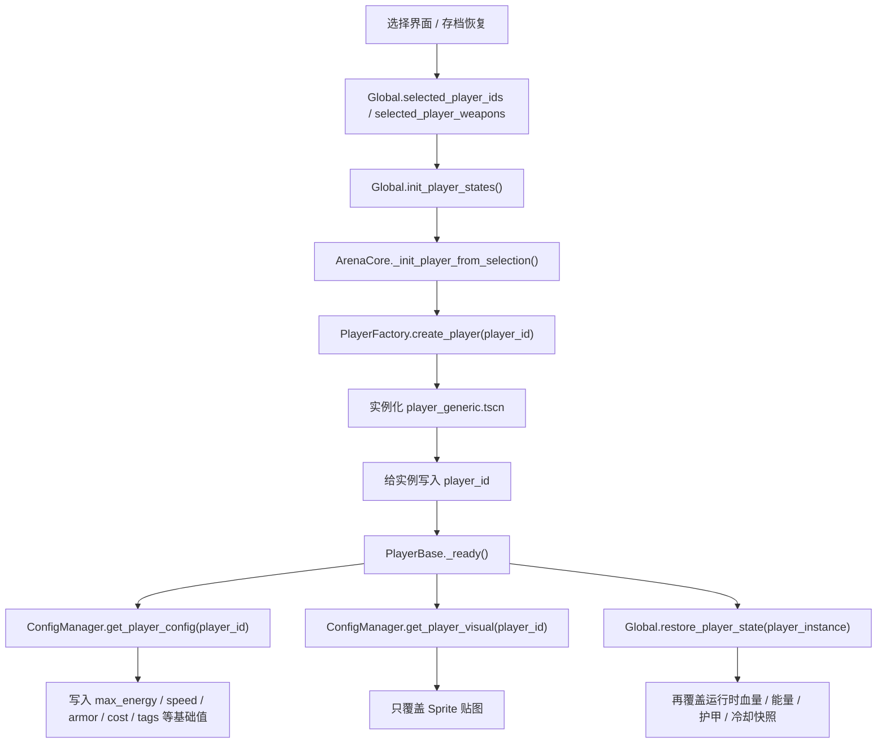
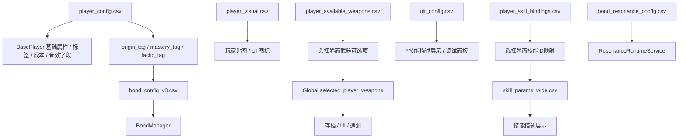
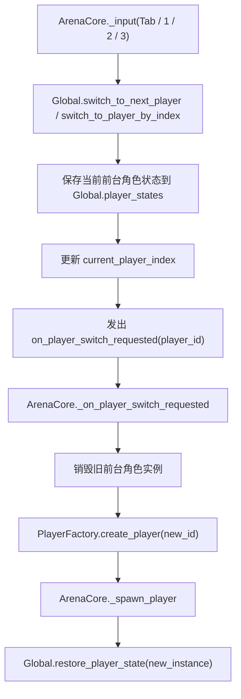

# 项目底层架构与数据流现状报告

日期：2026-04-05

审计口径说明：

- 本报告按“正式主链”审计，也就是从主菜单进入正式 `Arena` 时默认会走到的逻辑。
- 仓库中仍存在测试角色、试炼场、旧技能脚本、旧调试逻辑；若它们默认不会被正式链路实例化，本报告会明确标注为“遗留存在，但当前不生效”。

核心审计文件：

- `scenes/unit/players/player_base.gd`
- `scenes/arena/arena_core.gd`
- `autoloads/global.gd`
- `autoloads/player_factory.gd`
- `autoloads/config_manager.gd`
- `autoloads/config_repository.gd`
- `autoloads/assist_runtime_service.gd`
- `project.godot`

---

## 总体结论

当前项目已经被清成了一个“正式战斗底盘仍完整，但旧角色技能层已被大面积抽空”的状态。

可以直接保留并继续承接新设计的底盘包括：

- `ArenaCore`
- `Global` 小队状态与切人系统
- `EnemySpawner`
- `Bond / Resonance / Save / HUD`
- `ConfigManager / ConfigRepository` 的配置读取体系

已经被关掉或只剩兼容壳的部分包括：

- 旧角色脚本自动注入
- 旧 `SkillManager` 自动挂载
- 旧武器自动装配
- 旧 Ultimate 正式战斗链

一句话概括现状：

> 现在的工程已经适合直接注入新的 3 个正式特化角色，但不适合再回头复活旧的 Q/E/F 技能主链。

---

## 模块 1：角色与控制基类（BasePlayer）现状

### 1.1 当前 BasePlayer 仍保留的职责

`BasePlayer` 现在仍然是正式玩家实例的宿主层，保留了以下几类内容：

1. 基础身份与配置
   - `player_id`
   - `config`

2. 基础资源与属性
   - `max_energy`
   - `energy_regen`
   - `max_armor`
   - `base_speed`
   - `pickup_range`
   - `energy`
   - `armor`
   - `xp`
   - `gold`

3. 旧技能兼容字段
   - `skill_q_cost`
   - `skill_e_cost`
   - `close_threshold`

4. 受击与位移
   - `move_dir`
   - `external_force`
   - `external_force_decay`
   - `knockback_scale`
   - `reduction_per_armor`
   - `player_hit_cooldown`

5. 通用生存技能：战术拒止
   - `tactical_reject_enabled`
   - `tactical_reject_energy_cost`
   - `tactical_reject_cooldown`
   - `tactical_reject_radius`
   - `tactical_reject_push_distance`
   - `tactical_reject_stun_duration`
   - `tactical_reject_visual_duration`

6. 残留战斗挂点
   - `current_weapons`
   - `ultimate_skill`
   - `_pending_skill_cooldowns`
   - `modifier_manager`
   - `equipped_item_id`

### 1.2 当前 BasePlayer 对外信号

- `energy_changed`
- `armor_changed`
- `xp_changed`
- `gold_changed`
- `dash_started`
- `dash_active`
- `dash_finished`

### 1.3 当前仍有价值的宿主接口

- `consume_energy(amount)`
- `gain_energy(amount)`
- `add_xp(amount)`
- `add_gold(amount)`
- `update_ui_signals()`
- `can_move()`
- `_process_subclass(delta)`
- `notify_space_draw_release(release_data)`
- `get_skill_context_snapshot()`
- `get_skill_asset_snapshot()`
- `_cancel_active_planning_skills()`

### 1.4 正式输入源到底来自哪里

当前正式主链真正生效的输入源是 `project.godot` 里的 `InputMap`，不是 `config/system/input_config.csv` 动态重绑。

当前默认映射如下：

- `WASD` -> `move_left / move_right / move_up / move_down`
- `Space` -> `skill_q`
- `Q` -> `tactical_reject`
- `E` -> `skill_e`
- `F` -> `skill_f`
- `鼠标左键` -> `click_left`
- `鼠标右键` -> `click_right`
- `Tab` -> `switch_player`
- `1 / 2 / 3` -> `switch_player_1 / switch_player_2 / switch_player_3`

### 1.5 目前输入是如何分发的

`PlayerBase._handle_input()` 当前分发逻辑如下：

| 输入 | 默认键 | 处理位置 | 当前正式主链结果 |
| --- | --- | --- | --- |
| 移动 | `WASD` | `PlayerBase._handle_input()` | 直接生效 |
| 通用拒止 | `Q` | `PlayerBase._try_activate_tactical_reject()` | 直接生效 |
| Space 画线 | `Space` | 转给 `SkillManager.charge_skill/release_skill` | 有残留分发，但正式主链默认没有 `SkillManager`，因此不生效 |
| E 技能 | `E` | 转给 `SkillManager.execute_skill("e")` | 同上，默认不生效 |
| F 技能 | `F` | 调用 `ultimate_skill.try_activate()` | `BasePlayer` 已禁用大招自动加载，正式主链基本不生效 |
| 左键 | `鼠标左键` | 转给 `SkillManager.execute_skill("lmb")` | 基类没有统一 Dash 实现，正式主链默认不生效 |
| 切人 | `Tab / 1 / 2 / 3` | `ArenaCore._input()` -> `Global.switch_to_*()` | 生效 |

### 1.6 当前正式主链的核心判断

当前正式主链里，`BasePlayer` 实际拥有的是：

- 移动
- 通用 Q 拒止
- 资源池与 HUD
- 受击与击退
- 小队切换宿主能力

而 `Space / E / F / LMB` 虽然在基类里还有旧分发代码，但默认找不到有效接收者。

这意味着：

> 下一步正式注入 3 个新角色时，应该基于新的正式角色接口来接，不应该继续依赖旧 `SkillManager` 自动挂载。

### 1.7 子类角色目前最自然的扩展点

`BasePlayer._process()` 里仍然保留了 `_process_subclass(delta)`。

因此当前最合理的正式角色结构是：

- 基类统一负责：移动、通用 Q、受击、资源、HUD、小队切换。
- 子类负责：`Space` 绘制态、`E`、`F`、角色专属 Dash。

### 1.8 Slow-mo / TimeScale 残留情况

当前仍存在两类 `time_scale` 相关逻辑。

第一类：兜底复位逻辑

- `player_base.gd` `_exit_tree()`：强制 `Engine.time_scale = 1.0`
- `arena_core.gd` `_reset_bullet_time_state()`：强制 `Engine.time_scale = 1.0`
- `arena_core.gd` 结束战局、清理、退出时：多处强制 `Engine.time_scale = 1.0`

第二类：全局顿帧逻辑仍然活着

- `autoloads/global.gd`：`frame_freeze(duration, time_scale)`
- `player_base.gd`：受击与低血告警会触发 `Global.frame_freeze`
- `scenes/unit/unit.gd`：高额累计伤害时会触发 `Global.frame_freeze`
- 旧武器行为脚本 `melee_behavior.gd` / `range_behavior.gd` 也会触发

结论：

- 旧“规划态慢动作”已经不再是正式主链的核心。
- 但 `Engine.time_scale` 级别的全局 Hitstop 机制仍然是活代码。

---

## 模块 2：当前的数据驱动层（CSV 配置表）现状

### 2.1 当前 CSV 读取并不是单一体系，而是三条链并存

#### 链 A：ConfigManager 启动即缓存

`ConfigManager._ready()` 会在启动时把大量 CSV 一次性读入内存。

典型表：

- `player_config.csv`
- `player_visual.csv`
- `player_skill_bindings.csv`
- `player_available_weapons.csv`
- `skill_params_wide.csv`
- `enemy_config.csv`
- `wave_config.csv`
- `game_config.csv`

特点：

- 读取快
- 查询方便
- 但和其他读取链存在重复

#### 链 B：ConfigRepository 按需现读

`ConfigRepository` 更像业务仓库层，每次调用时重新打开 CSV 解析。

典型表：

- `bond_config_v3.csv`
- `bond_resonance_config.csv`
- `ult_config.csv`
- `enemy_config_v2.csv`
- `wave_config_v2.csv`
- `wave_units_config_v2.csv`
- `shop_*`

特点：

- 语义更接近“业务数据仓库”
- 但当前没有统一缓存

#### 链 C：特化单例各自读取

典型包括：

- `DataManager` 读取 `attribute_upgrade.csv`
- `SoundManager` 读取 `config/audio/*.csv`
- `AbilityManager` 读取 `enemy_abilities.csv`
- `EliteConfigManager` 读取精英与精英刷怪配置

结论：

> 当前项目不是单一统一的数据驱动层，而是多套 CSV 读取器并存。

### 2.2 角色实例化与 CSV 覆盖流程



这里有一个非常重要的顺序：

1. 先用 CSV 写基础值
2. 再用 `Global.player_states` 恢复运行时值

因此正式切人和读档后的玩家最终状态，并不是纯 CSV，而是：

> CSV 基值 + 运行时状态回填

### 2.3 当前角色 / 技能相关 CSV 表头

#### `config/player/player_config.csv`

```text
player_id, display_name, display_order, enabled, ties, health, health_regen, skill_q_cost, skill_e_cost, close_threshold, energy_regen, max_energy, initial_energy, max_armor, base_speed, description, external_force_decay, knockback_scale, origin_tag, mastery_tag, tactic_tag, q_closure_sfx, q_closure_volume_db, q_closure_sfx_enabled
```

#### `config/player/player_visual.csv`

```text
player_id, sprite_path, scene_path, scale_x, scale_y, color_r, color_g, color_b, color_a, z_index
```

#### `config/player/player_skill_bindings.csv`

```text
player_id, slot_q, slot_e, slot_lmb, slot_rmb
```

#### `config/player/player_available_weapons.csv`

```text
player_id, weapon_type_1, weapon_type_2, weapon_type_3, weapon_type_4
```

#### `config/player/player_weapons.csv`

```text
player_id, weapon_slot_1, weapon_slot_2, weapon_slot_3, weapon_slot_4, weapon_slot_5, weapon_slot_6
```

#### `config/player/skill_params_wide.csv`

```text
skill_id, energy_cost, cooldown, fixed_segment_length, dash_speed, energy_per_10px, energy_threshold_distance, energy_scale_multiplier, base_line_duration, desc_q_line, desc_q_circle, desc_e, tags, param1, param1_note, param2, param2_note, param3, param3_note, param4, param4_note, param5, param5_note, param6, param6_note, param7, param7_note, param8, param8_note, param9, param9_note, param10, param10_note
```

#### `config/player/ult_config.csv`

```text
ult_id, name, duration, energy_cost, bonus_bond_tag, visual_color_hex, scale_multiplier, explosion_radius, explosion_damage_scale, description, f_role_id, f_internal_cd, f_q_line_amp, f_q_closure_amp, f_special_value_1, f_special_value_2, f_special_value_3, f_bond_o_payload, f_bond_m_payload, f_bond_t_payload
```

#### `config/player/bond_config_v3.csv`

```text
bond_id, type, level, required_count, effect_type, effect_param, effect_value, icon_path_index, display_name, description
```

#### `config/player/bond_resonance_config.csv`

```text
player_id, trigger_bond, trigger_level, resonance_id, params_json, icd, duration
```

#### `config/player/attribute_upgrade.csv`

```text
attribute_name, display_name, cost, value_increase
```

### 2.4 skill_params_wide.csv 的特殊解析规则

`skill_params_wide.csv` 不是简单按列名直接暴露。

`ConfigManager.load_skill_params_wide_format()` 当前行为是：

- 直接列直接写入字典：
  - `energy_cost`
  - `cooldown`
  - `fixed_segment_length`
  - `dash_speed`
  - `energy_per_10px`
  - `energy_threshold_distance`
  - `energy_scale_multiplier`
  - `base_line_duration`
  - `desc_q_line`
  - `desc_q_circle`
  - `desc_e`
  - `tags`
- `param1 ~ param10` 不以 `param1` 作为最终 key
- 它会去解析 `param1_note ~ param10_note` 括号内变量名

例如：

- `param1 = 12`
- `param1_note = 伤害(line_damage)`

最终在代码里变成：

- `line_damage = 12`

结论：

> 这张表本质是“宽表 + 备注列驱动变量名”的混合配置格式。

### 2.5 表间关联流程图



### 2.6 当前正式主链在用 / 兼容 / 未接入的表

#### 正式主链强依赖

- `config/player/player_config.csv`
- `config/player/player_visual.csv`
- `config/player/player_available_weapons.csv`
- `config/player/bond_config_v3.csv`
- `config/player/bond_resonance_config.csv`
- `config/player/attribute_upgrade.csv`
- `config/enemy/enemy_config.csv`
- `config/enemy/enemy_config_v2.csv`
- `config/enemy/enemy_visual.csv`
- `config/enemy/enemy_weapons.csv`
- `config/enemy/enemy_abilities.csv`
- `config/enemy/boss_phase_config.csv`
- `config/enemy/elite_enemies_config.csv`
- `config/enemy/elite_evolution_config.csv`
- `config/wave/wave_config.csv`
- `config/wave/wave_units_config.csv`
- `config/wave/wave_config_v2.csv`
- `config/wave/wave_units_config_v2.csv`
- `config/wave/elite_wave_config.csv`
- `config/wave/elite_spawn_config.csv`
- `config/wave/wave_chest_config.csv`
- `config/system/game_config.csv`
- `config/system/camera_config.csv`
- `config/system/map_config.csv`
- `config/system/credits_config.csv`
- `config/audio/ui_sounds.csv`
- `config/audio/combat_sounds.csv`
- `config/audio/skill_sounds.csv`
- `config/audio/environment_sounds.csv`
- `config/item/item_config.csv`
- `config/item/emblem_config.csv`
- `config/item/chest_config.csv`
- `config/item/shop_item_config.csv`
- `config/item/upgrade_attributes.csv`
- `config/wave/shop_attribute_config.csv`
- `config/wave/shop_wave_config.csv`
- `config/weapon/weapon_config_optimized.csv`

#### 正式主链有读取，但当前更偏 UI / 调试 / 兼容

- `config/player/player_skill_bindings.csv`
- `config/player/skill_params_wide.csv`
- `config/player/ult_config.csv`
- `config/system/input_config.csv`
- `config/player/player_weapons.csv`

#### 工具 / 预设 / 当前未接入正式链

- `config/item/item_effect_config.csv`
- `config/system/sound_config.csv`
- `config/system/ult_config.csv`
- `config/player/bond_config_v3_trial_246.csv`
- `config/player/skill_params_wide_preset_baseline.csv`
- `config/player/skill_params_wide_preset_fun.csv`
- `config/player/skill_params_wide_preset_fun_tuned.csv`
- `config/player/skill_params_wide_preset_hardcore.csv`
- `config/player/skill_params_wide_trial_8roles.csv`
- `config/player/skill_params_wide_trial_8roles_preset_baseline.csv`
- `config/player/skill_params_wide_trial_8roles_preset_fun.csv`
- `config/player/skill_params_wide_trial_8roles_preset_fun_tuned.csv`
- `config/player/skill_params_wide_trial_8roles_preset_hardcore.csv`

### 2.7 当前哪些表的哪些列没真正落到正式战斗主链

#### `player_config.csv`

当前实际使用列很多：

- `display_name`
- `display_order`
- `enabled`
- `ties`
- `health`
- `health_regen`
- `skill_q_cost`
- `skill_e_cost`
- `close_threshold`
- `energy_regen`
- `max_energy`
- `initial_energy`
- `max_armor`
- `base_speed`
- `description`
- `external_force_decay`
- `knockback_scale`
- `origin_tag`
- `mastery_tag`
- `tactic_tag`
- `q_closure_sfx`
- `q_closure_volume_db`
- `q_closure_sfx_enabled`

说明：

- 这张表目前没有完全“死列”。
- 但其中存在大量旧技能语义字段：
  - `skill_q_cost`
  - `skill_e_cost`
  - `close_threshold`
  - `q_closure_*`
- 其中 `q_closure_*` 只有旧 `skill_drawing_base` + `SoundManager.play_character_q_closure()` 还会吃，正式主链默认不生效。

#### `player_visual.csv`

当前正式玩家主链稳定使用：

- `player_id`
- `sprite_path`

当前正式玩家主链未用：

- `scene_path`
- `scale_x`
- `scale_y`
- `color_r`
- `color_g`
- `color_b`
- `color_a`
- `z_index`

备注：

- 这些列在敌人视觉链中有类似字段消费方式，但玩家正式链当前没有。

#### `player_skill_bindings.csv`

当前明确被读取的列：

- `slot_q`
- `slot_e`

当前正式主链未用列：

- `slot_lmb`
- `slot_rmb`

说明：

- 旧 `SkillManager` 理论上可以消费全部 4 个槽位。
- 但正式主链默认不自动创建 `SkillManager`，所以整张表现在更像“UI 与兼容展示表”。

#### `player_available_weapons.csv`

当前读取列：

- `weapon_type_1`
- `weapon_type_2`
- `weapon_type_3`
- `weapon_type_4`

说明：

- 这几列都被 `ConfigManager.get_player_available_weapon_types()` 正式消费。
- 但当前只用于：
  - 选择界面
  - `Global.selected_player_weapons`
  - 存档/读取/奖励/调试
- 不再驱动正式战斗中的武器实例化。

#### `player_weapons.csv`

当前情况：

- 整张表会被 `ConfigManager` 读入 `player_weapon_configs`
- 但正式主链没有实际消费者

当前未用列：

- `weapon_slot_1`
- `weapon_slot_2`
- `weapon_slot_3`
- `weapon_slot_4`
- `weapon_slot_5`
- `weapon_slot_6`

结论：

> 这整张表目前等价于闲置缓存表。

#### `skill_params_wide.csv`

当前稳定被正式链消费的内容主要是展示相关：

- `desc_q_line`
- `desc_q_circle`
- `desc_e`

其余当前主要停留在旧技能兼容层的内容：

- `energy_cost`
- `cooldown`
- `fixed_segment_length`
- `dash_speed`
- `energy_per_10px`
- `energy_threshold_distance`
- `energy_scale_multiplier`
- `base_line_duration`
- `tags`
- `param1 ~ param10`
- `param1_note ~ param10_note`

结论：

> 这张表今天还在被“读”，但正式战斗主链默认不会真正执行里面的大多数数值字段。

#### `ult_config.csv`

当前稳定在用的列：

- `ult_id`
- `description`

调试与兼容层会额外读取：

- `name`
- `duration`
- `energy_cost`
- `bonus_bond_tag`
- `visual_color_hex`
- `scale_multiplier`
- `explosion_radius`
- `explosion_damage_scale`
- `f_role_id`
- `f_internal_cd`
- `f_q_line_amp`
- `f_q_closure_amp`
- `f_special_value_1`
- `f_special_value_2`
- `f_special_value_3`
- `f_bond_o_payload`
- `f_bond_m_payload`
- `f_bond_t_payload`

但说明很关键：

- `BasePlayer._load_ultimate_skill()` 已在 Stage 1 被禁用
- 因此 `ult_config.csv` 目前不再是正式战斗强依赖
- 它现在主要承担：
  - UI 展示
  - 调试面板显示
  - 未来兼容入口

#### `input_config.csv`

当前情况：

- 会被 `ConfigManager` 读成 `input_configs`
- 但项目没有用这张表去重建或覆盖 `InputMap`

因此当前整张表都属于：

- “被加载”
- “但不控制真实输入”

列级状态：

- `action`：被作为 key 读入
- `key_code`：当前未驱动真实输入
- `description`：当前未驱动真实输入
- `player_switch_index`：当前未驱动真实输入

结论：

> 正式输入实际吃的是 `project.godot`，不是 `input_config.csv`。

---

## 模块 3：小队与后台系统（Squad & Assist）现状

### 3.1 当前“逻辑三人”的核心状态都在 Global

当前小队系统核心状态集中在 `autoloads/global.gd`：

- `selected_player_ids`
- `reserve_player_ids`
- `selected_player_weapons`
- `current_player_index`
- `player_states`
- `leader_player_id`

### 3.2 player_states 当前保存的运行时内容

每个角色在 `player_states` 中保存：

- `health`
- `max_health`
- `energy`
- `max_energy`
- `armor`
- `health_regen`
- `energy_regen`
- `base_speed`
- `speed`
- `skill_cooldowns`
- `f_runtime`
- `bench_enter_time`
- `last_activated_time`

### 3.3 切人正式流程



### 3.4 当前已经存在的后台 / HUD 相关全局信号

#### 小队 / HUD 层信号

- `on_player_switch_requested`
- `on_active_character_changed`
- `on_switch_rejected`
- `on_squad_state_changed`
- `on_f_runtime_changed`
- `on_f_pack_count_changed`

#### 当前已经存在的 Assist 触发入口

当前真正落地的 Assist 触发点只有两个：

1. 前台击杀敌人
   - `Enemy` 死亡时直接调用 `AssistRuntimeService.on_front_enemy_killed(enemy)`

2. 前台释放 Space 画线
   - `PlayerBase.notify_space_draw_release(release_data)`
   - 直接调用 `AssistRuntimeService.on_front_draw_release(owner, release_data)`

### 3.5 当前并不存在的统一战斗事件总线

当前项目没有统一全局信号来广播这些事件：

- `on_enemy_killed`
- `on_space_released`
- `on_tactical_reject_used`
- `on_dash_started`
- `on_dash_finished`
- `on_skill_e_cast`
- `on_skill_f_cast`

结论：

> 现在的 Assist 触发机制是“直连函数调用”，不是正式化的全局事件总线。

### 3.6 当前 AssistRuntimeService 的结构问题

当前 `AssistRuntimeService` 已具备：

- bench 角色识别
- 独立 cooldown
- 根据前台事件触发后台效果

但它的角色识别方式仍然是硬编码的：

- `_is_parasite_role()`
- `_is_collapse_role()`
- `_is_minimalist_role()`

并且 `on_front_draw_release()` 当前依赖一个无 schema 的字典 payload，默认期待这些键：

- `is_closed`
- `approx_area`
- `centroid`
- `points`
- `draw_cost`

这意味着：

> 小队后台系统的骨架是有的，但 Assist 逻辑还不是一个可扩展到 32 角色的正式数据驱动框架。

---

## 模块 4：技术建议

### 4.1 现有底盘里值得保留的部分

在正式注入 3 个新角色前，最值得保留的不是旧技能链，而是这些底盘：

- `ArenaCore + Global` 的前后台切人状态机
- `Spawner` 的旧波次 + v2 Director 双轨结构
- `Bond / Resonance / Save / HUD`
- `ConfigManager` 的角色 / 敌人 / 地图 / 波次缓存体系

### 4.2 对 BasePlayer 的结构建议

建议把 `BasePlayer` 的正式职责边界明确为：

#### 基类负责

- 移动
- 通用 Q 拒止
- 资源池
- 受击与生存反馈
- HUD 同步
- 小队切人
- 后台状态恢复

#### 子类负责

- `Space` 绘制态
- `E`
- `F`
- 角色专属 Dash

并建议：

- 不再依赖默认 `SkillManager` 自动挂载
- 保留 `notify_space_draw_release()`，但正式化 payload 结构

### 4.3 一个需要特别注意的技术缺口

当前 `BasePlayer` 名义上保留了 Dash 信号，但没有统一正式 Dash 实现。

如果接下来直接把 3 个新角色注入正式链，建议顺手把 Dash 也收回正式基类，否则 3 个角色会各自维护一套 Dash 逻辑。

### 4.4 对 CSV 体系的重大调整建议

建议把现有“旧 Q/E/F 语义耦合”的配置拆分成更明确的正式结构，至少准备以下 6 张：

- `player_config.csv`
- `player_runtime_bindings.csv`
- `space_skill_config.csv`
- `skill_e_config.csv`
- `skill_f_config.csv`
- `assist_config.csv`

建议方向如下：

#### player_config.csv

只保留身份与基础属性：

- `player_id`
- `display_name`
- `enabled`
- `display_order`
- `health`
- `health_regen`
- `max_energy`
- `initial_energy`
- `energy_regen`
- `max_armor`
- `base_speed`
- `origin_tag`
- `mastery_tag`
- `tactic_tag`
- `description`
- UI / portrait / audio 相关字段

#### player_runtime_bindings.csv

建议新增：

- `player_id`
- `player_scene`
- `player_script`
- `assist_id`
- `dash_profile_id`

#### space_skill_config.csv

建议新增独立 Space 配置表，不再复用旧 `skill_q` 语义壳。

#### skill_e_config.csv

专门承载 E 的正式配置。

#### skill_f_config.csv

专门承载 F 的正式配置。

#### assist_config.csv

专门承载后台援助配置，不再硬编码在脚本里。

### 4.5 建议降级或移除的旧字段 / 旧表

建议未来从“核心正式配置”中降级或移除：

- `player_config.skill_q_cost`
- `player_config.skill_e_cost`
- `player_config.close_threshold`
- `player_skill_bindings.slot_q`
- `player_skill_bindings.slot_e`
- `player_skill_bindings.slot_lmb`
- `player_skill_bindings.slot_rmb`
- `skill_params_wide.csv`
- `player_weapons.csv`
- `input_config.csv`

原因：

- 它们都带着旧技能主链的历史语义
- 与新“Space 画线为核心”的正式设计不一致

### 4.6 建议补上的正式事件总线

为了让 Assist / Bond / UI / Telemetry 都能稳定接未来新角色，建议补一套统一事件：

- `enemy_killed(front_player, enemy, context)`
- `space_draw_started(front_player, context)`
- `space_draw_released(front_player, payload)`
- `skill_e_cast(front_player, payload)`
- `skill_f_cast(front_player, payload)`
- `dash_started(front_player, payload)`
- `dash_finished(front_player, payload)`
- `tactical_reject_used(front_player, payload)`
- `front_character_changed(player_id, index)`

### 4.7 建议正式化“画线资产 payload”

建议未来所有角色的 Space 画线资产统一遵守以下 payload 结构：

- `asset_kind`
- `owner_id`
- `source_skill`
- `points`
- `segments`
- `aabb`
- `centroid`
- `approx_area`
- `is_closed`
- `logic_tags`
- `physics_tags`
- `duration`
- `draw_cost`

这样会同时统一：

- Assist 联动
- 物理标签
- 后台被动
- 调试面板
- 回放 / 录制

### 4.8 当前最建议优先处理的 4 件事

1. 把正式输入契约定死：
   - `Q = 通用战术拒止`
   - `Space = 角色专属画线`
   - `E / F = 角色技能`
   - `LMB = 正式 Dash 或统一攻击入口`

2. 把旧 `SkillManager / skill_drawing_base / player_skill_bindings / skill_params_wide` 降级为兼容层，不再作为新角色主链

3. 把 `AssistRuntimeService` 从硬编码角色识别改成 `assist_id + 事件订阅`

4. 把 `selected_player_weapons` 的定位彻底定清：
   - 要么正式接回战斗实例化
   - 要么从新角色主循环里彻底剥离

### 4.9 最终技术判断

如果下一步要直接发 3 个新角色的正式 MD 和新 CSV 结构：

> 当前这套工程是能接的，但必须按“新角色直连正式 BasePlayer 契约”的方式来接，不能再回头复活旧 `SkillManager` 主导的 Q/E/F 体系。

---

## 附录：本次审计的核心判断摘要

### 正式主链仍然可靠的部分

- `ArenaCore`
- `Global`
- `Spawner`
- `Bond`
- `Resonance`
- `Save`
- `HUD`
- `ConfigManager / ConfigRepository`

### 当前已经明显不适合作为新角色主链的部分

- 旧 `SkillManager` 自动注入
- 旧 `skill_drawing_base` 主导的 Q 闭合体系
- 旧 `player_skill_bindings + skill_params_wide` 技能主链
- 旧 `player_weapons.csv` 装配链

### 对下一阶段最有价值的一句话

> 下一阶段应该做的是“建立新的正式角色接口与 6 张正式配置表”，而不是继续修补旧角色技能架构。
