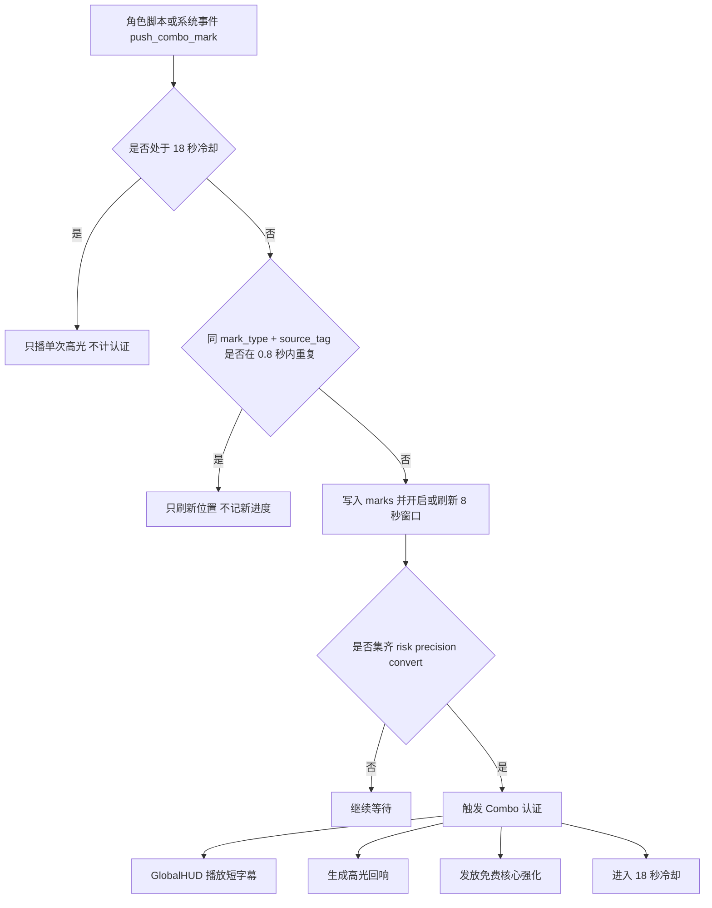

# 历史参考，不再维护

# 全角色技能执行设计总表（2026-03-15）

## 1. 文档目的

这份文档用于把当前 PolyLash 的 32 个实际启用角色，统一整理成一份可执行的技能设计总表。

本文档解决以下几件事：

- 统一当前角色英文 ID 和中文名，避免旧名和现名混用。
- 统一 `Q / E / F` 的职责分工，确保角色技能逻辑自洽。
- 为每个角色补上 `F` 的即时增强、资源/盲盒产出方式、盲盒结果和玩家操作目标。
- 为每个角色补上技能表现形式、玩家应见效果和可执行的验收标准。
- 为每个角色补上“我能为别人提供什么价值”的协同视角。
- 补上一套与角色无关、与极限操作相关的全局 `Combo` 认证规则。
- 基于当前项目真实资源系统，提出一套可实施的能量消耗方案。

本文档采用以下基础认知：

- 开局只上场 1 名角色，局内招募/替换到 3 人。
- 敌人追玩家，`Q` 画线是主玩法本体。
- `Q 非闭合` 承担日常输出和保命循环。
- `Q 闭合` 负责高价值收口和大面积爽点。
- `E` 是二次介入，不抢 `Q` 的主玩法位置。
- `F` 是 10 秒高压高收益窗口，不是普通大招。

### 1.1 左键冲撞固定基线

左键冲撞继续沿用总表中的固定规格：

- 触发方式：`鼠标左键点击`
- 冲撞方向：`始终朝鼠标方向`
- 冲撞距离：`400`
- 冲撞速度：`2000`
- 冲撞有效时长：`0.20s`
- 冲撞期间：`角色主碰撞关闭，玩家无敌`
- 冲撞伤害：`20`
- 冲撞击退：`2.0`

程序如需支撑角色联动，统一补三个信号，不改冲撞本体参数：

- `dash_started(player_id, start_pos, direction)`
- `dash_active(player_id, current_pos, direction, normalized_time)`
- `dash_finished(player_id, end_pos, direction)`

## 2. 当前角色池与命名校对

当前实际启用角色共 32 名，按当前 `player_config.csv` 为准。

### 2.1 Colossus 系

- `butcher / 屠夫`
- `glacier / 冰河`
- `jailer / 狱警`
- `blacksmith / 铁匠`
- `paladin / 圣卫`
- `breachmarshal / 破阵督军`
- `hexwarden / 咒铠师`
- `executioner / 处刑人`

### 2.2 Inkborn 系

- `pyro / 焰术师`
- `weaver / 织网者`
- `runeblazer / 符焰师`
- `bloodsworn / 血契者`
- `spiritcaller / 祖灵祭司`
- `mirebinder / 墨沼师`
- `necro / 死灵师`
- `gildhand / 点金师`

### 2.3 Nomad 系

- `wind / 风行者`
- `arcstriker / 霆击者`
- `stormseer / 岚眼术士`
- `banner / 旗令官`
- `turretwright / 炮械师`
- `illusionist / 幻术师`
- `singularist / 坍缩师`
- `fatebinder / 命契师`

### 2.4 Alchemist 系

- `sapper / 工兵`
- `lurewarden / 诱猎师`
- `plague / 疫师`
- `medic / 军医`
- `quartermaster / 军需官`
- `swarm / 巢母`
- `broker / 清算商`
- `trapper / 伏猎者`

### 2.5 命名修正

- 旧设计案中的 `midas`，在当前实际角色池中应统一为 `gildhand / 点金师`。
- 后续所有配置、文档、验收记录都应优先使用当前真实 ID。

## 3. 统一执行规则

### 3.1 `Q` 的统一职责

- `Q 非闭合` 是主循环，负责清路、压血、切路、拖战、保命。
- `Q 闭合` 是高价值行为，只有聚怪成功、位置对、时机值时才值得交。
- 所有角色都必须做到：不开闭合也能完整玩，不闭合不等于失败版技能。

### 3.2 `E` 的统一职责

- `E` 只做“第二次手动介入”。
- `E 单按` 必须保底，至少能拆贴脸、改追击、拉开口子或短换位。
- `E` 接 `Q 非闭合` 时，重点是改向、拉拽、回收、换位、接管。
- `E` 接 `Q 闭合` 时，重点是收口、挤压、处刑、重排，不是简单加伤。

### 3.3 `F` 的统一职责

`F` 统一采用“三层结构”：

- `即时层`：按下 `F` 立刻进入角色签名模式，不能等资源掉出来才有感觉。
- `主动层`：10 秒内，玩家继续打 `Q/E`，从明确载体上产出可追的奖励。
- `后悔层`：如果不追、不捡、不花奖励，会明显亏掉高光上限。

### 3.4 `F` 的资源与盲盒统一规则

后续不再把 `F` 资源设计成单纯“掉币”，统一升级为“角色记名封包”。

统一规则如下：

- `F` 激活后的第一个有效 `Q` 或 `E` 事件必掉 1 个封包，保证开窗后立刻有目标。
- 封包必须从明确载体上弹出，不允许纯随机空刷。
- 载体只能是：线端、锚点、节点、收口、拖拽终点、闭合边缘、被正确处理的敌人。
- 封包落点允许有小范围随机偏移，但来源必须可读。
- 玩家本人触碰封包时自动开包，不额外增加按钮。
- 场上封包不做停顿选牌，不做三选一卡牌 UI，不做二次确认交互。
- 每个角色同时最多保留 `2` 个未开的封包、`1` 个 `E` 装载槽、`1` 个 `Q 闭合` 装载槽；`通用实用奖励` 默认即时结算，不占长期槽位。
- 每个 `F` 窗口内，第一个封包保底开出“核心战斗奖励”。
- 每个 `F` 窗口内，稀有头奖最多出现 `1` 次。
- `F` 结束时，未开的封包与未花掉的已装载强化全部清空，不允许囤积。

### 3.5 盲盒结果的统一结构

所有角色的封包开奖，都统一落到以下三类：

- `核心战斗奖励`
  - 强化下一次 `E`
  - 强化下一次 `Q 闭合`
  - 给下一次 `E/Q 闭合` 增加一次额外行为
- `通用实用奖励`
  - 小额回能
  - 短治疗
  - 短护甲
  - 短移速
  - 减耗或小额冷却返还
- `稀有头奖`
  - 技能行为翻倍
  - 双触发
  - 额外一次强化机会
  - 下次 `E` 和 `Q 闭合` 同时强化

注意：

- 头奖强化的是“技能行为”，不是纯数值倍率。
- 玩家应该看见技能几何行为改变，而不是只看见跳字更大。
- 若头奖同时强化 `E` 与 `Q 闭合`，统一以 `联结态` 覆盖两槽显示，不新增第三个长期槽位。

### 3.6 切人规则

本设计采用：

- `背包独享`
- `场面共享`

具体规则：

- 封包为掉落角色记名。
- 本角色拾取可获得完整开包结果。
- 其他角色触碰记名封包时，只转成小额保底收益：`30 能量` 或 `0.8 秒短移速`，但不能拿走核心强化。
- 已经作用到场上的强化结果，如更强的线、环、锚、节点、处刑口，可以被下一个角色接力利用。

### 3.6.1 `F` 的场上实体与 HUD 展示规格

基于当前项目 `Arena` 只挂 `GlobalHUD + SquadHUD` 两层 HUD、且 `SquadHUD` 已经承担 `3 个角色槽 + 当前角色能量条` 的事实，本轮 `F` 的专属信息统一按下面落位：

- `GlobalHUD` 只保留全局信息：波次、时间、XP、Gold、`Combo` 短字幕；不常驻承载某个角色的 `F` 装载槽。
- `SquadHUD` 负责当前角色的 `F` 展开态。
- `CharacterSlot` 负责非当前角色的 `F` 缩略态。
- 场上封包保持 `世界实体` 表现，不弹停顿选牌界面，不遮断玩家移动与追怪节奏。

场上 `角色记名封包` 必须同时具备以下要素：

- `来源拖尾`：从掉包载体到落点之间有 `0.12s - 0.18s` 的签名拖尾，告诉玩家包从哪里来。
- `记名边框`：封包外框使用掉落角色签名色，保证切人后仍能一眼认主。
- `稀有层级`：普通包只显示签名边框；稀有头奖包额外带 `金色脉冲外环`，但不提前公开具体奖励内容。
- `拾取吸附`：本人靠近后封包有一次 `0.05s` 的吸附停顿，再进入开包揭示。
- `离屏追踪`：离开屏幕的本人记名封包，复用 `ChestIndicator` 的边缘箭头逻辑，最多同时追踪最近 `2` 个。

玩家本人触碰封包后的表现统一为：

- 出现 `0.20s - 0.35s` 的 `开包揭示条`，显示 `奖励名 + 奖励归属槽位`。
- 若结果进入 `E` 或 `Q 闭合`，揭示条必须有一段飞入 `SquadHUD` 对应槽位的轨迹。
- 若结果是 `通用实用奖励`，则立即结算，并在 `SquadHUD` 右侧短 Buff 区显示名称与剩余时长，不占长期槽位。

其他角色触碰记名封包时：

- 封包直接灰化碎裂。
- 只出现 `30 能量` 或 `0.8 秒短移速` 的保底浮字。
- 不弹揭示条，不装载核心强化。

### 3.6.2 `F` 的 HUD 装载槽与切人展示规格

`SquadHUD` 的主布局统一调整为 `SlotsContainer -> FWindowPanel -> EnergyBar` 三段式。

- `FWindowPanel` 默认隐藏；只有当前角色处于 `F` 窗口，或仍有未花装载时才展开。
- `FWindowPanel` 左侧固定显示：`角色签名名`、`F 剩余时间进度条`、`本人未开封包数`。
- `FWindowPanel` 中间固定显示：`下一次 E` 槽位、`下一次 Q 闭合` 槽位。
- `FWindowPanel` 右侧固定显示：`通用实用奖励短 Buff 条`。
- 稀有头奖若同时强化 `E` 与 `Q 闭合`，使用一条横跨两槽的 `金色联结条` 表示，不新开第三槽。

非当前角色的 `CharacterSlot` 只保留缩略态：

- `FTimeBar`：头像上缘细进度条，显示该角色 `F` 剩余时间。
- `PackBadge`：右上角数字角标，显示该角色本人未开封包数 `0-2`。
- `EReadyMark`：左下角亮点，表示 `E` 槽已装载。
- `QReadyMark`：右下角亮点，表示 `Q 闭合` 槽已装载。
- `JackpotMark`：头像角上的金标，表示该角色当前持有稀有双槽联结态。

切人展示统一规则：

- 某角色开 `F` 后切到后台，倒计时继续，不暂停。
- 切回拥有 `F` 窗口的角色时，`FWindowPanel` 直接恢复为该角色当前状态。
- 多个角色可以同时各自持有自己的 `F` 窗口；屏幕上永远只展开当前角色这一份，其余只显示缩略态。
- `F` 结束、角色死亡、或波次强制清场时，该角色的封包、装载、短 Buff、离屏箭头全部一起清空。

### 3.6.3 `F` 的装载、顶替与溢出规则

- `E` 核心奖励只能进入 `E 槽`。
- `Q 闭合` 核心奖励只能进入 `Q 闭合槽`。
- `通用实用奖励` 默认即时结算，不进入 `E/Q` 两槽。
- 同槽位已有奖励时，统一采用 `更高稀有度覆盖更低稀有度；同稀有度后来的覆盖先来的；更低稀有度自动转成一次小额实用奖励`。
- 稀有双槽联结态覆盖当前 `E/Q` 两槽的显示，但仍只算 `1 组联结结果`。
- 场上未开封包已满 `2` 个时，新掉包事件不再生成第三个实体，而是直接结算为 `应急保底`，并提示 `封包已满`。
- `Combo` 认证送出的免费核心强化，也走相同的 `E/Q` 两槽规则，不新增独立第三槽。

### 3.7 能量口径统一方案

当前项目真实耗能逻辑并不统一：

- `Q` 主要按画线距离扣能。
- `E` 主要按技能表固定扣能。
- `F` 主要按最大能量百分比扣能。

后续设计统一采用下面这套规则：

- `Q 非闭合`
  - 只吃“按距离滚动的画线成本”
  - 基础公式：`每 10px 消耗 × 绘制段数`
  - 超过 `1800px` 后开始按角色设定递增
- `Q 闭合`
  - 吃完整的开放线成本
  - 闭合成功时再额外补扣“闭合附加费”
- `E`
  - 固定一次性扣能
  - 原则上不高于一次中等长度非闭合线的 1.4 倍
- `F`
  - 吃“开窗门票”
  - 以最大能量百分比计费
  - 激活后必须给 `Q/E` 一定减负，确保 10 秒里还能继续操作

统一建议：

- `F` 激活费下调到 `24% - 28%`
- `F` 窗口内基础减负：
  - `Q 非闭合线耗 -20%`
  - `Q 闭合附加费 -25%`
  - `E 固定耗能 -15%`
- 某些角色按定位额外偏向 `E`、`Q 闭合` 或 `伴走成本`

### 3.7.1 `30 秒` 能量预算验算口径

所有角色调参时，必须同时跑 `日常模板` 与 `高光模板` 两套验算。

- `标准短线`：`700px - 900px`
- `标准中线`：`1000px - 1200px`
- `日常模板`：`5 次 Q 非闭合（标准中线） + 3 次 E + 1 次 Q 闭合`
- `日常模板结果要求`：不借封包、不借额外掉落、只吃自然回能时，`30 秒` 结束后剩余能量应在 `12% - 28%`，不得中途断手。
- `高光模板`：`开 1 次 F` 后，在 `10 秒` 窗口内完整打完 `2 次 Q 非闭合（标准短线） + 2 次 E + 1 次 Q 闭合`
- `高光模板结果要求`：`F` 窗口必须完整打得出来；窗口结束时允许接近见底，但不得在第 `6 秒` 前提前空蓝。
- `E 倾向` 角色允许把 `日常模板` 改成 `4 次 E + 4 次中线 Q 非闭合 + 1 次 Q 闭合`。
- `闭合倾向` 角色允许把 `日常模板` 改成 `2 次 E + 4 次短中线 Q 非闭合 + 2 次 Q 闭合`。
- 如果角色只有在 `F` 内才玩得动，或 `F` 一开就没有能量继续操作，直接判 `需重做`。

### 3.8 技能表现形式统一口径

- `技能表现形式` 不是写美术概念图，而是写玩家进战斗后 1 秒内能读到的场上实体和几何关系。
- 每个角色都必须让玩家看清 5 件事：`Q 开线时场上留下了什么`、`E 改写了什么`、`Q 闭合把什么收口了`、`F 开窗后什么东西开始掉`、`资源从哪里来`。
- 优先写可读载体：线、锚点、节点、门框、奇点、图腾、补给箱、封包落点，不要只写“伤害变强”。
- 优先写行为变化：改向、拉拽、回收、收口、并网、结算、再触发，不要只写“倍率提高”。

### 3.9 玩家应见效果统一口径

- 每个角色都按同一套玩家视角描述：`E 单按保底`、`Q 开线`、`Q 开线 -> E`、`Q 闭合 -> E`、`F 开窗`。
- `玩家应见效果` 的重点不是技能说明文，而是“屏幕上到底出现了什么变化，玩家为什么知道这次操作成功了”。
- 对 `F` 必须明确三点：`掉什么`、`从哪里掉`、`捡到后下一拍什么行为会被放大`。

### 3.9.1 操作反馈下限统一口径

为解决“强，但不够爽”的风险，所有角色实现时统一至少满足以下反馈下限：

- `E 单按` 至少同时命中 `自身动作位移/武器伸展`、`目标位移或改追击`、`场上资产被改写`、`重击声画反馈` 四类里的 `2` 类；只剩一次贴脸补刀视为不通过。
- `Q 开线 -> E` 必须明确改写已经存在的 `线/锚/节点/门/炮/奇点/囊口` 的朝向、回收、二次触发或路权，不允许只是多一段同类伤害。
- `Q 闭合 -> E` 必须在 `0.12s - 0.22s` 内出现 `收口/回卷/挤压/窄口形成` 之一；闭合区静止只跳高伤害不算成立。
- `F` 拾包后的下一拍，必须在几何上可见被放大的是 `E` 还是 `Q 闭合`；如果只能通过读数值变化感知，视为反馈不足。
- 同一角色至少要有 `1 个` 玩家愿意主动追求的签名瞬间，不得全部退化成“站在原地数值更高”。

### 3.10 验收标准统一口径

- 每个角色统一按 5 步验收：`E 单按保底`、`Q 开线`、`Q 开线 -> E`、`Q 闭合 -> E`、`F 开窗`。
- `通过`：5 步里至少 4 步成立，且 `Q 开线 -> E`、`F 开窗` 必须成立，再加上该角色的签名步骤成立。
- `需调优`：主循环成立，但表现不够清楚，或者某一步虽然有收益、但玩家肉眼读不出来。
- `需重做`：`Q / E / F` 没形成连贯操作链，或者角色签名爽点只剩数值、没有明确行为反馈。

### 3.11 团队协同设计原则

- 角色协同不写成“必须 A 搭 B”的固定配对，而是写成“我能给后手角色留下什么战场价值”。
- 每个角色至少要有 `1 个主对外价值` 和 `1 个副对外价值`。
- 对外价值必须是场上能看见、能接手、能兑现的东西，而不是隐藏增伤。
- 角色之间的协同，应尽量通过 `位置关系`、`路径关系`、`血量关系`、`资产状态关系` 成立。
- 理想协同链不是“两个技能说明刚好能对上”，而是：
  - `有人先把敌人放到一个更差的位置`
  - `有人继续把这批敌人压到一个更危险的状态`
  - `最后有人把这批已经处理过的目标兑现掉`

### 3.12 通用对外价值标签

后续设计角色时，统一从下面 8 类价值里选主副标签：

- `聚拢`：把敌人运到更适合处理的位置。
- `限位`：让敌人减速、转向、卡口、被迫穿线。
- `压血`：持续掉血、区域灼烧、慢性死亡线。
- `处决`：把低血目标快速收掉，或让阈值型收益成立。
- `改追线`：改写敌人追谁、从哪条路追、朝哪边扑。
- `推进`：给自己和后手角色制造前压窗口、安全面、破口。
- `接管`：把场上已有资产升级、转写、再装填、再利用。
- `稳场`：提供救场、续航、护盾、回撤点、容错空间。

几个典型协同链示例：

- `限位 -> 压血 -> 处决`
  - 例如先把敌人卡在锯线/冰脊/门口，再用火线/毒带/虫路压血，最后由阈值型角色收头。
- `聚拢 -> 闭合 -> 爆发`
  - 例如先把敌人运到一起，再闭合成囚场/网囊/法典环，最后把整团怪一起结算。
- `改追线 -> 路径惩罚 -> 收口`
  - 例如先诱导怪群追错，再让它们踩进雷线、伏线、火路、处刑口。
- `推进 -> 开窗 -> 贪收益`
  - 例如先有人开出安全面，再让后手角色趁这几秒开 `F`、追封包、继续扩大收益。
- `接管 -> 升级 -> 二次兑现`
  - 例如把场上已有节点、炮位、补给箱、飞行物、控制点改写成更高价值资产。

### 3.13 非角色专属极限 Combo 原则

- `Combo` 不应该是固定输入串，不是“永远 Q -> E -> F -> 切人”。
- `Combo` 必须和战场风险、敌人站位、玩家走位、临场决策有关。
- 同一套按键在不同局面里，不应该稳定触发同一套 Combo。
- 单次漂亮操作不算完整 Combo，只算一次 `高光印记`。
- 真正的 `Combo 认证` 必须是短时间内连续完成多种不同类型的高风险改局行为。
- 如果熟练玩家可以每波稳定刷出来，这套系统就失败了，它已经退化成常规循环。

### 3.14 高光印记来源

高光印记统一分为 `险印`、`准印`、`转印` 三类。

`险印` 来源：

- `极限脱围`：被怪群贴脸或半包围时，靠一次正确的 `Q/E/换位` 开出活路并脱身。
- `险地拾取`：在高压位置主动吃到封包、资源或关键回响，而不是顺手白捡。
- `逆压开窗`：在局面很差时开 `F`，并在短时间内把开窗收益成功兑现一次。

`准印` 来源：

- `完美收口`：把一批敌人准确送进窄口、囚场、袋口、处刑线，而不是随便闭个圈。
- `临界收头`：卡在危险时机把一批刚过阈值的目标收掉。
- `双重穿杀`：让同一批目标在极短时间内被两段不同危险资产连续正确处理。

`转印` 来源：

- `追线反转`：敌人已经决定追某条路/某个目标时，被你手动改向送进第二层危险区。
- `瞬接改写`：接手自己或上一名角色留下的场上资产，并立刻把它改写成另一种用途。
- `借场换位`：借已有锚点、奇点、镜点、门口、回收线、推进面完成一次高风险换边并反打。

### 3.15 Combo 认证规则与奖励

- 单次高光动作只给 `1 枚印记`，不给直接收益。
- 想触发真正的 `Combo 认证`，必须在 `8 秒` 内集齐 `险印 + 准印 + 转印` 三类不同印记。
- 同类印记重复触发只刷新观察价值，不算新的认证进度。
- 一次 `Combo 认证` 后，至少应有明显冷却观察期，避免被熟练玩家当成常规收益刷。

`Combo 认证` 成立后，统一给以下结果：

- 出现明确的战场认证表现：短字幕、强调音效、角色脚下或最后一次关键操作点出现 `高光回响`。
- 当前角色立刻获得 `1 格免费核心强化装载`：
  - 优先装到 `下一次 E 强化`
  - 若已装载，则装到 `下一次 Q 闭合强化`
- 接下来 `4 秒` 内首次释放的 `E` 或 `Q 闭合` 额外免一次对应能量成本。

注意：

- `Combo 认证` 是全局战斗系统，不属于某个角色的专属被动。
- `F` 可以帮助制造高光，但 `F` 本身不直接白送 Combo。
- 角色条目里要补的是“我能给别人留下什么价值”，不是“我和谁绑定”。

### 3.15.1 Combo 认证流程



#### 3.15.2 统一接口

统一接口保持为：

```gdscript
push_combo_mark(mark_type, player_id, world_pos, source_tag)
```

约束如下：

- `mark_type` 只允许 `risk / precision / convert`
- `source_tag` 必须是可读语义值，例如：
  - `danger_pickup`
  - `perfect_close`
  - `asset_rewrite`
  - `dash_link_finish`
  - `critical_cleanup`

#### 3.15.3 免费强化发放规则

`Combo` 认证成功后，统一发放一份 `ComboGrant`：

1. 优先装载到 `slot_e`。
2. 如果 `slot_e` 已被更高稀有占用，则尝试装到 `slot_q`。
3. 如果 `slot_q` 也被更高稀有占用，则把奖励改成 `pending_free_cost_target`，等待最近一次 `E` 或 `Q 闭合` 免消耗。
4. `pending_free_cost_expire_left` 统一固定 `4.0s`。


### 3.16 既有左键冲撞稳定规格

左键冲撞是既有共通能力，本轮不改基线，只允许角色技能在需要时 `监听并借用`。

- 触发方式：`鼠标左键点击`
- 朝向：`始终朝鼠标方向`
- 冲撞距离：`400`
- 冲撞速度：`2000`
- 冲撞有效时长：`0.20s`
- 冲撞期间：`玩家无敌（角色主碰撞关闭）`
- 冲撞伤害：`20`
- 冲撞击退：`2.0`

策划联动规则：

- 不允许某个角色私自改写左键的基础无敌、距离、速度、朝向逻辑。
- 允许角色技能在 `dash_start / dash_active / dash_end` 三个时机读取左键状态，做额外联动。
- 允许的联动类型只有：`拖行目标`、`穿线追加结算`、`借位换边`、`把已挂住目标送进危险区`。
- 如果某个角色没有写明左键联动，则默认左键只承担保命、微位移、过线闪避，不额外改变该角色技能结果。

### 3.17 技能时长与状态机统一口径

- 这里写的 `Q 非闭合时长`，指 `松开 Q 后，场上开放线/锚点/节点/障碍实际存在的时间`，不包含画线按住过程。
- 这里写的 `Q 闭合时长`，指 `闭合成功后的总存在时间`，包含 `收口预警` 与 `闭合区持续`。
- 这里写的 `E 时长`，指 `按下 E 到该次介入完成、场上结果稳定落地` 的总时长。
- `F 时长` 统一固定为 `10.00s`，不做角色差异化。

统一时长边界：

- `Q 非闭合` 推荐在 `2.20s - 3.40s`
- `Q 闭合` 推荐在 `1.60s - 2.20s`
- `E` 推荐在 `0.22s - 0.35s`
- 所有技能都不允许把主要收益做成长时间常驻场。

统一状态机：

- `Q 非闭合`：`生成 -> 激活 -> 衰减 -> 消失`
- `Q 闭合`：`闭合确认 -> 预警/收口 -> 闭合区生效 -> 消失`
- `E`：`目标搜索或方向确认 -> 介入动作 -> 结果结算 -> 结束`
- `F`：`即时签名增强 -> 10 秒窗口内掉封包/追资源 -> 窗口结束清空未花结果`

### 3.18 程序实施字段说明

从本节开始，每个角色都补两类硬规格：

- `时长规格`：直接给程序可写的持续时间。
- `程序实现要素`：直接写该技能必须生成什么实体、什么判定区、什么收口事件、什么掉包源。

程序实现时，默认至少落下以下对象：

- `可见实体`：锚点、节点、门框、炮位、补给箱、图腾、奇点、假身等。
- `判定区域`：线段 Area、闭合 Polygon、窄口 Arc、拖拽终点区、回弹区、灼烧区等。
- `时序事件`：收口、回卷、并网、提前结算、追斩、召回、爆种、装填。
- `掉包源`：必须绑定到现存实体、终点、边缘、处理正确的敌人，禁止空刷。

实现文档里不再使用“看起来明显”“应该有感觉”作为唯一描述。
后续每个角色条目都必须给出：

- 这个技能生成什么。
- 这些东西持续多久。
- 它们在哪一帧或哪一段时序里结算。
- 如果需要左键冲撞联动，联动发生在哪个阶段。

## 3.18. UI 与表现规格

### 3.18.1 盲盒展示形式结论

本项目 `F` 盲盒不是三选一，不是多图标选牌，不是暂停界面。

统一形式如下：

1. 场上只有一个可拾取的 `LootPack` 世界实体。
2. 玩家踩到后自动开奖。
3. HUD 只播一条单结果 `揭示条`。
4. 结果如进入 `E` 或 `Q 闭合` 槽，揭示条飞入槽位。

### 3.18.2 `LootPack` 世界实体最低节点要求

每个封包实体至少包含下列节点：

| 节点 | 用途 |
| --- | --- |
| `Root` | 挂脚本和运行时数据 |
| `OwnerFrame` | 角色记名边框，使用角色签名色 |
| `BaseIcon` | 未开包时的统一封包主体图形 |
| `RareRing` | 稀有头奖时启用的金色脉冲外环 |
| `SourceTrail` | 起点到落点的 `0.12s - 0.18s` 拖尾 |
| `PickupArea` | 半径 `48` 的拾取判定区 |
| `AnimationPlayer` | 负责飞出、悬浮、吸附、碎裂 |

### 3.18.3 `LootPack` 外观规则

#### 3.18.3.1 常态

- 普通包显示 `OwnerFrame + BaseIcon`
- 稀有头奖包额外显示 `RareRing`
- 封包悬浮幅度固定 `5` 像素
- 悬浮频率固定 `2.2Hz`

#### 3.18.3.2 拾取

- 本人拾取：`0.05s` 吸附，然后隐藏世界实体，转 HUD 揭示条
- 他人拾取：`0.08s` 灰化碎裂，然后立即消失

### 3.18.4 `FWindowPanel` 节点结构

`SquadHUD/VBoxContainer` 必须调整为：

```text
VBoxContainer
├─ SlotsContainer
├─ FWindowPanel
└─ EnergyBar
```

`FWindowPanel` 必须使用下面结构：

```text
FWindowPanel
├─ LeftInfo
│  ├─ ModeLabel
│  ├─ TimeBar
│  └─ PackCounter
├─ SlotArea
│  ├─ ESlot
│  ├─ QCloseSlot
│  └─ LinkBand
├─ UtilityArea
│  └─ UtilityBuffList
└─ RevealLayer
```

节点职责如下：

| 节点 | 职责 |
| --- | --- |
| `ModeLabel` | 显示当前 `F` 签名模式名 |
| `TimeBar` | 显示剩余 `10.0s` 倒计时 |
| `PackCounter` | 显示本人未开包数 `0/2` |
| `ESlot` | 显示下一次 `E` 强化 |
| `QCloseSlot` | 显示下一次 `Q 闭合` 强化 |
| `LinkBand` | 仅在 `jackpot_linked == true` 且两槽都激活时显示 |
| `UtilityBuffList` | 显示短 Buff，最多 3 条 |
| `RevealLayer` | 播放单条开包揭示动画 |

### 3.18.5 `CharacterSlot` 缩略态

`CharacterSlot` 只允许通过 `Overlay/FStateMini` 增加 `F` 缩略信息，不允许改现有主布局顺序。

必须使用下面结构：

```text
CharacterSlot
├─ Highlight
├─ VBoxContainer
├─ DeadOverlay
├─ DeadLabel
└─ Overlay
   └─ FStateMini
      ├─ FTimeBar
      ├─ PackBadge
      ├─ EReadyMark
      ├─ QReadyMark
      └─ JackpotMark
```

显示规则如下：

| 节点 | 显示条件 |
| --- | --- |
| `FTimeBar` | `f_runtime.active == true` |
| `PackBadge` | `unopened_count > 0` |
| `EReadyMark` | `slot_e.active == true` |
| `QReadyMark` | `slot_q.active == true` |
| `JackpotMark` | `jackpot_linked == true` |

### 3.18.6 离屏追踪规则

`ChestIndicator` 必须扩展为可追踪角色记名封包。

统一规则如下：

1. 只追踪当前操控角色自己的包。
2. 最多同时追踪最近 `2` 个。
3. 包回到屏幕内后立即取消箭头。
4. 当前角色切换后，立刻重算新角色的 `indicator_targets`。

### 3.18.7 `GlobalHUD` 的 Combo 表现

`GlobalHUD` 只增加瞬时文本，不新增常驻面板。

统一要求：

- 单次印记上报可播小型短字幕，时长 `0.4s - 0.6s`
- `Combo` 认证成功播大型短字幕，时长 `0.8s - 1.2s`
- 高光回响生成在 `last_world_pos`

## 3.18 能量、时长、失败分支

### 3.18.1 `Q` 成本

开放线的基础能量算法继续沿用现有画线系统。

本轮新增顺序如下：

1. `skill_drawing_base.gd` 先算当前路径的基础开放线成本。
2. 若几何上为闭合，则再加角色条目中的 `闭合附加费`。
3. 若当前角色处于 `F` 窗口，按窗口减耗修正最终成本。
4. 若当前角色持有 `Combo` 免费次且目标匹配，则本次对应项直接免消耗一次。

### 3.18.2 `E` 成本

`E` 一律采用固定消耗值。

执行顺序如下：

1. 取角色条目中的 `E` 固定能量值。
2. 若当前角色处于 `F` 窗口，应用 `E` 减耗。
3. 若命中 `Combo` 免费次，则本次 `E` 免消耗并清空该免费次。

### 3.18.3 `F` 门票与窗口内减耗

为了统一实现，本轮把总表里的“统一建议”落成程序默认值：

| 项目 | 默认值 |
| --- | --- |
| `F` 门票 | `最大能量 * 26%`，向上取整 |
| `Q 非闭合` 减耗 | `-20%` |
| `Q 闭合附加费` 减耗 | `-25%` |
| `E` 减耗 | `-15%` |

角色条目若明确写了覆盖值，则以角色条目为准。

### 3.18.4 统一时长边界

实现时统一遵守总表边界：

| 技能 | 统一边界 |
| --- | --- |
| `Q 非闭合` | `2.20s - 3.40s` |
| `Q 闭合` | `1.60s - 2.20s` |
| `E` | `0.22s - 0.35s` |
| `F` | 固定 `10.00s` |

### 3.18.5 失败分支

程序必须明确实现下面失败分支：

| 场景 | 结果 |
| --- | --- |
| `Q` 路径为空或无效 | 退出规划，不扣能，不生成资产 |
| 开放线能量不足 | 拒绝执行，保留槽位 |
| 几何闭合但闭合附加费不足 | 自动降级成开放线，保留 `slot_q` |
| `E` 能量不足 | 拒绝执行，保留 `slot_e` |
| `E` 没找到目标 | 执行 `empty_hit_fallback` |
| `F` 门票不足 | 拒绝激活 |
| `F` 开窗后未触发任何有效事件 | 10 秒后直接清空窗口，不补发奖励 |
| 未开包已满 2 个 | 触发 `应急保底`，不生成第三包 |
| 切人后旧包所属窗口已过期 | 包立即失效并删除 |


## 4. Colossus 系

### butcher / 屠夫

1. 屠夫核心定位

Q 非闭合 是“投锚开线”，作用是把敌人沿线送到锚点终点。
Q 闭合 是“投环收口”，作用是把敌人吸进闭合区，再朝一个明确的处刑口收束。
E 只做第二次手动改写，不单独承担主要输出。
F 必须逼玩家回到锚点、拖拽终点和处刑口边缘去追血钩封包。
左键冲撞联动 的爽点是“我勾住一个人，再带着他一起撞进我自己做好的终点或口子”。

2. Q 非闭合

输入条件：

玩家按住 Q 绘制开放线。
松开 Q 时读取最后一次鼠标方向。
如果路径合法且能量足够，执行。

表现与时序：

0.00s：生成飞锯锚投射体，沿松手方向飞出。
飞行距离固定 240px。
飞行速度固定 1600px/s。
飞行时间固定 0.15s。
锚点落地后，把投射后的路径落成锯线危险带。
锯线持续时间固定 2.60s。

判定规则：

飞行阶段使用宽度 72px 的扫掠判定。
命中的敌人不是被弹开，而是沿松手方向被持续推送到锚点终点圆区。
锯线本体宽度 84px。
线上的敌人每 0.20s 受到一次切割，并继续被沿线推向终点。

必须出现的可见元素：

飞锯锚投射体。
锯锚终点实体。
锯线危险带。
终点危险核心圈。

验收标准：

玩家必须一眼看出线的终点在哪里。
敌人必须明显是被送去终点，不是原地掉血。
即使不开闭合，非闭合线本身也要成立。

3. Q 闭合

输入条件：

玩家按住 Q 绘制闭合线。
松开时路径满足闭合条件，且能量足够闭合附加费。

表现与时序：

0.00s：生成血锯环投射体，整体沿松手方向飞出。
飞行距离固定 220px。
飞行速度固定 1500px/s。
飞行时间固定 0.15s。
飞行结束后，闭合区落地为血锯环。
闭合区总持续时间 1.80s。
其中 0.16s 为收口预警阶段。
1.64s 为处刑阶段。

判定规则：

飞行阶段使用闭合形状扫掠体。
所有被扫到的敌人都朝闭合区中心被拉扯。
落地后生成一个处刑口。
处刑口方向由玩家松开 Q 时的鼠标方向决定。
处刑口角度固定 70°。
处刑口长度固定 110px。
闭合区内部敌人先被细血线约束，再被统一拉向处刑口。
进入处刑口带状区的敌人，每 0.18s 受到一次高频切割。

必须出现的可见元素：

飞行中的血锯环。
闭合落地后的血锯环。
处刑口方向标记。
敌人与闭合中心之间的细血线束缚。

验收标准：

玩家必须看出“这是一个环，那个方向是处刑口”。
敌人必须先被吸入，再被约束，再被送入口子。
闭合爽点必须来自收束和处刑口，不是范围伤害。

4. E 单按

输入条件：

按下 E。
优先取鼠标方向前方 30° 扇形内最近敌人。
若扇形内没有目标，再取 260px 半径内最近敌人。

表现与时序：

0.00s：角色向鼠标方向抬手甩钩。
0.05s：生成血钩判定线。
0.08s：若命中目标，目标被挂上钩锁状态。
0.08s - 0.28s：目标朝玩家方向被物理拉扯。
总时长固定 0.28s。

判定规则：

命中后不是直接瞬移到玩家脚边。
目标需要沿钩线被拖行。
拖行目标点是玩家前方 72px 的停留点。
拖行速度 1400px/s。
拖行结束后，对目标施加一次 0.35s 短硬直。

验收标准：

E 单按必须有明显“勾中并拖回来”的感觉。
不能只是一段伤害或一段控制字样。

5. Q 非闭合 -> E

输入条件：

场上存在屠夫自己的锯锚和锯线危险带。
按下 E 时，若目标距离任意锯线 120px 内，则进入回线模式。

表现与时序：

E 命中后，不把敌人拖到玩家身前。
先把敌人横向拉到最近锯线。
再沿锯线方向把敌人拖向锚点终点。
终点处追加一次锯口重伤。

判定规则：

第一步把敌人拉到最近锯线投影点。
第二步在 0.16s 内沿锯线把敌人拖向锚点，拖行距离固定 160px。
拖行期间每 0.08s 结算一次切割。
若剩余线长不足 160px，则直接拖到锚点。

验收标准：

玩家必须明确看到“这个 E 不是把人拉到我这里，而是把人拖回锯线终点”。

6. Q 闭合 -> E

输入条件：

场上存在屠夫自己的血锯环和处刑口。
按下 E 时，若目标在闭合区内或闭合边 80px 内，则进入收口模式。

表现与时序：

0.00s：处刑口方向重新对准当前鼠标方向。
0.08s：血锯环半径立刻缩小 22%。
0.08s - 0.26s：闭合区内所有敌人被同时拉向处刑口中线。
已经进入处刑口区域的敌人会被细血线锁住。
锁住后每 0.10s 切一次，共切 3 次。

验收标准：

玩家必须看到“我按 E 后，这个环开始往一个口子收”。
不能只是圈内目标多跳几个伤害数字。

7. 左键冲撞联动

触发条件：

E 已命中并进入拖拽阶段。
在 E 生效后的 0.26s 内收到左键冲撞开始。

联动规则：

在冲撞开始瞬间，记录敌人与玩家的相对位移。
整个冲撞期间，敌人的目标位置固定为玩家位置加上该相对位移。
敌人不是挂在玩家中心点，而是被玩家带着一起走。
每帧用物理拉扯逼近目标位置，不允许瞬移。
冲撞期间每 0.06s 结算一次拖行伤害，共 3 次。
冲撞结束时，若场上存在开放线，则把敌人甩到最近锚点终点圆区。
若场上存在闭合区，则把敌人甩到处刑口中心。
若都不存在，则把敌人甩到玩家前方 90px。

验收标准：

玩家必须看到“我把人勾住后，带着他一起冲过去”。
这套联动必须明显比单按 E 更强，更爽。

8. F

输入条件：

按下 F。

即时层：

按下立刻进入屠场态。
当前锚点、锯线、处刑口被血色点亮。
首个 E 自带强化回钩。

主动层：

10 秒内，首个有效 Q 或 E 事件必掉 1 个血钩封包。
封包只能从锚点、拖拽终点、处刑口边缘弹出。
首包保底开血钩印，强化下一次 E 的双回钩和终点拖行。
常见开锯口牙或狂热血。
稀有开屠场敕令，让下一次 E 与 Q 闭合同时强化。

后悔层：

如果不追血钩封包，这一窗就失去双回钩和二段收口的上限。
F 结束时未开的封包和未花掉的强化全部清空。

验收标准：

玩家必须因为想放大下一次拖行和收口而主动追包。
如果 F 只剩伤害数字变大，直接判失败。

9. 我对屠夫的结论

这版屠夫现在的作用是：

投锚开线。
投环收口。
回线拖行。
带人冲撞。
把敌人稳定送进一个更窄、更危险的处刑几何。

它能为下一个角色带来的好处是：

留下一批被拖到锚点终点、被塞进处刑口、被迫贴着锯线站位的目标。
特别适合 DOT、陷阱结算、阈值收头和闭合爆发型角色接手。

能量口径：

Q 0.42/10px，1800px 后递增 0.0008。
闭合附加 95。
E 42。
F 28%。
F 窗口 E 耗能 -20%，闭合附加费 -25%。

### glacier / 冰河

1. 冰河核心定位

Q 非闭合 是“立冰脊、造安全面”，单线就要能堵口、切弯、给自己留站位。
Q 闭合 是“寒楔囚场”，作用是把敌人压到边和角里，再等二次碎裂。
E 只做爆棱、刮边和第二次手动改位，不单独承担主要输出。
F 必须逼玩家沿裂点、回卷角和囚场边角去追冰楔封包。
左键冲撞联动 的爽点是“我贴着冰脊冲过去，再把墙尾碎成第二拍碎角”。

2. Q 非闭合

输入条件：

玩家按住 Q 绘制开放线。
松开时路径合法且能量足够。

表现与时序：

0.00s：生成冰楔投桩，沿松手方向飞出。
飞行距离固定 210px。
飞行速度固定 1450px/s。
飞行时间固定 0.15s。
落地后把投射后的开放线冻结成冰脊。
冰脊持续时间固定 2.80s。

判定规则：

冰脊宽度固定 96px。
松手时玩家所在侧定义为安全面，反侧为碎棱面。
敌人接触碎棱面会被以 700px/s 挤离安全面并附加霜缓。
同一敌人在 0.60s 内重复碰脊会变成脆裂态。

必须出现的可见元素：

厚重冰脊。
安全面冷光边。
脊尾裂点。
敌人被挤向碎棱面的轨迹。

验收标准：

玩家必须一眼看出哪一面是自己能贴着走的。
不开闭合时，单条冰脊也必须能提供堵口和切路价值。

3. Q 闭合

输入条件：

玩家按住 Q 绘制闭合线。
松开时路径满足闭合条件，且能量足够闭合附加费。

表现与时序：

0.00s：生成寒楔囚场投射体，整体飞出。
飞行距离固定 190px。
飞行时间固定 0.15s。
落地后形成寒楔囚场。
闭合区总持续时间 2.00s。
其中 0.20s 为闭口成型阶段。
1.80s 为囚场持续阶段。

判定规则：

囚场不会把敌人往中心吸。
它会把圈内敌人持续压向最近边或角。
若同一段边上堆叠 2 个以上敌人，则每 0.18s 触发一次碎棱挤压。
松手方向决定一个碎棱角，持续后段该角会额外高亮，表示后续回卷终点。

必须出现的可见元素：

双层冰脊边。
闭口内缩线。
碎棱角标记。
沿边被挤压的敌人。

验收标准：

玩家必须看出这是“压边、逼角、等碎裂”的闭合。
闭合爽点必须来自囚场刮边和碎角，不是普通减速圈。

4. E 单按

输入条件：

按下 E。

表现与时序：

0.00s：角色抬臂蓄力。
0.06s：在身前 70° / 180px 扇区触发一次爆棱反推。
总时长固定 0.30s。

判定规则：

命中的敌人被向远离玩家方向推开 120px。
目标附加 1.20s 的脆裂增伤标记。
若玩家身边 120px 内存在自己的冰脊，则最近一段冰脊同步喷出一次短爆棱。

验收标准：

E 单按必须像一次主动拆贴脸和开空间的冰爆。
不能只是给目标多一个减速图标。

5. Q 非闭合 -> E

输入条件：

场上存在自己的冰脊。
按下 E 时，若目标或鼠标点距离冰脊 120px 内，则进入沿脊改位模式。

表现与时序：

E 先把目标吸附到最近脊面点。
再沿冰脊方向拖行 180px 到最近裂点。
抵达裂点后，裂点外爆。
目标被再推出 100px，并留下 0.60s 的碎棱残留区。

验收标准：

玩家必须看到“我在借冰脊改写敌人的站位”。
不能只是离墙近就多一段伤害。

6. Q 闭合 -> E

输入条件：

场上存在自己的寒楔囚场。

表现与时序：

按下 E 时，当前鼠标所指边角被设为回卷角。
0.00s：囚场半径缩小 18%。
0.08s - 0.26s：所有沿边被压住的敌人被刮送到回卷角。
到角后每 0.12s 触发一次碎裂，共 3 次。

验收标准：

玩家必须看到“闭口 -> 刮边 -> 碎角”的完整节奏。
而不是冰圈里突然跳大字。

7. 左键冲撞联动

触发条件：

左键冲撞若在 E 触发后的 0.35s 内贴着自己的冰脊，或穿过囚场边角。

联动规则：

在最近裂点或回卷角补一次提前碎裂。
这次碎裂只结算 1 次，不改变左键基础距离和无敌。
若附近存在被 E 标记过的目标，则优先把该目标推向碎点。

验收标准：

玩家必须感觉到自己是在借冰墙补第二拍碎角。
不能只是普通位移穿过去。

8. F

输入条件：

按下 F。

即时层：

按下立刻进入极夜态。
现有冰脊边缘亮起寒光并获得更强阻挡。
安全面给玩家短时提速。
首个 E 自带双爆棱。

主动层：

10 秒内，首个有效 Q 或 E 事件必掉 1 个冰楔封包。
封包只能从冰脊裂点、回卷终点、囚场边角弹出。
首包保底开回棱令，强化下一次 E 的双爆棱和双裂点。
常见开寒楔扣或霜甲。
稀有开极夜契，让下一次 E 与 Q 闭合同时附带回卷。

后悔层：

如果不追冰楔封包，这一窗就失去双裂点和双爆棱的上限。
F 结束时未开的封包和未花掉的强化全部清空。

验收标准：

玩家必须为了更强的回卷和碎角而主动沿冰脊跑位追包。
如果 F 只剩数值护甲和减速增强，直接判失败。

9. 我对冰河的结论

这版冰河现在的作用是：

立冰脊。
造安全面。
沿脊改位。
刮边回卷。
把敌人稳定压去边角和裂点。

它能为下一个角色带来的好处是：

留下一批被压在边角、带脆裂态、路线被冰脊强行改坏的目标。
特别适合路径陷阱、灼烧线、处决和闭合爆发型角色接手。

能量口径：

Q 0.40/10px，1800px 后递增 0.0006。
闭合附加 100。
E 38。
F 28%。
F 窗口闭合附加费 -30%。

### jailer / 狱警

1. 狱警核心定位

Q 非闭合 是“立门改路”，单线就要让玩家看懂哪边能过、哪边会被判错。
Q 闭合 是“禁域走廊”，作用是把敌人塞进一条有合法口和死门的错误路径。
E 只做锁门、旋门和第二次手动判罚，不单独承担主要输出。
F 必须逼玩家回到门边、回弹终点和走廊口去追卷宗封包。
左键冲撞联动 的爽点是“我先把门判错，再冲过去把那扇门当场拍死”。

2. Q 非闭合

输入条件：

玩家按住 Q 绘制开放线。
松开时路径合法且能量足够。

表现与时序：

0.00s：生成判门标枪，沿松手方向飞出。
飞行距离固定 220px。
飞行时间固定 0.15s。
落地后把投射后的开放线切成若干审判门段。
整条门线持续时间固定 3.00s。

判定规则：

每 180px 至少生成一个门段。
门段一侧为合法侧，另一侧为错路侧。
敌人从错路侧试图穿门时，会被弹回 100px、减速 0.45s，并挂误判标记。
从合法侧通过时，只保留轻减速。

必须出现的可见元素：

门框。
箭头朝向。
错路红弧。
敌人撞门停住或弹回的反馈。

验收标准：

玩家必须一眼看懂哪边能过、哪边会撞。
不开闭合时，门线本身也必须能成立。

3. Q 闭合

输入条件：

玩家按住 Q 绘制闭合线。
松开时路径满足闭合条件，且能量足够闭合附加费。

表现与时序：

0.00s：生成禁域框架，整体飞出。
飞行距离固定 200px。
飞行时间固定 0.15s。
落地后形成禁域走廊。
闭合区总持续时间 2.10s。
其中 0.18s 为闭合确认阶段。
1.92s 为禁域持续阶段。

判定规则：

闭合区必须明确给出一个赦免口和一个相对的死门。
敌人试图穿过死门或逆向穿门时，会被高速回弹到走廊内侧并附带追电减速。
合法口附近必须保持可读的通路，让玩家看懂哪里是合法线，哪里是错路边。

必须出现的可见元素：

赦免口。
死门。
内部门片。
回弹追电。

验收标准：

玩家必须看出这是“合法口 / 死门 / 回弹判错”的闭合。
闭合爽点必须来自路径关系，不是随机电伤。

4. E 单按

输入条件：

按下 E。

表现与时序：

若 260px 内存在自己的门段，则优先对最近门段执行锁门。
若不存在，则在玩家前方 120px 临时补一段锁门板。
总时长固定 0.24s。

判定规则：

被锁门命中的最近敌人必须出现撞门停住的效果。
目标获得 0.35s 的短停顿。
没有现成门时，补门也必须能保底挡下贴脸追兵。

验收标准：

E 单按必须像一次主动封路和判停。
不能只是给前方多跳一下电伤。

5. Q 非闭合 -> E

输入条件：

场上存在自己的门段。
按下 E 时，若目标或鼠标点距离门段 100px 内，则进入旋门判罚模式。

表现与时序：

最近门段会在 0.10s 内旋转 90°，朝向当前鼠标方向。
门边敌人被推送 160px 到新的错误路径上。
若该敌人已经带有误判，则额外刷新一次追电。

验收标准：

玩家必须看到“我把门口改坏了，怪被我手动改去了更差的那条路”。

6. Q 闭合 -> E

输入条件：

场上存在自己的禁域走廊。

表现与时序：

按下 E 后，当前鼠标方向对应的边被设为新的死门。
0.10s：走廊内门全部闭锁。
随后一股追电脉冲从赦免口扫到死门。
不在合法线上或逆向前进的敌人会先撞向最近墙边，再弹回死门前堆叠。

验收标准：

玩家必须看到“这些怪是被判回错路”。
而不是走廊里随机挨电。

7. 左键冲撞联动

触发条件：

左键冲撞若在 E 触发后的 0.35s 内穿过自己的门段，或穿过禁域走廊的赦免口。

联动规则：

在穿过点补一次短距合门。
最近一个带误判的目标会被再撞回一次。
这次补判只结算 1 次，不改变左键基础距离和无敌。

验收标准：

玩家必须感觉到自己是在借门轴补一记反判。
不能只是冲过去以后多弹一个数字。

8. F

输入条件：

按下 F。

即时层：

按下立刻进入终审态。
现有门框发亮并附带短时追电。
首个 E 自带强化锁门。

主动层：

10 秒内，首个有效 Q 或 E 事件必掉 1 个卷宗封包。
封包只能从门边、回弹终点、走廊口弹出。
首包保底开追电裁定，强化下一次 E 的连锁追电和锁门。
常见开误判令或公诉能片。
稀有开终审法槌，让下一次 E 回弹双判一次。

后悔层：

如果不追卷宗封包，这一窗就失去二次判罚和连锁追电的上限。
F 结束时未开的封包和未花掉的强化全部清空。

验收标准：

玩家必须为了更强的锁门与回弹而主动追包。
如果 F 只剩电伤变大，直接判失败。

9. 我对狱警的结论

这版狱警现在的作用是：

立门改路。
锁门判停。
旋门改坏路径。
把怪判回死门。
把一批敌人的追击路线直接改错。

它能为下一个角色带来的好处是：

留下一批被锁在门口、被判回死门、路线被改坏的前排。
特别适合陷阱触发、火线灼烧、窄口爆发和阈值处决型角色接手。

能量口径：

Q 0.40/10px，1800px 后递增 0.0006。
闭合附加 90。
E 38。
F 27%。
F 窗口 E 耗能 -20%。

### blacksmith / 铁匠

1. 铁匠核心定位

Q 非闭合 是“铺热锻槽、留空锻位”，单线就要能灼烧、卡位，并告诉玩家这里还能再加工。
Q 闭合 是“熔锻环”，核心价值是把场上已有资产重锻一拍，而不是普通火圈。
E 只做装填、重锻和第二次人工改写，不单独承担主要输出。
F 必须逼玩家回到锻槽口、重锻命中点和熔环节点去追钢片封包。
左键冲撞联动 的爽点是“我顺着热锻槽冲过去，顺手把最近空槽点成下一拍的喷锻口”。

2. Q 非闭合

输入条件：

玩家按住 Q 绘制开放线。
松开时路径合法且能量足够。

表现与时序：

开放线落地后形成热锻槽。
热锻槽持续时间固定 3.20s。
沿线每 260px 至少切出一个空锻位。
线体本身保持低频灼烧。

判定规则：

敌人站在热锻槽上每 0.24s 受一次灼烧。
目标会被轻微吸向最近空锻位。
带可重锻标签的己方资产经过空锻位时只会被点亮，不会自动升级。
必须等玩家二次介入，才会真的把它锻成下一拍。

必须出现的可见元素：

热锻槽红热线。
空锻位空腔。
待重锻高亮。
火星脉冲。

验收标准：

玩家必须看懂哪里还是空槽，哪里已经是待加工位。
不开闭合时，单条热锻槽也要能成立。

3. Q 闭合

输入条件：

玩家按住 Q 绘制闭合线。
松开时路径满足闭合条件，且能量足够闭合附加费。

表现与时序：

0.00s：闭合区点燃为熔锻环。
0.20s：熔环闭合成型。
闭合区总持续时间 2.20s。
其中 2.00s 为重锻持续阶段。

判定规则：

熔锻环会给所有投射物、节点、陷阱、召唤物、补给箱做一次可重锻扫描。
处于环上的兼容资产在持续内最多接受 1 次统一重锻。
即使没有其他资产，熔环本身也会每 0.40s 放一次回火脉冲，把敌人沿环边推行。

必须出现的可见元素：

熔锻环边。
可重锻资产高亮。
回火脉冲沿环跑动。
锻造火花。

验收标准：

玩家必须看出这不是普通火圈，而是在给现成资产“等我下一锤”。
闭合爽点必须来自统一重锻，不是范围灼烧。

4. E 单按

输入条件：

按下 E。

表现与时序：

0.00s：抬锤蓄力。
0.08s：在身前 75° / 170px 扇区落下一次回火重击。
总时长固定 0.28s。

判定规则：

命中的敌人被击退 90px，并附加回火标记。
若玩家 180px 内存在自己的空锻位，则最近 1 个空锻位进入装填中状态。

验收标准：

E 单按必须像一记带加工意义的锤击。
不能只是普通扇形伤害。

5. Q 非闭合 -> E

输入条件：

场上存在自己的热锻槽或空锻位。
按下 E 时，若目标、鼠标点或兼容资产距离热锻槽 160px 内，则进入装填重锻模式。

表现与时序：

最近空锻位会被敲成喷锻口。
若该位置已有兼容资产，则直接升级为重锻口，并立即触发一次增强版二段行为。
若没有兼容资产，也要沿线喷出一次短距离熔流。

验收标准：

玩家必须看到“我不是敲一下怪，我是在把这条线或这个资产锻成下一拍工具”。

6. Q 闭合 -> E

输入条件：

场上存在自己的熔锻环。

表现与时序：

按下 E 后，玩家选定顺时针或逆时针方向。
一股熔锻脉冲在 0.26s 内绕环跑一圈。
环上的兼容资产被统一升一拍，并立即各触发一次。
被脉冲扫到的敌人会被沿环拖行 140px，并追加灼烧。

验收标准：

玩家必须看到“整环资产被我一锤全升起来了”。
这是铁匠最关键的协同高光。

7. 左键冲撞联动

触发条件：

左键冲撞若在 E 触发后的 0.35s 内穿过自己的热锻槽，或擦过熔锻环边。

联动规则：

沿冲撞轨迹补一条 0.70s 的临时回火槽。
若轨迹起点或终点附近存在空锻位，则最近 1 个空锻位立即喷出一次短熔流。
该联动只结算 1 次，不改变左键基础伤害和无敌。

验收标准：

玩家必须感觉到自己是在顺手把一条热槽点成第二拍工具。
不能只是冲过去以后多烧一下。

8. F

输入条件：

按下 F。

即时层：

按下立刻进入过热态。
锻槽边缘变亮并自动给最近一个空槽预热。
首个 E 自带免费重锻。

主动层：

10 秒内，首个有效 Q 或 E 事件必掉 1 个钢片封包。
封包只能从锻槽口、重锻命中点、熔环节点弹出。
首包保底开重锻签，强化下一次 E 的免费重锻和重击版。
常见开熔脊片或炉压。
稀有开神工锤令，让下一次 E 双重锻并影响 2 个资产。

后悔层：

如果不追钢片封包，这一窗就失去“一锤带两拍”的最强上限。
F 结束时未开的封包和未花掉的强化全部清空。

验收标准：

玩家必须为了更强的重锻和双资产接管而主动追包。
如果 F 只剩灼烧数字变大，直接判失败。

9. 我对铁匠的结论

这版铁匠现在的作用是：

铺热锻槽。
留空锻位。
人工装填。
统一重锻。
把现成资产改造成更狠的下一拍。

它能为下一个角色带来的好处是：

留下一批被重锻过的投射物、炮位、节点、陷阱口、补给箱和灼烧线。
尤其适合炮械师、工兵、诱猎师、焰术师这类依赖留场资产的角色接手。

能量口径：

Q 0.38/10px，1800px 后递增 0.0006。
闭合附加 85。
E 36。
F 26%。
F 窗口 E 耗能 -20%，Q 非闭合线耗 -15%。

### paladin / 圣卫

1. 圣卫核心定位

Q 非闭合 是“立誓墙、造前线”，它必须像一个能贴着走、会继续往前压的推进面。
Q 闭合 是“守誓庭”，作用是把敌人压去一侧，同时给队伍开出一个稳定推进口。
E 只做突进、推墙和第二次手动压庭，不单独承担主要输出。
F 必须逼玩家回到墙边、推进终点和压庭口去追圣印封包。
左键冲撞联动 的爽点是“我穿过自己的墙，再补一记回推，把前线继续往前抹过去”。

2. Q 非闭合

输入条件：

玩家按住 Q 绘制开放线。
松开时路径合法且能量足够。

表现与时序：

开放线落地为誓墙。
誓墙持续时间固定 2.80s。
松手时玩家所在侧为安全面，另一侧为压制面。
墙体每 0.40s 向压制面放一次短脉冲。

判定规则：

敌人接触压制面会被推出 70px，并短暂停步。
友方贴着安全面走时会获得短时净化与轻微抗打断。
因此誓墙看起来是活的推进面，不是死挡板。

必须出现的可见元素：

誓墙本体。
安全面圣光边。
压制脉冲。
墙边净化火花。

验收标准：

玩家必须一眼看出哪边能站，哪边会把怪往前推。
不开闭合时，单条誓墙也要能成立。

3. Q 闭合

输入条件：

玩家按住 Q 绘制闭合线。
松开时路径满足闭合条件，且能量足够闭合附加费。

表现与时序：

0.00s：形成守誓庭框架。
0.16s：压庭成型。
闭合区总持续时间 2.00s。

判定规则：

闭合成型时，松手方向对应的一侧会被标为推进口。
其对边为裁决边。
庭内敌人会被持续压向裁决边。
推进口附近保持更安全的入场面。
闭合体验必须是压庭开口，而不是普通圣圈。

必须出现的可见元素：

推进口。
裁决边。
向一侧挤压的轨迹。
庭边圣障。

验收标准：

玩家必须看出“我给队伍开了一个推进口，并把怪推去了另一边”。
闭合爽点必须来自前线推进，不是护盾数字。

4. E 单按

输入条件：

按下 E。

表现与时序：

角色进行一次 140px 的誓约突进。
命中时立即在身前触发盾击。
总时长固定 0.30s。

判定规则：

首个命中的敌人被推开 110px。
玩家获得 0.80s 的短护盾。
即使没有墙也必须能保底开出一条短活路。

验收标准：

E 单按必须像一次主动顶线和拆贴脸。
不能只是给自己套盾。

5. Q 非闭合 -> E

输入条件：

玩家或目标距离自己的誓墙 120px 内。

表现与时序：

按下 E 后，最近一段誓墙会在 0.18s 内朝压制面前推 120px。
墙前敌人会被一起顶走。
推完后在原位留下一块 0.80s 的圣障余辉，作为短时安全落脚点。

验收标准：

玩家必须看到“我不是单人突进，我是在借墙继续把前线往前推”。

6. Q 闭合 -> E

输入条件：

场上存在自己的守誓庭。

表现与时序：

按下 E 后，当前鼠标所指边成为新的裁决边。
庭面在 0.20s 内从推进口一侧向裁决边内压 15%。
庭内敌人被统一顶去一边。
玩家按命中人数获得护盾，上限按 3 个目标结算。

验收标准：

玩家必须看到“庭在被我推着走，怪被我全送去那一边”。

7. 左键冲撞联动

触发条件：

E 结束后的 0.35s 内，左键冲撞穿过自己的誓墙。

联动规则：

在穿墙点补一次小型圣障回推。
这次回推只结算 1 次，不改变左键基础距离和无敌。
作用是把追在墙边的敌人再拨开一点，保证推进不断。

验收标准：

玩家必须感觉到自己是借墙继续顶线，而不是单独做一次穿墙位移。

8. F

输入条件：

按下 F。

即时层：

按下立刻进入圣谕态。
当前誓墙获得更强碰撞和边缘净化。
首个 E 自带额外前推。

主动层：

10 秒内，首个有效 Q 或 E 事件必掉 1 个圣印封包。
封包只能从墙边、推进终点、压庭口弹出。
首包保底开前推誓印，强化下一次 E 的额外前推。
常见开审庭令或祷护。
稀有开圣谕降临，让下一次 E 和 Q 闭合同步附带净化与推庭。

后悔层：

如果不追圣印封包，这一窗就只剩基础抗线，失去连续前压的最强上限。
F 结束时未开的封包和未花掉的强化全部清空。

验收标准：

玩家必须为了更强的推墙和压庭而主动追包。
如果 F 只剩护盾和减伤变大，直接判失败。

9. 我对圣卫的结论

这版圣卫现在的作用是：

立誓墙。
造前线。
推墙前压。
压庭开口。
给队伍稳定开出一段安全推进面。

它能为下一个角色带来的好处是：

留下一块可靠的安全面、一批被压到裁决边的前排，以及可放心开技能的推进窗口。
适合焰术师、处刑人、工兵、军医这类需要空间或时间的角色接手。

能量口径：

Q 0.40/10px，1800px 后递增 0.0005。
闭合附加 100。
E 40。
F 27%。
F 窗口闭合附加费 -30%。

### breachmarshal / 破阵督军

1. 破阵督军核心定位

Q 非闭合 是“掷楔开沟”，作用是把正面阵型硬生生犁出一条破口。
Q 闭合 是“震压口”，作用是把怪震回边缘，再逼它们从同一个破口再穿一次。
E 只做肩撞、回震和第二次手动开口，不单独承担主要输出。
F 必须逼玩家沿沟口、回震终点和闭口边缘去追徽片封包。
左键冲撞联动 的爽点是“我已经撕开一条沟，再顺着这条沟补第二拍扫沟冲击”。

2. Q 非闭合

输入条件：

玩家按住 Q 绘制开放线。
松开时路径合法且能量足够。

表现与时序：

0.00s：抛出冲击楔，沿松手方向飞出。
飞行距离固定 240px。
飞行速度固定 1600px/s。
飞行时间固定 0.15s。
落地后把投射后的线体切成一条破阵沟。
破阵沟持续时间固定 2.40s。

判定规则：

破阵沟宽度固定 96px。
表面带明显推进箭头。
敌人接触沟体会被沿箭头方向拖行，并附加破甲。
沟口与楔头位置必须明确高亮，告诉玩家下一次冲击从哪里起。

必须出现的可见元素：

冲击楔。
破阵沟。
推进箭头。
破甲碎片。

验收标准：

玩家必须一眼看出哪里已经被撕开，哪里是沟口。
不开闭合时，单条破阵沟也要成立。

3. Q 闭合

输入条件：

玩家按住 Q 绘制闭合线。
松开时路径满足闭合条件，且能量足够闭合附加费。

表现与时序：

0.00s：形成震压口框架。
0.14s：闭口确认。
闭合区总持续时间 1.70s。

判定规则：

闭合后必须形成一个显眼的震压口。
口内敌人会先被拉到口心，再被震回边缘。
口边保存回震方向，为后续 E 的二次穿杀提供明确几何。
观感必须是开口二次夹杀。

必须出现的可见元素：

震压口。
口心脉冲。
边缘回震箭头。
敌人被震回边缘。

验收标准：

玩家必须看出这是“拉到口心 -> 震回边缘 -> 再穿一次”的闭合。
闭合爽点必须来自二次穿口，不是普通爆炸。

4. E 单按

输入条件：

按下 E。

表现与时序：

角色进行一次 160px 的肩撞开口。
总时长固定 0.28s。

判定规则：

首个命中的敌人被带行 120px，并施加破甲裂痕。
即使没有沟体，也必须能硬拆一小块空间。

验收标准：

E 单按必须像一次主动撕口。
不能只是短位移加伤害。

5. Q 非闭合 -> E

输入条件：

场上存在自己的破阵沟。
按下 E 时，若目标或鼠标点距离破阵沟 110px 内，则进入扫沟模式。

表现与时序：

最近楔头起爆。
目标先被吸附到沟体。
再沿推进箭头被拖行 180px 到沟口。
拖行期间每 0.08s 结算一次冲击。
抵达沟口后追加一次破口爆裂。

验收标准：

玩家必须看到“这次肩撞是在借破阵沟继续撕口子”。

6. Q 闭合 -> E

输入条件：

场上存在自己的震压口。

表现与时序：

按下 E 后，当前鼠标侧被设为回震侧。
0.08s：震压口收窄 20%。
所有口内敌人先被炸到回震侧边缘。
随后立刻被震回口心再穿一次。

验收标准：

玩家必须看到“震回去，再穿一次”。
这是破阵督军最重要的高光。

7. 左键冲撞联动

触发条件：

E 生效后的 0.40s 内，左键冲撞穿过自己的破阵沟。

联动规则：

沿剩余沟线额外补一次二段扫沟冲击。
只结算扫沟，不刷新 E 冷却，也不延长左键无敌。

验收标准：

玩家必须感觉到自己是在顺着破口再冲一拍。
不能只是冲过去后多跳一个爆字。

8. F

输入条件：

按下 F。

即时层：

按下立刻进入军令态。
破阵沟表面出现高亮推进箭头。
首个 E 自带回震。

主动层：

10 秒内，首个有效 Q 或 E 事件必掉 1 个徽片封包。
封包只能从沟口、回震终点、闭口边缘弹出。
首包保底开回震令，强化下一次 E 的追加回震。
常见开扩口片或冲锋火油。
稀有开破阵军令，让下一次 E 双肩撞并带双线回震。

后悔层：

如果不追徽片封包，这一窗就失去连续撕口和双重穿杀的上限。
F 结束时未开的封包和未花掉的强化全部清空。

验收标准：

玩家必须为了更强的开口和回震而主动顺沟推进追包。
如果 F 只剩数值伤害变高，直接判失败。

9. 我对破阵督军的结论

这版破阵督军现在的作用是：

掷楔开沟。
肩撞撕口。
扫沟补冲。
回震再穿。
把正面阵型硬生生改成一条可推进的破口。

它能为下一个角色带来的好处是：

留下一批被震散、破甲、被拖出阵型的前排，以及一条明确的破口推进线。
适合爆发贴脸、火线灼烧、阈值收头和开 F 贪收益的角色接手。

能量口径：

Q 0.41/10px，1800px 后递增 0.0007。
闭合附加 90。
E 37。
F 28%。
F 窗口 E 耗能 -20%，Q 非闭合线耗 -15%。

### hexwarden / 咒铠师

1. 咒铠师核心定位

Q 非闭合 是“铺咒铠面、立咒甲钉”，它必须明确告诉玩家贴我和穿我做的面都很亏。
Q 闭合 是“封咒廊”，作用是把一批敌人放进共享诅咒与减速的狭长区域。
E 只做反咬、换面和第二次手动反冲，不单独承担主要输出。
F 必须逼玩家回到碎甲点、反冲终点和咒廊夹角去追咒钉封包。
左键冲撞联动 的爽点是“我反咬把人掀开，再借咒钉把追上来的怪重新抽回咒面”。

2. Q 非闭合

输入条件：

玩家按住 Q 绘制开放线。
松开时路径合法且能量足够。

表现与时序：

开放线落地后形成一条咒铠带。
咒铠带持续时间固定 2.60s。
沿线每 220px 立出一枚咒甲钉。

判定规则：

线体一侧为铠面，另一侧为咒刺面。
敌人接触咒刺面会被减速并挂重咒。
敌人强穿整条咒铠带时，会被最近咒甲钉短暂拽住。
必须形成“贴近咒面会吃亏”的体验。

必须出现的可见元素：

咒铠片。
咒甲钉。
刺面符文。
被钉点牵住的细咒线。

验收标准：

玩家必须一眼看懂哪一边是会吃亏的咒刺面。
不开闭合时，单条咒铠带也要成立。

3. Q 闭合

输入条件：

玩家按住 Q 绘制闭合线。
松开时路径满足闭合条件，且能量足够闭合附加费。

表现与时序：

0.00s：闭合区变为封咒廊。
0.18s：封咒成型。
闭合区总持续时间 1.90s。
其中 1.72s 为咒廊存在阶段。

判定规则：

闭合后的咒甲钉必须互相连线。
廊内目标共享衰弱与部分伤害事件，并附带减速。
持续中后段，咒廊会轻微内缩一次，提醒玩家这是会收紧的走廊。

必须出现的可见元素：

封咒廊边。
钉与钉之间的牵连线。
共享诅咒标记。
廊体内缩。

验收标准：

玩家必须看出这是一条会共享诅咒、会慢慢收紧的狭廊。
闭合爽点必须来自牵连和反冲，不是普通减速圈。

4. E 单按

输入条件：

按下 E。

表现与时序：

0.00s：角色碎甲反咬。
0.06s：自身周围 140px 范围内触发一次反咬震波。
总时长固定 0.26s。

判定规则：

范围内敌人被推开 100px 并挂重咒。
最近的一个目标额外获得更高层级的衰弱。
这是咒铠师拆贴脸的保底动作。

验收标准：

E 单按必须像一次主动拆贴身并反挂诅咒。
不能只是近身扇形伤害。

5. Q 非闭合 -> E

输入条件：

场上存在自己的咒铠带或咒甲钉。
按下 E 时，若目标或鼠标点距离咒铠带 110px 内，则进入换面反抽模式。

表现与时序：

最近一段咒铠面会在 0.10s 内旋转到当前鼠标朝向。
被咒线牵住的敌人会被横甩 160px 到最近钉点或另一侧面上。
若目标已有重咒，则本次横甩追加一次传播。

验收标准：

玩家必须看到“我在换铠面的朝向，逼怪重新吃一次我的咒面”。

6. Q 闭合 -> E

输入条件：

场上存在自己的封咒廊。

表现与时序：

按下 E 后，咒廊在 0.20s 内收窄 20%。
当前鼠标前方半廊内的敌人会被集体掀回廊深处 180px。
一次重咒传播会沿所有牵连线同步扩散。

验收标准：

玩家必须看到“我把前排掀回咒廊里，让他们一起承担这次诅咒”。

7. 左键冲撞联动

触发条件：

左键冲撞若在 E 触发后的 0.35s 内穿过自己的咒铠带，或擦过封咒廊边。

联动规则：

最近一枚咒甲钉会补出一条反抽咒链。
最近一个带重咒的目标会被再拖回 140px 到咒面或廊边。
该联动只结算 1 次，不改变左键基础距离和无敌。

验收标准：

玩家必须感觉到自己是在借咒钉把追兵重新抽回坏位置。
不能只是冲过去以后多跳一个减速。

8. F

输入条件：

按下 F。

即时层：

按下立刻进入大巫态。
咒铠表面亮起流动符文并获得短超甲。
首个 E 自带双重反咬。

主动层：

10 秒内，首个有效 Q 或 E 事件必掉 1 个咒钉封包。
封包只能从碎甲点、反冲终点、咒廊夹角弹出。
首包保底开反咬签，强化下一次 E 的双重反咬。
常见开封咒钉或巫血。
稀有开大巫降神，让下一次 E 反咬并把周围怪全拖进咒廊。

后悔层：

如果不追咒钉封包，这一窗就只剩基础反咬，失去把怪整批拖回咒廊的最高光。
F 结束时未开的封包和未花掉的强化全部清空。

验收标准：

玩家必须为了更强的反咬和拖回咒廊而主动追包。
如果 F 只剩衰弱数值变高，直接判失败。

9. 我对咒铠师的结论

这版咒铠师现在的作用是：

铺咒铠面。
立咒甲钉。
反咬拆贴脸。
把怪重新掀回咒面和咒廊。
让一批目标一起吃到共享诅咒和衰弱。

它能为下一个角色带来的好处是：

留下一批被衰弱、被牵连、被掀回走廊深处的前排。
特别适合 DOT、爆发、处决和闭合收口型角色接手。

能量口径：

Q 0.40/10px，1800px 后递增 0.0006。
闭合附加 90。
E 38。
F 27%。
F 窗口 E 耗能 -20%。

### executioner / 处刑人

1. 处刑人核心定位

Q 非闭合 是“断罪线”，作用是持续压阈值并明确告诉玩家谁快到线下了。
Q 闭合 是“断头区”，作用是把线下目标拉进一个可连续收头的名单。
E 只做追斩、补斩和第二次阈值兑现，不单独承担全部压血。
F 必须逼玩家沿线下目标、追斩终点和断头区边缘去追断罪封包。
左键冲撞联动 的爽点是“我追斩完再横切断罪线，把一个将死目标重新压回线下”。

2. Q 非闭合

输入条件：

玩家按住 Q 绘制开放线。
松开时路径合法且能量足够。

表现与时序：

0.00s：断罪线落地。
线体宽度固定 82px。
持续时间固定 2.50s。

判定规则：

敌人接触断罪线时会挂断罪刻度。
基础线下阈值为 28% 最大生命。
目标每在断罪线上停留 0.20s，本地阈值再提高 4%，上限 40%。
当目标生命低于当前阈值时，头顶必须出现明显高亮。

必须出现的可见元素：

断罪线。
头顶刻度。
线下红闪。
穿线拖影。

验收标准：

玩家必须一眼看出谁正在被线抬高阈值。
不开闭合时，单条断罪线也要成立。

3. Q 闭合

输入条件：

玩家按住 Q 绘制闭合线。
松开时路径满足闭合条件，且能量足够闭合附加费。

表现与时序：

0.00s：形成断头区框架。
0.12s：断头成型。
闭合区总持续时间 1.60s。

判定规则：

闭合区必须生成一条可读的断头台线。
所有当前处于线下阈值内的目标会被拉入处刑名单并高亮。
名单目标会被缓慢拉向断头台线，为后续连续追裁做准备。

必须出现的可见元素：

断头区边。
断头台线。
名单高亮。
被拉向台线的轨迹。

验收标准：

玩家必须看出这是“名单成立了，我可以顺着台线去裁人”的闭合。
闭合爽点必须来自名单追裁，不是普通单体伤害。

4. E 单按

输入条件：

按下 E。
优先搜索最近线下目标。
若没有线下目标，再搜索 260px 内最近高威胁目标。

表现与时序：

0.00s：角色前踏 120px。
0.08s：触发一次追斩。
总时长固定 0.22s。

判定规则：

若目标已在线下，则直接触发处决判定。
若还没到线下，则造成重伤并附加追裁印。
追裁印会临时把目标的有效阈值再下压一档。

验收标准：

E 单按必须像一次主动兑现阈值的追斩。
不能只是普通单体伤害。

5. Q 非闭合 -> E

输入条件：

目标带有自己的断罪刻度。

表现与时序：

按下 E 后，角色会追斩穿过目标。
目标会被重新压回最近的断罪线段上。
立刻重算一次阈值。
若因为这次回压达到了线下，则当场触发额外补斩。

验收标准：

玩家必须看到“我是在借断罪线校准阈值，不是多打一段普攻伤害”。

6. Q 闭合 -> E

输入条件：

场上存在自己的断头区。

表现与时序：

按下 E 后，优先扑向最近处刑名单目标。
若处决成功，可在 0.08s 后跳向 260px 内下一名名单目标。
最多连续 3 段。
不在线下的目标只能吃重伤，不能继续延长连裁。

验收标准：

玩家必须看到“我在顺着名单追裁”。
而不是混乱乱跳。

7. 左键冲撞联动

触发条件：

左键冲撞若在 E 触发后的 0.30s 内穿过自己的断罪线，或横切断头台线。

联动规则：

在切线位置补一段 0.12s 的断头标尺。
最近一个带断罪刻度的目标会被横切拉回该线面，并立刻重算一次阈值。
若因此进入线下，则只补 1 次额外追裁资格，不改变左键基础伤害和无敌。

验收标准：

玩家必须感觉到自己是在横切校准阈值，再多拿一次追裁机会。
不能只是位移后附带一段额外伤害。

8. F

输入条件：

按下 F。

即时层：

按下立刻进入断罪时刻。
所有当前被线压住的目标出现更明显的临界提示。
首个 E 自带双追斩资格。

主动层：

10 秒内，首个有效 Q 或 E 事件必掉 1 个断罪封包。
封包只能从线下目标、追斩终点、断头区边缘弹出。
首包保底开追斩令，强化下一次 E 的双追斩。
常见开抬线札或冷血。
稀有开断头执照，让下一次 E 和 Q 闭合都带瞬斩资格。

后悔层：

如果不开窗后立刻追断罪封包，这一窗就只剩提示，没有连续收头上限。
F 结束时未开的封包和未花掉的强化全部清空。

验收标准：

玩家必须为了更强的连裁和抬线而主动追包。
如果 F 只剩提示发亮，直接判失败。

9. 我对处刑人的结论

这版处刑人现在的作用是：

铺断罪线。
抬线下阈值。
建处刑名单。
顺名单追裁。
把残局里真正该死的人一个一个兑现掉。

它能为下一个角色带来的好处是：

留下一批被压到线下但尚未处理的低血目标，以及被追裁打乱站位的残局。
适合任何爆发补刀、切人接管和收尾清场型角色接手。

能量口径：

Q 0.40/10px，1800px 后递增 0.0007。
闭合附加 95。
E 40。
F 28%。
F 窗口 E 耗能 -20%，闭合附加费 -20%。

## 5. Inkborn 系

### pyro / 焰术师

1. 焰术师核心定位

Q 非闭合 是“铺油膜、立喷焰口”，作用是先做出一条敌人不愿穿、却会被逼穿的火路。
Q 闭合 是“炉环返燃”，作用是让整条火路突然倒卷回来。
E 只做点火、反喷和第二火头，不单独承担主要输出。
F 必须逼玩家沿喷焰口和返燃终点去追炉芯封包。
左键冲撞联动 的爽点是“顺着油路冲过去，顺手把整条路点起来”。

2. Q 非闭合

输入条件：

玩家按住 Q 绘制开放线。
松开 Q 时读取最后一次鼠标方向。
如果路径合法且能量足够，执行。

表现与时序：

0.00s：生成火油抛罐，沿松手方向飞出。
飞行距离固定 200px。
飞行时间固定 0.14s。
落地后把投射后的路径铺成油膜带。
沿线每 260px 生成一个喷焰口。
油膜带持续时间固定 2.60s。

判定规则：

敌人站在油膜带上会被减速，并被喷焰口间歇烫伤。
喷焰口会朝线尾方向喷出短焰，告诉玩家这条火路后续可以被点成返燃。

必须出现的可见元素：

油膜带。
喷焰口。
火路方向箭头。
喷口短焰。

验收标准：

玩家必须一眼看出火路往哪里走。
不开闭合时，单条油膜带也要成立。

3. Q 闭合

输入条件：

玩家按住 Q 绘制闭合线。
松开时路径满足闭合条件，且能量足够闭合附加费。

表现与时序：

0.00s：闭合区点燃为炉环。
0.14s：炉环成型。
闭合区总持续时间 1.80s。
其中 1.66s 为返燃持续阶段。

判定规则：

炉环不会只是站桩烧人。
它会沿闭合边界形成一股可见的返燃方向。
环内敌人先被逼向环边，再被返燃火舌扫过一次。

必须出现的可见元素：

炉环边。
返燃方向流火。
环内倒卷火舌。
被逼穿火边的敌人。

验收标准：

玩家必须看出整条火路是在往回卷。
闭合爽点必须来自返燃回卷，不是普通火圈。

4. E 单按

输入条件：

按下 E。

表现与时序：

0.00s：角色短冲 150px。
短冲路径上留下火脉。
总时长固定 0.24s。

判定规则：

首个命中的敌人会被点燃。
若短冲路径经过自己的油膜带，则最近一个喷焰口立刻点火。

验收标准：

E 单按必须像带着火脉冲过前排。
不能只是普通位移。

5. Q 非闭合 -> E

输入条件：

场上存在自己的油膜带和喷焰口。
按下 E 时，若目标或鼠标点距离油膜带 120px 内，则进入反喷模式。

表现与时序：

最近喷焰口会被点成主火头。
0.10s 后，沿油膜带向相反方向再点起第二火头。
两股火头在 0.24s 内相向扫过一段火路。

验收标准：

玩家必须看到这是“点第二火头”或“反喷折返”。
不能只是油路上多跳一次伤害。

6. Q 闭合 -> E

输入条件：

场上存在自己的炉环。

表现与时序：

按下 E 后，当前鼠标方向成为返燃起点。
0.06s：炉环亮度升高。
0.06s - 0.26s：整圈返燃沿闭合边扫过一周。
返燃扫过后，环心再补一次内卷火。

验收标准：

玩家必须看到整圈返燃回卷。
不能只是圈内多了一段爆燃。

7. 左键冲撞联动

触发条件：

左键冲撞如果在己方油膜带上发生。

联动规则：

沿冲撞轨迹补一条 0.80s 的临时点火带。
该点火带只继承点火功能，不改变左键基础伤害。

验收标准：

玩家必须感觉到自己是顺着火路冲过去，并把追兵身后也点着了。

8. F

输入条件：

按下 F。

即时层：

按下立刻进入炉心态。
当前火线亮度升高且返燃速度加快。
首个 E 带双喷火头。

主动层：

10 秒内，首个有效 Q 或 E 事件必掉 1 个炉芯封包。
封包只能从喷焰口、返燃终点、炉环内侧弹出。
首包保底开返燃芯，强化下一次 E 的双返燃。
常见开火冠页或热压。
稀有开炼狱令，让下一次 E 与闭合都附加第二条火路。

后悔层：

如果不追炉芯封包，这一窗就失去第二火头和双返燃的上限。
F 结束时未开的封包和未花掉的强化全部清空。

验收标准：

玩家必须因为想放大下一次返燃而主动追包。
如果 F 只剩火伤数字变大，直接判失败。

9. 我对焰术师的结论

这版焰术师现在的作用是：

铺火路。
逼穿。
返燃。
把敌人压在一条会来回烧的危险路上。

它能为下一个角色带来的好处是：

留下一条持续灼烧线和一批被迫穿火路的目标。
特别适合聚怪、限位、处决和闭合爆发型角色接手。

能量口径：

Q 0.38/10px，1800px 后递增 0.0008。
闭合附加 85。
E 44。
F 26%。
F 窗口 Q 非闭合线耗 -20%。

### weaver / 织网者

1. 织网者核心定位

Q 非闭合 是“铺丝线、留收网中心”，单股线就要有挂人、减速、切路价值。
Q 闭合 是“网囊强收”，作用是把散怪兜成一团。
E 只做第二次人工收网，不负责自己硬打满爆发。
F 必须逼玩家回到返程线末端和囊口边缘去接丝核。
左键冲撞联动 的爽点是“我切过丝线时，顺手把最近目标反拉回网里”。

2. Q 非闭合

输入条件：

玩家按住 Q 绘制开放线。
松开时路径合法且能量足够。

表现与时序：

开放线落地后形成丝线。
线尾生成一个收网中心。
丝线持续时间固定 3.00s。

判定规则：

敌人触碰丝线会被减速，并朝收网中心轻微偏移。
丝线会记录返程路径，告诉玩家这条线后面可以收回来。

必须出现的可见元素：

丝线。
收网中心。
返程光丝。
被挂住的敌人。

验收标准：

玩家必须看出单股线本身就能切路和挂人。

3. Q 闭合

输入条件：

玩家按住 Q 绘制闭合线。
松开时满足闭合条件，且能量足够闭合附加费。

表现与时序：

0.00s：闭合区形成网囊。
0.16s：囊口成型。
闭合区总持续时间 2.00s。

判定规则：

网囊会把囊内目标沿返程线方向逐步拉束。
囊口会在持续后段自动缩一次，让整团目标更紧。

必须出现的可见元素：

网囊边。
囊口。
返程线。
被压紧的一团怪。

验收标准：

玩家必须看出闭合后的怪是被兜成一团，不是被普通控制圈困住。

4. E 单按

输入条件：

按下 E。

表现与时序：

0.00s：最近贴脸目标被强收。
0.08s：目标朝收网中心被拉拽。
总时长固定 0.30s。

判定规则：

如果场上没有丝线，E 也要临时生成一个短收网中心，保底拆贴脸。

验收标准：

E 单按必须像“强收拆脸”，而不是普通拉怪。

5. Q 非闭合 -> E

输入条件：

场上存在自己的丝线。
按下 E 时，若目标距离丝线 120px 内，则进入返程收网模式。

表现与时序：

最近丝线开始返程。
目标被沿返程线拉向收网中心。
返程末端会把目标压停 0.40s。

验收标准：

玩家必须看到怪是被拉回自己预先做好的收网中心。

6. Q 闭合 -> E

输入条件：

场上存在自己的网囊。

表现与时序：

按下 E 后，囊口立即缩一次。
囊内目标在 0.20s 内被统一拉向囊心。
囊心形成一个短时爆发点。

验收标准：

玩家必须看到整团怪被压紧成囊。

7. 左键冲撞联动

触发条件：

左键冲撞若穿过己方活跃丝线。

联动规则：

触发一次丝线绷断反拉。
把离冲撞路径最近的一个目标拉向收网中心。
不额外改变左键位移。

验收标准：

玩家必须感觉到自己在借丝线做第二次拉束。

8. F

输入条件：

按下 F。

即时层：

按下立刻进入万丝态。
所有已铺丝线显示返程光效并缩短返程时间。
首个 E 追加二段收网。

主动层：

10 秒内，首个有效 Q 或 E 事件必掉 1 个丝核封包。
封包只能从返程线末端、收网中心、囊口边缘掉落。
首包保底开返核签。
常见开囊口针或蛛丝药。
稀有开万丝归巢，让下一次 E 双收网并保留一个返程核。

后悔层：

如果不接核再收，这一窗就会少掉最强的二段收网。
F 结束时未开的封包和未花掉的强化全部清空。

验收标准：

玩家必须为了下一次更强收网而主动跑去接核。

9. 我对织网者的结论

这版织网者现在的作用是：

铺网。
切路。
返程收网。
把散怪压成稳定靶子。

它能为下一个角色带来的好处是：

留下一批被拉束、停住、挤紧的目标。
特别适合 AOE 结算、处决和爆发闭合型角色接手。

能量口径：

Q 0.36/10px，1800px 后递增 0.0006。
闭合附加 80。
E 38。
F 26%。
F 窗口 E 耗能 -20%，闭合附加费 -20%。

### runeblazer / 符焰师

1. 符焰师核心定位

Q 非闭合 是“落符点、留节点”，先告诉玩家这些点后面还能被接管和连爆。
Q 闭合 是“圣典环”，作用是把零散符点串成一整圈连锁爆燃。
E 只做附火、接管和点爆，不单独承担主输出。
F 必须让玩家去追符点、连爆终点和闭合节点掉出的符炎封包。
左键冲撞联动 的爽点是“切过符链时，顺手把一段节点点亮”。

2. Q 非闭合

输入条件：

玩家按住 Q 绘制开放线。
松开时路径合法且能量足够。

表现与时序：

开放线落地后沿线生成空符点。
折点位置优先生成符焰节点。
整条符路持续时间固定 3.00s。

判定规则：

空符点本身只做待接管资产。
符焰节点会提供低频灼烧和明显的点亮提示。
玩家必须一眼看出哪些点已点燃，哪些点还能接。

必须出现的可见元素：

空符点。
符焰节点。
节点间微弱连线。
待接管高亮。

验收标准：

玩家必须看出节点和普通火伤是两回事。
不开闭合时，单个节点也要有后续可接的意味。

3. Q 闭合

输入条件：

玩家按住 Q 绘制闭合线。
松开时满足闭合条件，且能量足够闭合附加费。

表现与时序：

0.00s：节点被串成圣典环。
0.16s：圣典成型。
闭合区总持续时间 1.90s。
其中 1.74s 为连爆持续阶段。

判定规则：

圣典环会记录连锁顺序。
环上被点亮的节点会按顺序连续起爆。
未点亮的节点也会被圣典环临时接管，形成一整圈爆燃轨迹。

必须出现的可见元素：

圣典环边。
节点连锁序号。
连爆轨迹。
爆燃终点。

验收标准：

玩家必须看到点位串起来了。
闭合爽点必须来自连锁，而不是普通炸圈。

4. E 单按

输入条件：

按下 E。

表现与时序：

0.00s：角色做一次焚步迁跃。
迁跃终点立刻点亮最近节点。
总时长固定 0.26s。

判定规则：

若场上没有节点，则迁跃终点临时生成一个一次性符点。
若场上已有节点，则优先点亮最近节点并引爆一次可读爆点。

验收标准：

E 单按必须至少能打出一组明显爆点。

5. Q 非闭合 -> E

输入条件：

场上存在自己的空符点或符焰节点。
按下 E 时，若目标或鼠标点距离节点 140px 内，则进入接管模式。

表现与时序：

最近节点被附火。
附火会沿相邻两点之间跳一次。
若相邻点已点亮，则立刻触发一段短连爆。

验收标准：

玩家必须看到自己是在接管上一拍资产，而不是补一段普通爆炸。

6. Q 闭合 -> E

输入条件：

场上存在自己的圣典环。

表现与时序：

按下 E 后，当前鼠标方向对应的节点成为连爆起页。
整环节点在 0.22s 内按顺序连续爆一次。
爆燃扫完整圈后，环心再补一段终页爆燃。

验收标准：

玩家必须看到整圈符点被串起来，而不是只炸一片。

7. 左键冲撞联动

触发条件：

左键冲撞若穿过己方活跃符链。

联动规则：

穿线位置补一次闪燃。
最近一个未点亮节点会被立刻点亮。
若该节点属于圣典环，则顺延一段短连锁。

验收标准：

玩家必须感觉到自己是借冲撞去点亮下一页，而不是平白多伤害。

8. F

输入条件：

按下 F。

即时层：

按下立刻进入圣典态。
现有符点表面浮现高亮符文并获得短时自动引燃。
首个 E 多接一个点。

主动层：

10 秒内，首个有效 Q 或 E 事件必掉 1 个符炎封包。
封包只能从符点、连爆终点、闭合环节点掉落。
首包保底开接管页。
常见开圣典页或余烬。
稀有开顶点敕令，让下一次 E 与闭合都触发双连锁。

后悔层：

如果不追页，这一窗就失去最强的节点接管与二轮连爆。
F 结束时未开的封包和未花掉的强化全部清空。

验收标准：

玩家必须为了扩大下一次接管或闭合去追页。

9. 我对符焰师的结论

这版符焰师现在的作用是：

落点。
接管。
串环。
把留场资产转成连锁爆燃。

它能为下一个角色带来的好处是：

留下可继续接管、附火、重锻、并网的节点资产。
天然放大所有留场资产型角色的后续收益。

能量口径：

Q 0.38/10px，1800px 后递增 0.0007。
闭合附加 82。
E 39。
F 26%。
F 窗口 E 耗能 -15%，闭合附加费 -20%。

### bloodsworn / 血契者

1. 血契者核心定位

Q 非闭合 是“挂血债、铺猩红回路”，作用是先把一批目标变成可追猎对象。
Q 闭合 是“盛宴圈”，作用是让低血目标开始被连续追猎。
E 只做扑击、收债和连扑，不单独承担主要输出。
F 必须把债印目标和扑击终点变成明确的拾包路线。
左键冲撞联动 的爽点是“撞住债主后，立刻再追一口”。

2. Q 非闭合

输入条件：

玩家按住 Q 绘制开放线。
松开时路径合法且能量足够。

表现与时序：

开放线落地后形成猩红回路。
回路上的敌人会被挂上血债印。
猩红回路持续时间固定 2.40s。

判定规则：

带血债印的目标在回路上会被持续压血。
血债目标会有明显猎物高亮。
玩家自身在回路上命中时会获得轻微吸血。

必须出现的可见元素：

血债印。
猩红回路。
猎物高亮。
回路上跳动的血焰。

验收标准：

玩家必须一眼看出谁是现在最值钱的猎物。

3. Q 闭合

输入条件：

玩家按住 Q 绘制闭合线。
松开时满足闭合条件，且能量足够闭合附加费。

表现与时序：

0.00s：闭合区形成盛宴圈。
0.12s：盛宴圈成型。
闭合区总持续时间 1.60s。

判定规则：

圈内低血或带血债印的目标会被加入猎物列表。
盛宴圈不会只是吸血圈。
它会把猎物持续标亮，并给 E 的后续连扑提供锁定优先级。

必须出现的可见元素：

盛宴圈边。
猎物列表高亮。
追猎箭头。
扑击拖影。

验收标准：

玩家必须看出闭合后是“开始猎”，不是站在圈里慢慢吸。

4. E 单按

输入条件：

按下 E。

表现与时序：

0.00s：角色朝最近目标扑击。
若没有近目标，则朝鼠标方向短扑。
总时长固定 0.24s。

判定规则：

首个命中的敌人会被短暂硬直。
若目标已带血债印，则本次扑击额外回一口生命。

验收标准：

E 单按必须像扑上去拆脸，而不是普通位移攻击。

5. Q 非闭合 -> E

输入条件：

场上存在自己的猩红回路和血债目标。

表现与时序：

按下 E 时，优先扑向最近血债目标。
扑中后会把它沿回路线追回去一段。
若路径上还有第二个债印目标，则允许再扑一次。

验收标准：

玩家必须看到自己是在收债连扑，不是只补一个位移。

6. Q 闭合 -> E

输入条件：

场上存在自己的盛宴圈。

表现与时序：

按下 E 后，优先扑向最近猎物列表目标。
若扑杀成功，可沿圈边再跳一名猎物。
最多连续 3 段。

验收标准：

玩家必须看到自己是在围着圈追着线下目标收。

7. 左键冲撞联动

触发条件：

左键冲撞若命中当前血债目标。

联动规则：

该次冲撞结束后 0.20s 内允许 E 追加一次免费次扑。
不刷新任何血债持续时间。

验收标准：

玩家必须感觉到“我先撞住他，再扑上去收债”。

8. F

输入条件：

按下 F。

即时层：

按下立刻进入盛宴态。
当前血债目标获得更鲜明的猎物标记。
首个 E 带额外扑击。

主动层：

10 秒内，首个有效 Q 或 E 事件必掉 1 个血契封包。
封包只能从债印目标、扑击终点、盛宴圈边缘弹出。
首包保底开猎印。
常见开盛宴肉签或热血。
稀有开猩红敕令，让下一次 E 连扑并刷新一次血债。

后悔层：

如果不追血契封包，这一窗就失去最强的连扑和刷新上限。
F 结束时未开的封包和未花掉的强化全部清空。

验收标准：

玩家必须为了下一次更凶的追猎主动追包。

9. 我对血契者的结论

这版血契者现在的作用是：

挂债。
追猎。
连扑。
把高价值低血目标优先追回来收掉。

它能为下一个角色带来的好处是：

留下一批被压低并挂债的高价值目标。
方便追击、处决、清算型角色直接兑现。

能量口径：

Q 0.36/10px，1800px 后递增 0.0007。
闭合附加 88。
E 38。
F 26%。
F 窗口 E 耗能 -20%。

### spiritcaller / 祖灵祭司

1. 祖灵祭司核心定位

Q 非闭合 是“立图腾、摆空节点”，作用是先把可并网、可借位的节点放出来。
Q 闭合 是“祖灵阵”，作用是把零散节点并成一个会共鸣回震的网络。
E 只做搬点、切轴和并网，不单独承担主输出。
F 必须逼玩家去追图腾底座、共鸣终点和阵边掉出的骨片。
左键冲撞联动 的爽点是“我冲过节点线时，顺手把共鸣也带起来”。

2. Q 非闭合

输入条件：

玩家按住 Q 绘制开放线。
松开时路径合法且能量足够。

表现与时序：

开放线落地后生成图腾和空节点。
节点之间保留并网缓存。
整条节点带持续时间固定 3.20s。

判定规则：

单个图腾就要提供站位和轻干扰价值。
空节点要有明显“还能接”的视觉语义。
玩家靠近图腾时应能清楚读出可并网方向。

必须出现的可见元素：

图腾。
空节点。
节点连线缓存。
待并网高亮。

验收标准：

玩家必须一眼看出哪些节点还没接。

3. Q 闭合

输入条件：

玩家按住 Q 绘制闭合线。
松开时满足闭合条件，且能量足够闭合附加费。

表现与时序：

0.00s：节点被闭成祖灵阵。
0.18s：祖灵阵成型。
闭合区总持续时间 2.20s。

判定规则：

祖灵阵内的节点会互相增幅。
阵边会周期性打出祖灵回震波。
共鸣顺序必须可读，让玩家知道这张网已经并起来了。

必须出现的可见元素：

祖灵阵边。
图腾连线。
共鸣回震波。
节点共振高亮。

验收标准：

玩家必须看出网被并起来了，而不是多了几个静态图腾。

4. E 单按

输入条件：

按下 E。

表现与时序：

0.00s：角色执行搬图腾或切轴。
最近图腾或副节点会被重新摆位。
总时长固定 0.30s。

判定规则：

即使没有完整网络，E 单按也要能保底搬点保命。

验收标准：

E 单按必须有明显“搬点”和“先活下来”的感觉。

5. Q 非闭合 -> E

输入条件：

场上存在自己的图腾或空节点。

表现与时序：

按下 E 时，优先把最近两个节点并起来。
若距离不足并网，则改为搬最近节点到更好的位置。
并网成功后会立刻补一段小共鸣。

验收标准：

玩家必须看到自己真在并网或搬点，不是补一段普通法伤。

6. Q 闭合 -> E

输入条件：

场上存在自己的祖灵阵。

表现与时序：

按下 E 后，当前鼠标方向对应的一段阵边会被设为回震主边。
整阵在 0.24s 内打一轮群体共鸣。
最后在主边补一次更强回震。

验收标准：

玩家必须看到整阵在共鸣，而不是只看见一圈伤害。

7. 左键冲撞联动

触发条件：

左键冲撞若穿过己方活跃节点连线。

联动规则：

触发一次短共鸣。
最近图腾会补一圈小脉冲。
不改变左键基础位移。

验收标准：

玩家必须感觉到自己是借节点网完成了第二拍控制。

8. F

输入条件：

按下 F。

即时层：

按下立刻进入祖灵共鸣态。
当前图腾出现第二层脉冲圈。
首个 E 带一次免费副节点。

主动层：

10 秒内，首个有效 Q 或 E 事件必掉 1 个骨片封包。
封包只能从图腾底座、共鸣终点、闭合阵边缘掉落。
首包保底开并网签。
常见开回震片或灵灰。
稀有开祖灵谕令，让下一次 E 搬点后复制一个副图腾。

后悔层：

如果不追骨片，这一窗就失去最强的扩网和复制图腾上限。
F 结束时未开的封包和未花掉的强化全部清空。

验收标准：

玩家必须为了扩网或复制节点主动去吃骨片。

9. 我对祖灵祭司的结论

这版祖灵祭司现在的作用是：

摆点。
并网。
共鸣。
把零散节点变成能被队友继续接管的网络。

它能为下一个角色带来的好处是：

留下可借位、可并网、可接管的节点网络。
方便装填、附火、重锻和连锁爆发继续放大。

能量口径：

Q 0.37/10px，1800px 后递增 0.0006。
闭合附加 84。
E 34。
F 25%。
F 窗口 Q 非闭合线耗 -15%，E 耗能 -15%。

### mirebinder / 墨沼师

1. 墨沼师核心定位

Q 非闭合 是“泼沼脉、做缓冲带”，作用是让敌人越追越慢。
Q 闭合 是“吞足潭”，作用是让目标越来越陷，最后被拖沉到中心。
E 只做翻浆、抽泥和加厚，不单独承担主要输出。
F 必须把翻浆点、吞没中心和沼脉交点变成明确的追包路线。
左键冲撞联动 的爽点是“冲进泥里时，顺手把泥翻得更厚”。

2. Q 非闭合

输入条件：

玩家按住 Q 绘制开放线。
松开时路径合法且能量足够。

表现与时序：

开放线落地后形成墨沼脉。
沼脉持续时间固定 2.80s。
线体会持续鼓泡，提示这是一条黏路。

判定规则：

敌人踩入墨沼脉后，移速和转身效率都会下降。
同一目标在沼脉上停留越久，受到的拖脚效果越重。

必须出现的可见元素：

墨沼脉。
鼓泡纹理。
黏路边缘。
被拖脚的敌人。

验收标准：

玩家必须一眼看出哪里特别黏。

3. Q 闭合

输入条件：

玩家按住 Q 绘制闭合线。
松开时满足闭合条件，且能量足够闭合附加费。

表现与时序：

0.00s：闭合区形成吞足潭。
0.16s：潭成型。
闭合区总持续时间 2.00s。

判定规则：

潭内目标会持续失去转向效率。
越靠近中心，拖沉效果越重。
持续后段，潭心会补一次明显的下陷脉冲。

必须出现的可见元素：

吞足潭边。
中心涡流。
鼓泡加深。
下陷脉冲。

验收标准：

玩家必须看出这是“越来越陷”，不是单纯毒圈。

4. E 单按

输入条件：

按下 E。

表现与时序：

0.00s：最近前排脚下翻浆。
0.08s：目标被钉慢。
总时长固定 0.28s。

判定规则：

翻浆一定要先把脸前威胁拆掉。
若目标已经在墨沼脉上，则本次翻浆会让该段沼脉暂时更厚。

验收标准：

E 单按必须有翻浆拆脸和明显钉慢感。

5. Q 非闭合 -> E

输入条件：

场上存在自己的墨沼脉。

表现与时序：

按下 E 时，最近一段沼脉会被抽泥或凝泥。
该段宽度立刻加厚。
目标会被横向拖回这段厚泥里。

验收标准：

玩家必须看到某一段沼脉被自己手动加厚了。

6. Q 闭合 -> E

输入条件：

场上存在自己的吞足潭。

表现与时序：

按下 E 后，潭心吸力升高。
潭内目标在 0.24s 内明显朝中心拖沉。
拖沉结束时补一次翻浆爆点。

验收标准：

玩家必须看到目标往中心被拖沉，而不是只在圈里慢慢扣血。

7. 左键冲撞联动

触发条件：

左键冲撞若在己方墨沼脉上发生。

联动规则：

沿冲撞轨迹补一段厚泥带。
最近敌人会被向厚泥带边缘甩一下，再被沼脉拖慢。

验收标准：

玩家必须感觉到自己是借泥路扩了一次缓冲带。

8. F

输入条件：

按下 F。

即时层：

按下立刻进入裂涌态。
现有沼脉开始出现更明显的鼓泡和回抽纹理。
首个 E 带免费翻浆。

主动层：

10 秒内，首个有效 Q 或 E 事件必掉 1 个沼印封包。
封包只能从翻浆点、吞没中心、沼脉交点弹出。
首包保底开厚泥签。
常见开裂涌片或湿壳。
稀有开墨沼谕令，让下一次 E 和闭合同时附强吸附。

后悔层：

如果不追沼印，这一窗就失去最强的双翻浆和内潭上限。
F 结束时未开的封包和未花掉的强化全部清空。

验收标准：

玩家必须为了放大下一次翻浆或吞沉去主动追包。

9. 我对墨沼师的结论

这版墨沼师现在的作用是：

做黏路。
造缓冲带。
把目标拖慢、拖沉、拖进更难离开的区域。

它能为下一个角色带来的好处是：

留下长停留、慢转身、难脱离危险区的目标。
特别适合 DOT、处决和延时结算型后手继续吃满收益。

能量口径：

Q 0.37/10px，1800px 后递增 0.0006。
闭合附加 80。
E 35。
F 25%。
F 窗口闭合附加费 -25%。

### necro / 死灵师

1. 死灵师核心定位

Q 非闭合 是“立回魂碑、铺回收线”，单碑就能切路和给自己回撤点。
Q 闭合 是“冥域回路”，作用是把已经处理过的目标再拖回死线。
E 只做召回、换碑和迁移尸契。
F 必须把碑底、召回终点和回路边缘都变成明确的追包路线。
左键冲撞联动 的爽点是“我冲过回收线时，顺手把最近目标拖回碑线”。

2. Q 非闭合

输入条件：

玩家按住 Q 绘制开放线。
松开时路径合法且能量足够。

表现与时序：

开放线落地后生成回魂碑和回收线。
回收线持续时间固定 3.00s。
碑体本身是可见的回撤锚点。

判定规则：

敌人穿过回收线时会被短时拖慢，并留下返程拖影。
玩家靠近回魂碑时会明确知道自己可以借这条线回撤。

必须出现的可见元素：

回魂碑。
回收线。
返程拖影。
碑线终点。

验收标准：

玩家必须一眼看出这是可反复借用的回收线。

3. Q 闭合

输入条件：

玩家按住 Q 绘制闭合线。
松开时满足闭合条件，且能量足够闭合附加费。

表现与时序：

0.00s：回魂碑闭成冥域回路。
0.18s：冥域成型。
闭合区总持续时间 2.00s。

判定规则：

回路内目标会被持续拖回核心碑线。
拖回关系必须清楚可见，让玩家看到“回来了”。
回路后段会补一次更强的内拉。

必须出现的可见元素：

冥域回路边。
回拉细线。
核心碑线。
回收终点。

验收标准：

玩家必须看出闭合后的价值是召回，不是多伤害。

4. E 单按

输入条件：

按下 E。

表现与时序：

0.00s：执行一次召回。
最近贴脸目标和玩家之间的距离被重置。
总时长固定 0.30s。

判定规则：

若场上已有碑线，则优先把目标拖回最近碑线。
若没有碑线，则保底给玩家做一次短回撤。

验收标准：

E 单按必须有明显召回重置距离的感觉。

5. Q 非闭合 -> E

输入条件：

场上存在自己的回魂碑和回收线。

表现与时序：

按下 E 时，优先把目标拖回最近碑线。
若目标已在线上，则改为换碑或迁移尸契。
换碑成功后，旧碑线会保留短暂返程残影。

验收标准：

玩家必须看到自己真把怪拖回碑线，或真把核心碑位改了。

6. Q 闭合 -> E

输入条件：

场上存在自己的冥域回路。

表现与时序：

按下 E 后，闭合区一批目标会被同时拖回核心碑线。
最后在碑线终点补一次更强召回压停。

验收标准：

玩家必须看到整批目标被拖回死线，而不是只在圈内抖一下。

7. 左键冲撞联动

触发条件：

左键冲撞若穿过己方回收线。

联动规则：

最近一个被回收线标记的目标会被短时追加回拉。
若冲撞终点靠近回魂碑，则优先把目标拉到碑前。

验收标准：

玩家必须感觉到自己在借回收线完成反打。

8. F

输入条件：

按下 F。

即时层：

按下立刻进入冥行态。
现有回魂线发亮且返程速度提升。
首个 E 获得一次额外召回。

主动层：

10 秒内，首个有效 Q 或 E 事件必掉 1 个骨牌封包。
封包只能从碑底、召回终点、回路边缘弹出。
首包保底开招魂牌。
常见开冥域骨签或魂火。
稀有开行军诏令，让下一次 E 召出短命骨卫并保留回收线。

后悔层：

如果不追骨牌，这一窗就失去最强的双召回和内拉上限。
F 结束时未开的封包和未花掉的强化全部清空。

验收标准：

玩家必须为了下一次更强召回主动去追骨牌。

9. 我对死灵师的结论

这版死灵师现在的作用是：

立碑。
做回收线。
把已经处理过的目标再拖回来。

它能为下一个角色带来的好处是：

留下一条可反复借用的回收线。
方便聚怪、反打、再收口和处决型角色继续接力。

能量口径：

Q 0.38/10px，1800px 后递增 0.0006。
闭合附加 84。
E 36。
F 26%。
F 窗口 E 耗能 -20%。

### gildhand / 点金师

1. 点金师核心定位

Q 非闭合 是“镀金线、挂金壳”，作用是先把目标变成以后更值钱的对象。
Q 闭合 是“法典环”，作用是让环内镀金目标进入高回报结算区。
E 只做敲碎、提前结算和定身。
F 必须把碎壳点、结算终点和环边都变成明确的追包路线。
左键冲撞联动 的爽点是“我撞过镀金目标时，顺手把裂痕也撞开”。

2. Q 非闭合

输入条件：

玩家按住 Q 绘制开放线。
松开时路径合法且能量足够。

表现与时序：

开放线落地后形成镀金线。
被线体扫到的敌人会挂上镀金壳。
镀金线持续时间固定 2.60s。

判定规则：

镀金壳会降低目标行动效率。
壳体会随着持续时间出现越来越明显的金粉裂痕，提示它以后值钱。

必须出现的可见元素：

镀金线。
镀金壳。
金粉裂痕。
待结算高亮。

验收标准：

玩家必须一眼看出哪些目标已经是“以后值钱”的镀金对象。

3. Q 闭合

输入条件：

玩家按住 Q 绘制闭合线。
松开时满足闭合条件，且能量足够闭合附加费。

表现与时序：

0.00s：闭合区形成法典环。
0.14s：法典成型。
闭合区总持续时间 1.80s。

判定规则：

法典环会把环内已镀金目标全部列进可提前结算名单。
环内裂痕会增长得更快。
结算关系必须清楚可见，让玩家知道这里是结算区。

必须出现的可见元素：

法典环边。
名单高亮。
金粉裂痕加深。
提前结算提示。

验收标准：

玩家必须看出闭合后的价值是结算区成立，不是普通限制圈。

4. E 单按

输入条件：

按下 E。

表现与时序：

0.00s：对最近目标落下一次点金重击。
0.08s：目标被敲定住。
总时长固定 0.24s。

判定规则：

若目标已带镀金壳，则优先敲碎。
若目标未被镀金，则本次重击至少给它挂一层薄壳。

验收标准：

E 单按必须有点金重击定身和价值转化感。

5. Q 非闭合 -> E

输入条件：

场上存在自己的镀金线和镀金目标。

表现与时序：

按下 E 时，优先敲碎最近镀金壳。
若裂痕已足够深，则触发提前结算。
若裂痕不足，则至少让裂痕明显加深一档。

验收标准：

玩家必须看到敲碎或提前结算，而不是普通单体伤害。

6. Q 闭合 -> E

输入条件：

场上存在自己的法典环。

表现与时序：

按下 E 后，环内所有已镀金目标都会被统一结算一拍。
当前鼠标附近的那个目标优先吃到最重的法典清算。

验收标准：

玩家必须看到一圈镀金目标被统一结算。

7. 左键冲撞联动

触发条件：

左键冲撞若命中当前镀金目标。

联动规则：

目标的壳体裂痕会立刻加深一档。
若目标已接近结算阈值，则在 dash_end 时补一次轻结算。

验收标准：

玩家必须感觉到自己撞过去也是在敲账。

8. F

输入条件：

按下 F。

即时层：

按下立刻进入黄金法典态。
现有镀金目标表面出现金粉裂痕并更容易结算。
首个 E 带一次强化敲碎。

主动层：

10 秒内，首个有效 Q 或 E 事件必掉 1 个镀金币封包。
封包只能从碎壳点、结算终点、法典环边缘掉落。
首包保底开结算印。
常见开法典页或金花。
稀有开黄金敕令，让下一次 E 和闭合都带提前结算资格。

后悔层：

如果不追镀金币，这一窗就失去最强的提前结算和双重清算上限。
F 结束时未开的封包和未花掉的强化全部清空。

验收标准：

玩家必须为了放大奖励行为主动追包。

9. 我对点金师的结论

这版点金师现在的作用是：

挂壳。
攒裂痕。
提前结算。
把一批目标转成更容易收掉也更值钱的对象。

它能为下一个角色带来的好处是：

把已压低目标转成更容易处决、清算和开奖的结算对象。

能量口径：

Q 0.36/10px，1800px 后递增 0.0007。
闭合附加 82。
E 35。
F 26%。
F 窗口 Q 非闭合线耗 -15%，闭合附加费 -20%。

## 6. Nomad 系

### wind / 风行者

1. 风行者核心定位

Q 非闭合 是“放出去程风路”，作用是把自己和敌人的路线都改掉。
Q 闭合 是“飓眼环”，作用是先把敌人吸进圈，再折返切回去。
E 只做折返、回斩和换位。
F 必须逼玩家顺着风路伴走，主动去追折返点和回程终点的羽片。
左键冲撞联动 的爽点是“横切风路时，再补一段镜像回风斩”。

2. Q 非闭合

输入条件：

玩家按住 Q 绘制开放线。
松开时路径合法且能量足够。

表现与时序：

开放线落地后形成去程风路。
风路持续时间固定 2.20s。
整条线都带明显去程方向箭头。

判定规则：

敌人接触去程风路时会被顺线推行。
玩家贴着风路移动时会得到顺风提速。

必须出现的可见元素：

去程风路。
方向箭头。
顺风拖尾。
被顺线带走的敌人。

验收标准：

玩家必须一眼看出风路往哪走。

3. Q 闭合

输入条件：

玩家按住 Q 绘制闭合线。
松开时满足闭合条件，且能量足够闭合附加费。

表现与时序：

0.00s：闭合区形成飓眼环。
0.12s：飓眼成型。
闭合区总持续时间 1.60s。

判定规则：

飓眼环会先把敌人吸向内圈。
随后沿折返方向把目标切回外圈。
二段顺序必须非常清楚。

必须出现的可见元素：

飓眼环。
吸入轨迹。
折返切线。
回程方向。

验收标准：

玩家必须看出这是“吸进圈 -> 折返切”的二段感。

4. E 单按

输入条件：

按下 E。

表现与时序：

0.00s：角色执行一次风步。
风步末端立刻换位拉开距离。
总时长固定 0.22s。

判定规则：

若风步路径穿过自己的风路，则自动在末端补一刀回风斩。

验收标准：

E 单按必须像短换位保命，不是单纯加速。

5. Q 非闭合 -> E

输入条件：

场上存在自己的去程风路。

表现与时序：

按下 E 后，去程风路被改成回程线。
最近被风路带走的目标会被沿回程线切回来。

验收标准：

玩家必须看到自己把去程改成了第二拍回程。

6. Q 闭合 -> E

输入条件：

场上存在自己的飓眼环。

表现与时序：

按下 E 后，当前鼠标方向成为重切方向。
圈内敌人先被吸一下，再沿新方向折返切一次。

验收标准：

玩家必须看到飓眼重切，而不是普通二段伤害。

7. 左键冲撞联动

触发条件：

左键冲撞若在 E 触发后的 0.30s 内横切己方风路。

联动规则：

在切线位置补一次镜像回风斩。
只结算一次，不改变左键基础无敌时长。

验收标准：

玩家必须感觉到自己是在借风路切第二刀。

8. F

输入条件：

按下 F。

即时层：

按下立刻进入升华态。
去程线和回程线同时点亮。
首个 E 自带一次免费折返。

主动层：

10 秒内，首个有效 Q 或 E 事件必掉 1 个羽片封包。
封包只能从折返点、回程终点、飓眼边缘掉落。
首包保底开折返羽。
常见开飓眼纹或清风。
稀有开升华谕令，让下一次 E 折返后再送一轮镜像风切。

后悔层：

如果不跟着风路跑去追包，这一窗就失去双折返的上限。
F 结束时未开的封包和未花掉的强化全部清空。

验收标准：

玩家必须为了更强的折返而主动伴走风路。

9. 我对风行者的结论

这版风行者现在的作用是：

放路。
折返。
改路。
把怪送到队友更容易打直线的方向上。

它能为下一个角色带来的好处是：

留下一条被重排好的牵引线。
让直线爆发、附火逼穿和阈值收头更容易稳定命中。

能量口径：

Q 0.34/10px，1800px 后递增 0.0006。
闭合附加 72。
E 32。
F 24%。
F 窗口 Q 非闭合线耗 -20%，E 耗能 -15%。

### arcstriker / 霆击者

1. 霆击者核心定位

Q 非闭合 是“钉雷枪、拉导电链”，作用是先造出第一张网。
Q 闭合 是“雷暴网”，作用是把整张闭网变成会高频跳电的场。
E 只做过载突进、改接和并网。
F 必须把雷枪脚下、跳电终点和闭网边缘变成明确的追包路线。
左键冲撞联动 的爽点是“冲过链路时，再补一轮电弧突刺”。

2. Q 非闭合

输入条件：

玩家按住 Q 绘制开放线。
松开时路径合法且能量足够。

表现与时序：

开放线落地后沿线钉下雷枪节点。
相邻节点之间自动拉出导电链。
整套链路持续时间固定 2.40s。

判定规则：

单条链路就要有稳定压停感。
敌人穿链时会被电停顿一下，并留下电痕。

必须出现的可见元素：

雷枪。
导电链。
电停顿火花。
链路方向。

验收标准：

玩家必须一眼看出哪几根枪已经成链。

3. Q 闭合

输入条件：

玩家按住 Q 绘制闭合线。
松开时满足闭合条件，且能量足够闭合附加费。

表现与时序：

0.00s：闭合区形成雷暴网。
0.14s：雷暴网成型。
闭合区总持续时间 1.70s。

判定规则：

闭合区里的节点会持续改接。
每次改接都会触发一轮电弧突刺。
玩家必须明显看到“网在跳”。

必须出现的可见元素：

闭网边。
跳电突刺。
改接闪线。
电弧终点。

验收标准：

玩家必须看出闭合后的强点是并网后高频跳电。

4. E 单按

输入条件：

按下 E。

表现与时序：

0.00s：角色做一次过载突进。
突进路径上留下电痕。
总时长固定 0.24s。

判定规则：

若路径穿过已有链路，则终点补一次再跳电。

验收标准：

E 单按必须像过载突进穿前排，而不是普通位移。

5. Q 非闭合 -> E

输入条件：

场上存在自己的雷枪链路。

表现与时序：

按下 E 后，优先改接最近两把雷枪。
若改接成功，则补出一段新链。
若链已存在，则升级为短时更强电停顿。

验收标准：

玩家必须看到自己真把旧雷枪重新并成链。

6. Q 闭合 -> E

输入条件：

场上存在自己的雷暴网。

表现与时序：

按下 E 后，整张闭网进入高频跳电。
当前鼠标附近一段边优先改接一次，补出更密的突刺。

验收标准：

玩家必须看到整张网开始跳，而不是圈里多一段电伤。

7. 左键冲撞联动

触发条件：

左键冲撞若穿过己方导电链。

联动规则：

穿链位置补一次电弧突刺。
若冲撞终点靠近雷枪节点，则优先从该节点再跳一次。

验收标准：

玩家必须感觉到冲过链路时，把这一拍并网拉长了。

8. F

输入条件：

按下 F。

即时层：

按下立刻进入雷暴态。
现有链路发亮且首个 E 自带免费再跳。

主动层：

10 秒内，首个有效 Q 或 E 事件必掉 1 个电容封包。
封包只能从雷枪脚下、跳电终点、闭网边缘弹出。
首包保底开过载芯。
常见开并网片或蓄电脉。
稀有开雷暴军令，让下一次 E 过载后自动把附近节点全部并成网。

后悔层：

如果不追电容，这一窗就失去最强的双跳和自动并网上限。
F 结束时未开的封包和未花掉的强化全部清空。

验收标准：

玩家必须为了下一次更强的过载或并网主动追包。

9. 我对霆击者的结论

这版霆击者现在的作用是：

钉点。
拉链。
并网。
把怪群压成一批会被持续电停顿的目标。

它能为下一个角色带来的好处是：

留下一张会持续重连的电网和一批被电停顿的怪。
方便持续压血、闭合收口和范围爆发接手。

能量口径：

Q 0.35/10px，1800px 后递增 0.0007。
闭合附加 78。
E 36。
F 25%。
F 窗口 E 耗能 -20%。

### stormseer / 岚眼术士

1. 岚眼术士核心定位

Q 非闭合 是“放主眼、拉流场”，单个风眼就能搬运怪群与改变路线。
Q 闭合 是“台风核”，作用是让多眼协同吸放，而不是只做普通风圈。
E 只做换眼、并眼和甩眼。
F 必须把主眼、副眼和交点都变成明确的追包路线。
左键冲撞联动 的爽点是“冲过风眼时，顺手把吸放轴再改一次”。

2. Q 非闭合

输入条件：

玩家按住 Q 绘制开放线。
松开时路径合法且能量足够。

表现与时序：

开放线落地后生成主眼和流场箭头。
主眼持续时间固定 3.00s。
流场会明确标记吸与放的方向。

判定规则：

敌人进入流场后会被搬运。
单个主眼就要能把怪群送离原路线。

必须出现的可见元素：

主眼。
流场轨迹。
吸放箭头。
被搬运的敌人。

验收标准：

玩家必须一眼看出主眼现在在把怪往哪送。

3. Q 闭合

输入条件：

玩家按住 Q 绘制闭合线。
松开时满足闭合条件，且能量足够闭合附加费。

表现与时序：

0.00s：多眼并成台风核。
0.18s：台风核成型。
闭合区总持续时间 2.00s。

判定规则：

多眼会协同吸放。
闭合区里的怪会先被几只眼共同吸，再被重新甩向外圈。
玩家必须明显看到多核一起转动。

必须出现的可见元素：

主眼/副眼。
多眼连线。
台风核旋转。
吸放切换。

验收标准：

玩家必须看出是多核协同，而不是普通风圈。

4. E 单按

输入条件：

按下 E。

表现与时序：

0.00s：最近主眼或副眼被迅速换位。
角色本体同步脱离当前压力方向。
总时长固定 0.28s。

判定规则：

即使没有成网，E 单按也要能迅速切掉扑脸方向。

验收标准：

E 单按必须像迅速换眼解围。

5. Q 非闭合 -> E

输入条件：

场上存在自己的主眼。

表现与时序：

按下 E 后，优先并出一只副眼。
若副眼已存在，则改为甩眼，把主眼流场改成第二拍方向。

验收标准：

玩家必须看到自己真把流场改掉了。

6. Q 闭合 -> E

输入条件：

场上存在自己的台风核。

表现与时序：

按下 E 后，当前鼠标方向成为重排方向。
多眼会在 0.24s 内统一重排一次吸放。
整团目标会被改向或被甩出。

验收标准：

玩家必须看到多眼一起改向，而不是圈里多一段推拉。

7. 左键冲撞联动

触发条件：

左键冲撞若穿过己方风眼牵引区。

联动规则：

当前最近的风眼会短时反转一次吸放向量。
最近一批已被搬运的目标会再被拨一次方向。

验收标准：

玩家必须感觉到自己是借风眼完成换边。

8. F

输入条件：

按下 F。

即时层：

按下立刻进入主宰态。
现有风眼出现第二层拉扯圈。
首个 E 自带副眼。

主动层：

10 秒内，首个有效 Q 或 E 事件必掉 1 个岚签封包。
封包只能从主眼、副眼和交点位置弹出。
首包保底开并眼签。
常见开台风章或风眼息。
稀有开主宰敕令，让下一次 E 换眼后额外甩出一颗副眼。

后悔层：

如果不追岚签，这一窗就失去最强的扩眼和再甩一拍。
F 结束时未开的封包和未花掉的强化全部清空。

验收标准：

玩家必须为了扩眼或再甩一拍主动追包。

9. 我对岚眼术士的结论

这版岚眼术士现在的作用是：

放眼。
并眼。
搬运。
把怪群送去更适合队友结算的位置。

它能为下一个角色带来的好处是：

提供多入口聚怪与搬运。
让 AOE、闭合和处决型角色更容易打满。

能量口径：

Q 0.35/10px，1800px 后递增 0.0006。
闭合附加 78。
E 35。
F 25%。
F 窗口 Q 非闭合线耗 -15%，E 耗能 -15%。

### banner / 旗令官

1. 旗令官核心定位

Q 非闭合 是“插旗、给战线”，作用是让玩家知道跟着旗走更安全。
Q 闭合 是“总攻战阵”，作用是让敌人被持续点名和压进。
E 只做军号冲阵、推旗和点名总攻。
F 必须逼玩家沿战线去追旗底、推进终点和战阵边缘掉出的布片。
左键冲撞联动 的爽点是“顺着推进线冲过去，再补一次总攻波”。

2. Q 非闭合

输入条件：

玩家按住 Q 绘制开放线。
松开时路径合法且能量足够。

表现与时序：

开放线落地后生成战旗和推进线。
推进线持续时间固定 2.80s。
跟旗一侧会有更清楚的安全面提示。

判定规则：

友方贴着推进线前进时，会得到短时稳定感。
敌人接触推进线时会被轻推，知道战线在往前。

必须出现的可见元素：

战旗。
推进线。
冲锋箭头。
跟旗安全面。

验收标准：

玩家必须一眼看出跟着旗走更安全。

3. Q 闭合

输入条件：

玩家按住 Q 绘制闭合线。
松开时满足闭合条件，且能量足够闭合附加费。

表现与时序：

0.00s：旗线闭合成总攻战阵。
0.16s：战阵成型。
闭合区总持续时间 1.80s。

判定规则：

战阵内会持续点名一批前排目标。
战线会向内合围，把目标压向一个更危险的带。

必须出现的可见元素：

战阵边。
点名标记。
合围箭头。
压进轨迹。

验收标准：

玩家必须看出闭合是在“合围”，不是普通增益圈。

4. E 单按

输入条件：

按下 E。

表现与时序：

0.00s：吹号短冲。
冲过前排并把最近目标推开。
总时长固定 0.26s。

判定规则：

即使没有旗线，E 单按也必须能保底冲开一个活口。

验收标准：

E 单按必须像军号冲阵，不是普通位移。

5. Q 非闭合 -> E

输入条件：

场上存在自己的推进线。

表现与时序：

按下 E 后，最近一面旗会被前推。
推进线随之往前顶一段。
被顶到的前排会被迫后撤。

验收标准：

玩家必须看到战线真的被自己往前推深了一段。

6. Q 闭合 -> E

输入条件：

场上存在自己的总攻战阵。

表现与时序：

按下 E 后，战阵会优先点名一批目标。
这些目标会被送向更窄的处刑带。

验收标准：

玩家必须看到战阵点名和送入口子的感觉。

7. 左键冲撞联动

触发条件：

左键冲撞若沿己方推进线方向发生。

联动规则：

在冲撞终点补一次短程总攻波。
只命中一次最近前排，不改变左键基础伤害。

验收标准：

玩家必须感觉到自己是在借战线继续前压。

8. F

输入条件：

按下 F。

即时层：

按下立刻进入总攻态。
当前旗线边缘亮起冲锋箭头。
首个 E 带免费短冲锋。

主动层：

10 秒内，首个有效 Q 或 E 事件必掉 1 个布片封包。
封包只能从旗底、推进终点、战阵边缘弹出。
首包保底开总攻令。
常见开战阵旗结或军粮。
稀有开总攻军令，让下一次 E 后旗线自动补出一段冲锋波。

后悔层：

如果不顺战线去追包，这一窗就失去最强的双推进和自动补波。
F 结束时未开的封包和未花掉的强化全部清空。

验收标准：

玩家必须为了继续压前而顺战线吃包。

9. 我对旗令官的结论

这版旗令官现在的作用是：

给方向。
造战线。
继续前压。
给队伍开出明确的总攻节奏。

它能为下一个角色带来的好处是：

留下明确推进方向和压进窗口。
特别适合后手角色开 F、贴身收头和伴走贪资源。

能量口径：

Q 0.35/10px，1800px 后递增 0.0006。
闭合附加 76。
E 33。
F 24%。
F 窗口 Q 非闭合线耗 -20%。

### turretwright / 炮械师

1. 炮械师核心定位

Q 非闭合 是“摆炮点、看火线”，单炮点就要看住一路。
Q 闭合 是“交叉火网”，作用是让多条炮线开始互相接力。
E 只做速建、转炮和串炮。
F 必须逼玩家去追炮座、交叉火点和超频终点掉出的插芯。
左键冲撞联动 的爽点是“冲过火线时，顺手给自己补一次轻装填”。

2. Q 非闭合

输入条件：

玩家按住 Q 绘制开放线。
松开时路径合法且能量足够。

表现与时序：

开放线落地后生成炮座和空炮位。
炮线缓存会记录下一座炮可以接到哪里。
整套炮线持续时间固定 3.40s。

判定规则：

单炮点就要能明确看住一路。
空炮位必须给玩家清楚的“这里还能再接一门炮”的提示。

必须出现的可见元素：

炮点。
空炮位。
火线缓存。
炮口朝向。

验收标准：

玩家必须一眼看出哪些炮位还空着。

3. Q 闭合

输入条件：

玩家按住 Q 绘制闭合线。
松开时满足闭合条件，且能量足够闭合附加费。

表现与时序：

0.00s：多炮点闭成交叉火网。
0.18s：火网成型。
闭合区总持续时间 2.20s。

判定规则：

交叉点会成为短时重火核心。
不同炮线会互相接力扫线。
玩家必须明显看到炮线交叉。

必须出现的可见元素：

交叉火线。
交叉点。
超频蓄能圈。
扫线轨迹。

验收标准：

玩家必须看出闭合后的价值是“炮线交叉”，不是普通伤害圈。

4. E 单按

输入条件：

按下 E。

表现与时序：

0.00s：速建一座微炮塔。
微炮塔立即挡前场。
总时长固定 0.30s。

判定规则：

若附近已有炮点，则优先把这次 E 用在补炮或改炮口。

验收标准：

E 单按必须像速建微炮挡脸。

5. Q 非闭合 -> E

输入条件：

场上存在自己的炮点或空炮位。

表现与时序：

按下 E 后，优先转最近炮口。
若空炮位更关键，则改为串出一座新炮。
串炮成功后，火区会立刻发生明显变化。

验收标准：

玩家必须看到转炮或串炮后的火区变化。

6. Q 闭合 -> E

输入条件：

场上存在自己的交叉火网。

表现与时序：

按下 E 后，火网进入超频。
交叉火线会短时重装一次，并沿主要交叉线扫过去。

验收标准：

玩家必须看到火网超频扫线，而不是只听见炮声更密。

7. 左键冲撞联动

触发条件：

左键冲撞若穿过己方火线。

联动规则：

在 dash_end 时给玩家补一次轻型强装。
只影响下一次普通射击或技能发射物。

验收标准：

玩家必须感觉到自己是借火线完成了机动装填。

8. F

输入条件：

按下 F。

即时层：

按下立刻进入超频态。
所有炮位亮起蓄能圈。
首个 E 获得免费微炮。

主动层：

10 秒内，首个有效 Q 或 E 事件必掉 1 个插芯封包。
封包只能从炮座、火线交点、超频终点弹出。
首包保底开串炮芯。
常见开超频片或火药箱。
稀有开战术超频，让下一次 E 转炮后复制一条交叉火。

后悔层：

如果不追插芯，这一窗就失去最强的串炮与复制火线。
F 结束时未开的封包和未花掉的强化全部清空。

验收标准：

玩家必须为了串出新炮线主动追包。

9. 我对炮械师的结论

这版炮械师现在的作用是：

摆炮。
转炮。
串炮。
把局面变成稳定的持续火力平台。

它能为下一个角色带来的好处是：

留下持续炮线和卡口平台。
天然适合强装、附火、重锻和再并网这类接管型后手。

能量口径：

Q 0.36/10px，1800px 后递增 0.0006。
闭合附加 80。
E 33。
F 25%。
F 窗口 E 耗能 -15%，闭合附加费 -20%。

### illusionist / 幻术师

1. 幻术师核心定位

Q 非闭合 是“落镜点和替身”，作用是让怪先追错人。
Q 闭合 是“镜域复演”，作用是让真假目标再演一遍关键动作。
E 只做换位、开错位窗和镜像复演。
F 必须把返程轨迹、复演终点和镜域边缘变成明确的追包路线。
左键冲撞联动 的爽点是“从真身冲向镜点时，终点再补一次镜换”。

2. Q 非闭合

输入条件：

玩家按住 Q 绘制开放线。
松开时路径合法且能量足够。

表现与时序：

开放线落地后生成镜点和假身。
镜点、真身、假身之间会保留返程线提示。
镜点持续时间固定 2.60s。

判定规则：

敌人会优先被假身误导。
玩家必须一眼读懂真身、假身和镜点的位置关系。

必须出现的可见元素：

镜点。
真身。
假身。
返程线。

验收标准：

玩家必须看清怪在追错谁。

3. Q 闭合

输入条件：

玩家按住 Q 绘制闭合线。
松开时满足闭合条件，且能量足够闭合附加费。

表现与时序：

0.00s：镜线闭成镜域。
0.14s：镜域成型。
闭合区总持续时间 1.80s。

判定规则：

镜域会缓存最近一次关键动作。
闭合区内会再复演一遍这次动作。
闭合重点必须是“复演”，不是普通控制圈。

必须出现的可见元素：

镜域边。
动作残影。
真假位重复。
复演终点。

验收标准：

玩家必须看出镜域是在复写关键动作。

4. E 单按

输入条件：

按下 E。

表现与时序：

0.00s：角色与最近镜点或假位换位。
总时长固定 0.24s。

判定规则：

即使没有完整镜域，E 单按也要能立刻脱开贴脸。

验收标准：

E 单按必须有立刻脱身的换位感。

5. Q 非闭合 -> E

输入条件：

场上存在自己的镜点或假身。

表现与时序：

按下 E 后，优先开一个错位窗。
若最近动作可读，则追加一次镜像复演。

验收标准：

玩家必须看到错位窗或镜像复演，而不是只换个位置。

6. Q 闭合 -> E

输入条件：

场上存在自己的镜域。

表现与时序：

按下 E 后，闭合区里会再演一遍最近关键动作。
当前鼠标附近的那一段镜域优先吃到更完整的复演。

验收标准：

玩家必须看到镜域里再演一遍关键动作。

7. 左键冲撞联动

触发条件：

左键冲撞若从真身穿向镜点。

联动规则：

只在 dash_end 时追加一次镜换判定。
优先与最近镜点换位，不改变左键原始冲撞过程。

验收标准：

玩家必须感觉到这是“冲过去，结果人在另一边了”。

8. F

输入条件：

按下 F。

即时层：

按下立刻进入镜域态。
最近一次镜点到真身之间出现高亮返程线。
首个 E 获得免费镜换。

主动层：

10 秒内，首个有效 Q 或 E 事件必掉 1 个镜片封包。
封包只能从返程轨迹、复演终点、镜域边缘弹出。
首包保底开复演片。
常见开错位页或清醒药。
稀有开镜域圣谕，让下一次 E 换位后再复制一次关键动作。

后悔层：

如果不追镜片，这一窗就失去最强的双换位和双复演上限。
F 结束时未开的封包和未花掉的强化全部清空。

验收标准：

玩家必须为了下一次更夸张的错位或复演主动追包。

9. 我对幻术师的结论

这版幻术师现在的作用是：

欺敌。
错位。
复演。
给队伍制造安全输出空窗。

它能为下一个角色带来的好处是：

把目标骗离正确追击线，并制造安全窗口。
方便脆皮爆发型角色和贪封包型角色接手。

能量口径：

Q 0.34/10px，1800px 后递增 0.0006。
闭合附加 74。
E 31。
F 24%。
F 窗口 E 耗能 -20%。

### singularist / 坍缩师

1. 坍缩师核心定位

Q 非闭合 是“放移动奇点”，作用是一路拖着怪走。
Q 闭合 是“坍缩环”，作用是把一路拖的东西收回来，再反转甩出去。
E 只做换极、改程和甩极。
F 必须逼玩家贴着奇点伴走，主动去追轨迹和甩极终点掉出的尘核。
左键冲撞联动 的爽点是“冲的时候，把被牵住的人一起甩着走”。

2. Q 非闭合

输入条件：

玩家按住 Q 绘制开放线。
松开时路径合法且能量足够。

表现与时序：

开放线落地后生成移动奇点。
奇点会沿路径运动。
奇点持续时间固定 2.80s。

判定规则：

奇点必须足够像一个移动中心。
敌人接近奇点时会被持续牵引。
玩家贴着奇点走时能明显感觉到路径被它带着改。

必须出现的可见元素：

移动奇点。
牵引轨迹。
外圈引力波。
被拖走的敌人。

验收标准：

玩家必须一眼看出奇点在往哪拖怪。

3. Q 闭合

输入条件：

玩家按住 Q 绘制闭合线。
松开时满足闭合条件，且能量足够闭合附加费。

表现与时序：

0.00s：奇点路径闭成坍缩环。
0.16s：坍缩环成型。
闭合区总持续时间 1.90s。

判定规则：

坍缩环会把目标不断回卷到中心。
后段会触发一次反转，把目标从中心甩出去。

必须出现的可见元素：

坍缩环边。
中心回卷。
反转甩极。
奇点残影。

验收标准：

玩家必须看出闭合像“把一路拖的东西收回来再甩掉”。

4. E 单按

输入条件：

按下 E。

表现与时序：

0.00s：触发极性脉冲。
近身怪先被拉一下，再被甩开。
总时长固定 0.28s。

判定规则：

E 单按必须能保底拆近身，不靠先画线才成立。

验收标准：

玩家必须感觉到“先吸一下，再甩出去”。

5. Q 非闭合 -> E

输入条件：

场上存在自己的移动奇点。

表现与时序：

按下 E 后，优先换极或改程。
若当前怪群已经被拖到奇点附近，则改为甩极，把同群怪再送一次。

验收标准：

玩家必须看到自己真把奇点的第二拍改掉了。

6. Q 闭合 -> E

输入条件：

场上存在自己的坍缩环。

表现与时序：

按下 E 后，圈里怪先被进一步吸回中心。
0.12s 后反转，统一甩向当前鼠标方向。

验收标准：

玩家必须看到“回卷到中心 -> 再甩出”的双段强控。

7. 左键冲撞联动

触发条件：

左键冲撞若在奇点存在时发生。

联动规则：

离冲撞路径最近的已牵引目标会做一次甩极跟冲。
目标沿冲撞前方 140 距离被甩行，最后回到奇点影响半径边缘。

验收标准：

玩家必须感觉到自己是在带着奇点抓住的人一起冲。

8. F

输入条件：

按下 F。

即时层：

按下立刻进入牵引态。
奇点边缘出现第二圈吸力波。
首个 E 自带免费换极。

主动层：

10 秒内，首个有效 Q 或 E 事件必掉 1 个尘核封包。
封包只能从奇点轨迹、甩极终点、闭环边缘弹出。
首包保底开换极核。
常见开坍缩片或真空壳。
稀有开奇点律令，让下一次 E 甩极后再送一次自动回拉。

后悔层：

如果不跟着奇点跑去吃包，这一窗就失去双换极和自动回拉上限。
F 结束时未开的封包和未花掉的强化全部清空。

验收标准：

玩家必须为了放大下一次换极或甩极而主动伴走奇点。

9. 我对坍缩师的结论

这版坍缩师现在的作用是：

拖怪。
搬运。
回卷。
再甩。

它能为下一个角色带来的好处是：

把怪群运到队友最想要的位置。
让闭合、DOT、阈值处决和直线爆发更容易打满。

能量口径：

Q 0.36/10px，1800px 后递增 0.0007。
闭合附加 82。
E 36。
F 25%。
F 窗口 E 耗能 -20%，闭合附加费 -20%。

### fatebinder / 命契师

1. 命契师核心定位

Q 非闭合 是“下签、下注”，单个签就得有保底收益。
Q 闭合 是“开奖域”，作用是让区域内目标进入高波动结算。
E 只做止损、转注和锁大奖。
F 必须让玩家边追赌筹，边决定是不是现在就开奖。
左键冲撞联动 的爽点是“我冲过下注线时，顺手把这一注锁住”。

2. Q 非闭合

输入条件：

玩家按住 Q 绘制开放线。
松开时路径合法且能量足够。

表现与时序：

开放线落地后形成签路。
签路上的目标会被挂上下注标记。
签路持续时间固定 2.80s。

判定规则：

每个下注目标都要有清楚的波动 UI。
即使不闭合，单个签也要给玩家明确收益感。

必须出现的可见元素：

签路。
下注标记。
波动 UI。
头奖高亮提示。

验收标准：

玩家必须一眼看出这几只怪已经在“赌局里”。

3. Q 闭合

输入条件：

玩家按住 Q 绘制闭合线。
松开时满足闭合条件，且能量足够闭合附加费。

表现与时序：

0.00s：签路闭成开奖域。
0.14s：开奖域成型。
闭合区总持续时间 1.80s。

判定规则：

开奖域会把域内赌注全部转成高波动状态。
玩家必须清楚知道这里是“结算即将发生”的区域。

必须出现的可见元素：

开奖域边。
高波动闪烁。
下注名单。
可提前开奖提示。

验收标准：

玩家必须看出开奖域成立了，而不是普通增伤区。

4. E 单按

输入条件：

按下 E。

表现与时序：

0.00s：对最近危险目标执行止损开奖。
总时长固定 0.22s。

判定规则：

若目标身上已有下注，则立即提前开奖。
若没有下注，则先补一个小签，保证保底成立。

验收标准：

E 单按必须像立即止损开奖，而不是普通爆发技能。

5. Q 非闭合 -> E

输入条件：

场上存在自己的签路和下注目标。

表现与时序：

按下 E 后，优先转注或锁大奖。
若当前目标已经接近高收益阈值，则直接提前开奖。

验收标准：

玩家必须看到转注或锁大奖，而不是只多一段伤害。

6. Q 闭合 -> E

输入条件：

场上存在自己的开奖域。

表现与时序：

按下 E 后，闭合区内赌注会一次性兑现一拍。
当前鼠标附近的那一注优先吃到最重结算。

验收标准：

玩家必须看到整域赌注一起兑现。

7. 左键冲撞联动

触发条件：

左键冲撞若穿过己方签路。

联动规则：

最近一名下注目标会被短时锁奖。
若该目标随后立刻被 E 命中，则该次开奖不会亏本。

验收标准：

玩家必须感觉到自己冲过去是在“锁这一注”，不是白拿额外伤害。

8. F

输入条件：

按下 F。

即时层：

按下立刻进入梭哈态。
当前签路和赌注 UI 都显著高亮。
首个 E 免费带一次小奖。

主动层：

10 秒内，首个有效 Q 或 E 事件必掉 1 个赌筹封包。
封包只能从下注点、开奖终点、开奖域边缘弹出。
首包保底开锁奖签。
常见开梭哈页或翻盘筹。
稀有开头奖契据，让下一次 E 与闭合都带头奖概率且不亏本。

后悔层：

如果不追赌筹，这一窗就失去最强的双开奖和头奖决策。
F 结束时未开的封包和未花掉的强化全部清空。

验收标准：

玩家必须边追筹码，边做“现在开还是再等等”的选择。

9. 我对命契师的结论

这版命契师现在的作用是：

下注。
转注。
锁奖。
把队友已经压低的目标变成高回报结算对象。

它能为下一个角色带来的好处是：

让清算、处决和收尾型玩法有更高收益。

能量口径：

Q 0.35/10px，1800px 后递增 0.0007。
闭合附加 76。
E 33。
F 25%。
F 窗口 Q 非闭合线耗 -15%，E 耗能 -15%。

## 7. Alchemist 系

### sapper / 工兵

1. 工兵核心定位

Q 非闭合 是“埋雷线、排爆点”，少量线段就能形成战术口袋。
Q 闭合 是“连爆回路”，作用是让余波沿回路继续追下一段。
E 只做补爆、顺爆、反爆和改引信。
F 必须把雷点、余波终点和回路边缘变成明确的追包路线。
左键冲撞联动 的爽点是“冲过雷线时，顺手把最近一段引信也带起来”。

2. Q 非闭合

输入条件：

玩家按住 Q 绘制开放线。
松开时路径合法且能量足够。

表现与时序：

开放线落地后形成雷线与排爆点。
雷线持续时间固定 3.20s。
少量线段就能围出战术口袋。

判定规则：

每个雷点都要有清楚的引信顺序。
玩家必须看懂下一次会先炸哪里，后炸哪里。

必须出现的可见元素：

雷线。
雷点。
引信倒计时。
爆炸顺序箭头。

验收标准：

玩家必须一眼看出爆点顺序。

3. Q 闭合

输入条件：

玩家按住 Q 绘制闭合线。
松开时满足闭合条件，且能量足够闭合附加费。

表现与时序：

0.00s：雷线闭成连爆回路。
0.18s：回路成型。
闭合区总持续时间 2.00s。

判定规则：

余波会沿回路继续追下一段。
闭合表现必须像炸整圈，而不是普通炸圈。

必须出现的可见元素：

回路线。
余波追段。
回路起爆点。
下一段爆点提示。

验收标准：

玩家必须看出整圈回路在被一起带爆。

4. E 单按

输入条件：

按下 E。

表现与时序：

0.00s：补爆脸前一片。
总时长固定 0.24s。

判定规则：

E 单按必须保底解围。
若附近有雷点，则优先把最近雷点引爆。

验收标准：

E 单按必须像补一段爆点，不是普通扇形爆炸。

5. Q 非闭合 -> E

输入条件：

场上存在自己的雷线和雷点。

表现与时序：

按下 E 后，优先做顺爆或反爆。
若当前爆序不理想，则改引信，把更关键的一段提前。

验收标准：

玩家必须看到顺爆、反爆或改引信的差别。

6. Q 闭合 -> E

输入条件：

场上存在自己的连爆回路。

表现与时序：

按下 E 后，整个闭合回路会提前结算一拍。
余波会顺着回路再追完整一圈。

验收标准：

玩家必须看到整圈回路被一起带爆。

7. 左键冲撞联动

触发条件：

左键冲撞若穿过己方雷线。

联动规则：

穿线位置会立刻触发一次小型强收引爆。
优先带起最近一段未爆雷点。

验收标准：

玩家必须感觉到自己是在借冲撞改了一次引信节奏。

8. F

输入条件：

按下 F。

即时层：

按下立刻进入工爆态。
最近雷点亮起更明确的引信倒计时。
首个 E 免费带一次连爆。

主动层：

10 秒内，首个有效 Q 或 E 事件必掉 1 个雷栓封包。
封包只能从雷点、余波终点、回路边缘弹出。
首包保底开顺爆栓。
常见开回路线圈或火工包。
稀有开爆破执照，让下一次 E 可同时指定两段爆炸顺序。

后悔层：

如果不追雷栓，这一窗就失去双顺爆和双段指定的上限。
F 结束时未开的封包和未花掉的强化全部清空。

验收标准：

玩家必须为了更夸张的爆序主动追包。

9. 我对工兵的结论

这版工兵现在的作用是：

埋线。
排爆。
改引信。
把战场变成一张很清楚的延时爆炸网。

它能为下一个角色带来的好处是：

留下清晰危险带和延迟爆点。
方便诱导、聚怪、逼穿和收口型后手继续把价值放大。

能量口径：

Q 0.37/10px，1800px 后递增 0.0007。
闭合附加 82。
E 36。
F 25%。
F 窗口闭合附加费 -20%，E 耗能 -15%。

### lurewarden / 诱猎师

1. 诱猎师核心定位

Q 非闭合 是“立诱饵桩、做假路径”，作用是让怪先追错。
Q 闭合 是“诱猎环”，作用是把环内敌人的追击关系彻底改坏。
E 只做换位、爆饵和转味。
F 必须逼玩家回收诱饵桩、转头点和诱口边缘掉出的诱哨。
左键冲撞联动 的爽点是“冲过诱饵桩后，终点再留一个假残影”。

2. Q 非闭合

输入条件：

玩家按住 Q 绘制开放线。
松开时路径合法且能量足够。

表现与时序：

开放线落地后生成诱饵桩和假路径。
敌人会优先沿假路径追诱饵。
整条假路径持续时间固定 2.80s。

判定规则：

仇恨重定向标记必须非常可读。
玩家必须一眼看出怪正在咬假身。

必须出现的可见元素：

诱饵桩。
假路径。
仇恨标记。
转头箭头。

验收标准：

玩家必须明确知道怪在追错谁。

3. Q 闭合

输入条件：

玩家按住 Q 绘制闭合线。
松开时满足闭合条件，且能量足够闭合附加费。

表现与时序：

0.00s：假路径闭成诱猎环。
0.16s：诱猎环成型。
闭合区总持续时间 1.90s。

判定规则：

环内敌人会反复转头露背。
闭合区会保留第二诱口，方便后续导怪。

必须出现的可见元素：

诱猎环边。
第二诱口。
转头轨迹。
露背高亮。

验收标准：

玩家必须看出追击关系被改写了，不是普通控制圈。

4. E 单按

输入条件：

按下 E。

表现与时序：

0.00s：执行换位或爆饵。
脸前怪潮会被挪开。
总时长固定 0.24s。

判定规则：

没有铺线时，E 也要能保底解围。

验收标准：

E 单按必须有换位或爆饵解围感。

5. Q 非闭合 -> E

输入条件：

场上存在自己的诱饵桩和假路径。

表现与时序：

按下 E 后，优先转味或延长诱骗。
最近一批怪会再转一次头，或者被从脸前挪开。

验收标准：

玩家必须看到自己真改掉了追击关系。

6. Q 闭合 -> E

输入条件：

场上存在自己的诱猎环。

表现与时序：

按下 E 后，环内怪会被总引向第二诱口。
最靠前的一批目标会先露背，再一起转向。

验收标准：

玩家必须看到二次导怪，而不是圈内多一段控制。

7. 左键冲撞联动

触发条件：

左键冲撞若穿过己方诱饵桩。

联动规则：

在冲撞终点额外留下 0.90s 假残影。
最近一批敌人在该时段优先追残影。

验收标准：

玩家必须感觉到自己冲过去之后，怪潮真的被假目标带走了。

8. F

输入条件：

按下 F。

即时层：

按下立刻进入号令态。
假目标出现更明显仇恨标志。
首个 E 自带免费爆饵。

主动层：

10 秒内，首个有效 Q 或 E 事件必掉 1 个诱哨封包。
封包只能从诱饵桩、转头点、诱口边缘弹出。
首包保底开爆饵哨。
常见开回哨牌或肾上腺。
稀有开围捕令，让下一次 E 换位后全场最近怪短时转头。

后悔层：

如果不追诱哨，这一窗就失去最强的双爆饵和全场转头上限。
F 结束时未开的封包和未花掉的强化全部清空。

验收标准：

玩家必须为了再改一次追击关系主动追包。

9. 我对诱猎师的结论

这版诱猎师现在的作用是：

骗追击。
转头。
拉开阵型。
把怪潮从正面主战场挪开。

它能为下一个角色带来的好处是：

留下被诱偏、转身、露背的一批怪。
让路径惩罚、陷阱收口和处决型后手更容易接上。

能量口径：

Q 0.36/10px，1800px 后递增 0.0006。
闭合附加 78。
E 40。
F 25%。
F 窗口 E 耗能 -20%，Q 非闭合线耗 -15%。

### plague / 疫师

1. 疫师核心定位

Q 非闭合 是“播种毒带和毒种”，作用是持续压血、拖战、做慢性死线。
Q 闭合 是“瘴界”，作用是让传播速度、叠层速度和宿主交换一起加快。
E 只做爆种、迁毒和换宿主。
F 必须把毒种、迁毒终点和瘴界边缘变成明确的追包路线。
左键冲撞联动 的爽点是“冲过毒带时，顺手把这一段病场再带活一拍”。

2. Q 非闭合

输入条件：

玩家按住 Q 绘制开放线。
松开时路径合法且能量足够。

表现与时序：

开放线落地后形成毒带并留下毒种。
毒带持续时间固定 3.00s。
毒层 UI 会沿线逐步累积。

判定规则：

目标踩过毒带后会进入宿主状态表。
毒种会提示玩家后续可以爆种或迁毒。

必须出现的可见元素：

毒带。
毒种。
宿主标记。
毒层 UI。

验收标准：

玩家必须一眼看出这是慢性死线，不是普通 DOT 带。

3. Q 闭合

输入条件：

玩家按住 Q 绘制闭合线。
松开时满足闭合条件，且能量足够闭合附加费。

表现与时序：

0.00s：毒路闭成瘴界。
0.18s：瘴界成型。
闭合区总持续时间 2.20s。

判定规则：

瘴界内的传播、叠层和换宿主频率都会提升。
闭合区必须像一个活病场，而不是静态毒圈。

必须出现的可见元素：

瘴界边。
宿主跳转线。
层数加速闪烁。
扩散脉冲。

验收标准：

玩家必须看出圈里毒层在跳、在换、在加速。

4. E 单按

输入条件：

按下 E。

表现与时序：

0.00s：最近毒种被立刻爆开。
总时长固定 0.24s。

判定规则：

没有毒种时，E 也要保底在脸前炸开一个临时病点。

验收标准：

E 单按必须像爆种解围。

5. Q 非闭合 -> E

输入条件：

场上存在自己的毒带、毒种或宿主。

表现与时序：

按下 E 后，优先迁毒或换宿主。
若当前宿主过低价值，则把毒层推给更关键目标。

验收标准：

玩家必须看到迁毒或换宿主，而不是只多一段毒伤。

6. Q 闭合 -> E

输入条件：

场上存在自己的瘴界。

表现与时序：

按下 E 后，瘴界内所有宿主的毒层会快速跳跃一轮。
当前鼠标附近的宿主优先被催化。

验收标准：

玩家必须看到圈里毒层加速跳，不是普通结算加速。

7. 左键冲撞联动

触发条件：

左键冲撞若穿过己方毒带。

联动规则：

冲撞轨迹上留下短时高浓度毒尾。
最近一个宿主会被额外迁毒一次。

验收标准：

玩家必须感觉到自己冲过去时，是把病场也带着拖过去了。

8. F

输入条件：

按下 F。

即时层：

按下立刻进入进化态。
当前毒层 UI 更明显。
首个 E 获得免费爆种。

主动层：

10 秒内，首个有效 Q 或 E 事件必掉 1 个毒囊封包。
封包只能从毒种、迁毒终点、瘴界边缘弹出。
首包保底开爆囊签。
常见开瘴界囊或疫液。
稀有开进化母囊，让下一次 E 迁毒后自动再换一次宿主。

后悔层：

如果不追毒囊，这一窗就失去双爆种和自动换宿主上限。
F 结束时未开的封包和未花掉的强化全部清空。

验收标准：

玩家必须为了再扩传播或双爆种主动追包。

9. 我对疫师的结论

这版疫师现在的作用是：

播种。
拖战。
换宿主。
把目标持续往斩杀线里送。

它能为下一个角色带来的好处是：

长期压血、降低处理效率。
天然适合处决、清算和开奖型后手。

能量口径：

Q 0.37/10px，1800px 后递增 0.0006。
闭合附加 80。
E 34。
F 25%。
F 窗口 E 耗能 -15%，闭合附加费 -20%。

### medic / 军医

1. 军医核心定位

Q 非闭合 是“落救治站、造安全点”，作用是给自己和未来队友一个可绕可站的补给面。
Q 闭合 是“野战医院”，作用是把闭合区变成能赌命的安全区。
E 只做急救、短盾、前插屏障和移站。
F 必须让玩家为了二次急救主动去追针包。
左键冲撞联动 的爽点是“从站里冲出去，落地再补一层轻护盾”。

2. Q 非闭合

输入条件：

玩家按住 Q 绘制开放线。
松开时路径合法且能量足够。

表现与时序：

开放线落地后形成救治站和补给面。
补给面持续时间固定 3.20s。
安全区边界会有稳定的医疗灯带。

判定规则：

玩家站在补给面里会得到缓慢抬血。
这块区域必须同时可站、可绕、可撤。

必须出现的可见元素：

救治站。
补给面。
安全区边界。
医疗灯带。

验收标准：

玩家必须一眼看出这里是能站能绕的补给面。

3. Q 闭合

输入条件：

玩家按住 Q 绘制闭合线。
松开时满足闭合条件，且能量足够闭合附加费。

表现与时序：

0.00s：站点连线闭成野战医院。
0.18s：医院成型。
闭合区总持续时间 2.20s。

判定规则：

医院内治疗和急救窗口叠加。
闭合区必须明显像“抢命安全区”，而不是普通治疗圈。

必须出现的可见元素：

医院边界。
急救窗提示。
净化光柱。
安全区脉冲。

验收标准：

玩家必须看出这是能赌命的安全区。

4. E 单按

输入条件：

按下 E。

表现与时序：

0.00s：对自己执行急救。
立刻抬血线并给短护盾。
总时长固定 0.22s。

判定规则：

若附近有救治站，则优先从最近站点补出更强急救。

验收标准：

E 单按必须有非常明确的保底意义。

5. Q 非闭合 -> E

输入条件：

场上存在自己的救治站或补给面。

表现与时序：

按下 E 后，优先前插一道短屏障。
若当前位置更危险，则改为移站，把站位前推或后撤。

验收标准：

玩家必须看到自己真的把安全面改到了更需要的位置。

6. Q 闭合 -> E

输入条件：

场上存在自己的野战医院。

表现与时序：

按下 E 后，医院进入超压。
闭合区内短时强化治疗与净化。
最危险的一段边优先亮起急救脉冲。

验收标准：

玩家必须看到闭合区变成短时抢命安全区。

7. 左键冲撞联动

触发条件：

左键冲撞若在救治站范围内起始。

联动规则：

冲撞结束时给玩家补一个 0.60s 轻护盾。
只在站内起手时触发，不新增站外功能。

验收标准：

玩家必须感觉到这是借医疗站完成的一次安全前扑。

8. F

输入条件：

按下 F。

即时层：

按下立刻进入总医院态。
最近站点发光并给自己一个短时稳定盾。
首个 E 免费。

主动层：

10 秒内，首个有效 Q 或 E 事件必掉 1 个针包封包。
封包只能从站点边缘、急救命中点、医院边缘弹出。
首包保底开急救针。
常见开医院牌或肾上针。
稀有开总医院批示，让下一次 E 急救时自动给周围补二次护盾。

后悔层：

如果不追针包，这一窗就失去双急救和二次护盾上限。
F 结束时未开的封包和未花掉的强化全部清空。

验收标准：

玩家必须为了更强的急救主动冒险去拿包。

9. 我对军医的结论

这版军医现在的作用是：

造安全面。
抬血线。
救场。
给队伍开出无后顾之忧的抢命窗口。

它能为下一个角色带来的好处是：

提供稳场和开窗容错。
特别适合让后手角色安全开 F、险地拾取、继续贪收益。

能量口径：

Q 0.36/10px，1800px 后递增 0.0005。
闭合附加 76。
E 35。
F 24%。
F 窗口 E 耗能 -20%。

### quartermaster / 军需官

1. 军需官核心定位

Q 非闭合 是“投补给箱、拉补给线”，作用是形成可持续装填的火力节点。
Q 闭合 是“军需回路”，作用是让回路内最近资产自动强装。
E 只做强装、改弹型和重装指定资产。
F 必须逼玩家去追补给箱、插牌点和回路交点掉出的装填封包。
左键冲撞联动 的爽点是“冲过补给线时，顺手给自己补一次轻型强装”。

2. Q 非闭合

输入条件：

玩家按住 Q 绘制开放线。
松开时路径合法且能量足够。

表现与时序：

开放线落地后生成补给箱、补给线和空装填槽。
补给线持续时间固定 3.40s。

判定规则：

补给箱和补给线都必须有“还可以再去用”的感觉。
玩家必须看懂哪些东西还能继续装。

必须出现的可见元素：

补给箱。
补给线。
空装填槽。
插槽高亮。

验收标准：

玩家必须一眼看出可继续利用的补给资产。

3. Q 闭合

输入条件：

玩家按住 Q 绘制闭合线。
松开时满足闭合条件，且能量足够闭合附加费。

表现与时序：

0.00s：补给线闭成军需回路。
0.18s：回路成型。
闭合区总持续时间 2.00s。

判定规则：

回路内最近资产会自动强装一次。
闭合重点必须是装填爆发窗口成立，而不是普通增伤圈。

必须出现的可见元素：

军需回路。
自动强装箭头。
回路交点。
火力提升提示。

验收标准：

玩家必须看出回路成立后，谁会被先装起来。

4. E 单按

输入条件：

按下 E。

表现与时序：

0.00s：执行战术换弹。
立刻给自己打一轮强装射击。
总时长固定 0.24s。

判定规则：

若附近有补给资产，则优先把强装交给最近资产。

验收标准：

E 单按必须有强装射击保底。

5. Q 非闭合 -> E

输入条件：

场上存在自己的补给箱、补给线或空装填槽。

表现与时序：

按下 E 后，优先强装最近资产。
若当前更需要改弹型，则直接改掉最近资产或自己的弹型。

验收标准：

玩家必须看到最近资产或自己真的被强装一轮。

6. Q 闭合 -> E

输入条件：

场上存在自己的军需回路。

表现与时序：

按下 E 后，回路内最值钱的一个资产会被手动再强化一次。
自动强装和手动重装会形成一前一后的爆发窗口。

验收标准：

玩家必须看到军需回路爆发，而不是回路里只亮了一下。

7. 左键冲撞联动

触发条件：

左键冲撞若穿过己方补给线。

联动规则：

在 dash_end 时自动给玩家装填一次轻型强装。
只影响下一次普通射击或技能发射物。

验收标准：

玩家必须感觉到自己是借补给线完成了一次机动换弹。

8. F

输入条件：

按下 F。

即时层：

按下立刻进入火力链路态。
补给箱表面出现高亮插槽。
首个 E 免费带一轮强装。

主动层：

10 秒内，首个有效 Q 或 E 事件必掉 1 个装填封包。
封包只能从补给箱、插牌点、回路交点弹出。
首包保底开重弹牌。
常见开回路线卡或干电池。
稀有开火力授权，让下一次 E 能同时强装自己和最近资产。

后悔层：

如果不追牌和插牌，这一窗就失去最强的双强装和双资产强化。
F 结束时未开的封包和未花掉的强化全部清空。

验收标准：

玩家必须为了插回自己或友军资产主动追包。

9. 我对军需官的结论

这版军需官现在的作用是：

投箱。
连线。
强装。
给队伍开出非常可读的爆发窗口。

它能为下一个角色带来的好处是：

强化弹道、炮位、飞行物和补给节点。
方便任何输出型后手直接兑现。

能量口径：

Q 0.36/10px，1800px 后递增 0.0006。
闭合附加 78。
E 33。
F 25%。
F 窗口 E 耗能 -20%，闭合附加费 -20%。

### swarm / 巢母

1. 巢母核心定位

Q 非闭合 是“铺虫路、放卵、做骚扰带”，作用是让虫潮替你拖住一侧。
Q 闭合 是“母巢圈”，作用是让圈内虫群会回补、换路、再扑。
E 只做孵化爆裂、转巢和同步孵化。
F 必须逼玩家沿虫路去追节点、回扑终点和圈边掉出的虫卵封包。
左键冲撞联动 的爽点是“冲过虫路时，顺手沿路抖下一串卵”。

2. Q 非闭合

输入条件：

玩家按住 Q 绘制开放线。
松开时路径合法且能量足够。

表现与时序：

开放线落地后形成虫路与虫卵节点。
虫路持续时间固定 3.00s。
沿线会不断有虫潮骚扰一侧。

判定规则：

虫路必须让玩家知道哪一条还在活。
虫潮要有明显“替你拖边”的效果。

必须出现的可见元素：

虫路。
虫卵脉冲。
骚扰小群。
拖边方向。

验收标准：

玩家必须一眼看出虫路在帮自己拖住哪一侧。

3. Q 闭合

输入条件：

玩家按住 Q 绘制闭合线。
松开时满足闭合条件，且能量足够闭合附加费。

表现与时序：

0.00s：虫路闭成母巢圈。
0.18s：母巢圈成型。
闭合区总持续时间 2.00s。

判定规则：

圈内虫群会回补与换路。
闭合重点必须是“巢会活”，而不是普通召唤圈。

必须出现的可见元素：

母巢圈边。
回扑方向。
回补脉冲。
圈内再扑的虫潮。

验收标准：

玩家必须看出闭圈虫潮会重新扑出。

4. E 单按

输入条件：

按下 E。

表现与时序：

0.00s：触发一次孵化爆裂。
先清贴脸小群。
总时长固定 0.26s。

判定规则：

若附近已有虫卵，则优先把最近卵催熟爆开。

验收标准：

E 单按必须有孵化爆裂解围感。

5. Q 非闭合 -> E

输入条件：

场上存在自己的虫路或虫卵节点。

表现与时序：

按下 E 后，优先转巢或同步孵化。
最近一段虫路会临时活性提高，并把一小群虫潮转向新目标。

验收标准：

玩家必须看到转巢或同步孵化，而不是普通 DOT 补段。

6. Q 闭合 -> E

输入条件：

场上存在自己的母巢圈。

表现与时序：

按下 E 后，闭圈虫潮会立刻重新扑出。
当前鼠标一侧会优先成为回扑方向。

验收标准：

玩家必须看到母巢再扑，而不是圈内虫子只是在原地加速。

7. 左键冲撞联动

触发条件：

左键冲撞若穿过己方虫路。

联动规则：

沿冲撞路径补下一串短命虫卵。
最近一批虫潮会优先扑向冲撞终点。

验收标准：

玩家必须感觉到自己冲过去时，虫潮也跟着改了扑法。

8. F

输入条件：

按下 F。

即时层：

按下立刻进入母巢解放态。
现有虫卵表面出现活跃脉冲。
首个 E 免费带一轮催孵。

主动层：

10 秒内，首个有效 Q 或 E 事件必掉 1 个虫卵封包。
封包只能从虫路节点、回扑终点、母巢圈边缘掉落。
首包保底开再孵核。
常见开巢圈膜或虫浆。
稀有开母巢旨意，让下一次 E 转巢后自动补一条副虫路。

后悔层：

如果不沿虫路追包，这一窗就失去双孵化和副虫路上限。
F 结束时未开的封包和未花掉的强化全部清空。

验收标准：

玩家必须为了下一次更强的孵化或回扑主动顺虫路跑。

9. 我对巢母的结论

这版巢母现在的作用是：

占路。
拖边。
转巢。
让虫潮代替自己吃掉边线压力。

它能为下一个角色带来的好处是：

把主战场边线清干净。
让后手角色更专注处理正面目标。

能量口径：

Q 0.37/10px，1800px 后递增 0.0006。
闭合附加 82。
E 34。
F 25%。
F 窗口 Q 非闭合线耗 -15%，E 耗能 -15%。

### broker / 清算商

1. 清算商核心定位

Q 非闭合 是“摆摊、挂债、留清算点”，作用是让目标先进入可结算状态。
Q 闭合 是“黑市局”，作用是让所有债务开始快速兑现。
E 只做收债、搬摊、转债和提前清算。
F 必须把债务目标、搬摊终点和黑市局边缘变成明确的追包路线。
左键冲撞联动 的爽点是“冲过摊位时，顺手把最近一笔账也带进账本”。

2. Q 非闭合

输入条件：

玩家按住 Q 绘制开放线。
松开时路径合法且能量足够。

表现与时序：

开放线落地后生成摊位节点、债务标记和清算点。
整条摊位线持续时间固定 2.80s。

判定规则：

债务目标和普通目标必须一眼可分。
玩家要看懂哪些怪已经开始欠账。

必须出现的可见元素：

摊位。
债务标记。
账本提示。
清算点。

验收标准：

玩家必须一眼看出谁已经进入可结算状态。

3. Q 闭合

输入条件：

玩家按住 Q 绘制闭合线。
松开时满足闭合条件，且能量足够闭合附加费。

表现与时序：

0.00s：摊位路径闭成黑市局。
0.14s：黑市局成型。
闭合区总持续时间 1.80s。

判定规则：

局内债务兑现速度提高。
闭合重点必须是“开始收账”，而不是普通增伤场。

必须出现的可见元素：

黑市局边界。
账本流向。
债务名单。
结算速度提示。

验收标准：

玩家必须看出黑市局成立后，账在加速收。

4. E 单按

输入条件：

按下 E。

表现与时序：

0.00s：对最近危险债务目标执行收债。
总时长固定 0.22s。

判定规则：

若目标已有债务，则优先立即小清算。
若目标未挂债，则先挂一笔轻债，保证保底成立。

验收标准：

E 单按必须像“立刻收掉一笔危险债务”。

5. Q 非闭合 -> E

输入条件：

场上存在自己的债务目标和摊位节点。

表现与时序：

按下 E 后，优先搬摊、转债或提前清算。
若当前债务目标收益太低，则把账转给更值钱的目标。

验收标准：

玩家必须看到搬摊、转债或提前清算，而不是普通处决。

6. Q 闭合 -> E

输入条件：

场上存在自己的黑市局。

表现与时序：

按下 E 后，闭局内债务会快速兑现一拍。
当前鼠标附近那几笔账优先入账。

验收标准：

玩家必须看到黑市对账，不是只看见一段伤害。

7. 左键冲撞联动

触发条件：

左键冲撞若穿过己方摊位或清算点。

联动规则：

最近一名债务目标会被短时拉进账本。
若随后立刻被 E 命中，则本次收债额外加速一次。

验收标准：

玩家必须感觉到自己冲过去时也在“拉账”。

8. F

输入条件：

按下 F。

即时层：

按下立刻进入黑市清算态。
债务目标头顶出现金色账本提示。
首个 E 免费带一次小清算。

主动层：

10 秒内，首个有效 Q 或 E 事件必掉 1 个清算封包。
封包只能从债务目标、搬摊终点、黑市局边缘弹出。
首包保底开收债札。
常见开对账单或现金流。
稀有开清算批文，让下一次 E 清算后把附近一名目标也拉进账本。

后悔层：

如果不追清算封包，这一窗就失去最强的双收债和连带入账上限。
F 结束时未开的封包和未花掉的强化全部清空。

验收标准：

玩家必须为了更高回报的收账主动追包。

9. 我对清算商的结论

这版清算商现在的作用是：

挂债。
转债。
提前清算。
把队友制造的控制和压血变成额外收益。

它能为下一个角色带来的好处是：

专门补上残局变现与收尾价值。

能量口径：

Q 0.36/10px，1800px 后递增 0.0006。
闭合附加 76。
E 30。
F 24%。
F 窗口 E 耗能 -15%，闭合附加费 -20%。

### trapper / 伏猎者

1. 伏猎者核心定位

Q 非闭合 是“埋伏线、放夹口”，作用是把怪的必经路变成高代价路线。
Q 闭合 是“终猎袋”，作用是让袋内每次触线都追加收线和标记。
E 只做收线、强触发和改夹口。
F 必须逼玩家沿伏线去追节点、收线终点和袋口掉出的猎夹。
左键冲撞联动 的爽点是“横切伏线时，顺手把最近亮标目标一起拉过去”。

2. Q 非闭合

输入条件：

玩家按住 Q 绘制开放线。
松开时路径合法且能量足够。

表现与时序：

开放线落地后形成伏线和夹口节点。
伏线持续时间固定 3.00s。

判定规则：

玩家必须能明确预判怪会从哪条线进袋。
亮标状态要提示哪些目标已经是优先猎物。

必须出现的可见元素：

伏线。
夹口。
亮标目标。
必经路提示。

验收标准：

玩家必须一眼看出哪条路现在代价最高。

3. Q 闭合

输入条件：

玩家按住 Q 绘制闭合线。
松开时满足闭合条件，且能量足够闭合附加费。

表现与时序：

0.00s：伏线闭成终猎袋。
0.16s：猎袋成型。
闭合区总持续时间 1.90s。

判定规则：

袋内每次触线都追加收线和亮标。
闭合重点必须是袋口关上了，而不是普通困场。

必须出现的可见元素：

终猎袋口。
内夹线。
触线高亮。
被收紧的轨迹。

验收标准：

玩家必须看出袋口关上的感觉。

4. E 单按

输入条件：

按下 E。

表现与时序：

0.00s：执行一次收线。
贴脸怪先被拉离自己。
总时长固定 0.24s。

判定规则：

若附近已有亮标目标，则优先把亮标目标往自己预设的方向收。

验收标准：

E 单按必须有收线拆贴脸的感觉。

5. Q 非闭合 -> E

输入条件：

场上存在自己的伏线和夹口。

表现与时序：

按下 E 后，优先强触发最近夹口。
若夹口位置不理想，则改夹口到更好的必经点。

验收标准：

玩家必须看到强触发或改夹口，而不是只多一段伤害。

6. Q 闭合 -> E

输入条件：

场上存在自己的终猎袋。

表现与时序：

按下 E 后，袋内怪会被整体收紧到一个处刑点。
亮标目标优先被拉向最深处。

验收标准：

玩家必须看到袋内怪被收成一团，而不是圈里乱晃。

7. 左键冲撞联动

触发条件：

左键冲撞若横切己方伏线。

联动规则：

立即触发该条线的一次强收线。
优先把最近亮标目标拉向当前冲撞终点。

验收标准：

玩家必须感觉到自己是借冲撞完成了一次强收。

8. F

输入条件：

按下 F。

即时层：

按下立刻进入伏猎季态。
当前亮标目标头顶出现更明显猎光。
首个 E 免费带一次强触发。

主动层：

10 秒内，首个有效 Q 或 E 事件必掉 1 个猎夹封包。
封包只能从伏线节点、收线终点、猎袋口弹出。
首包保底开补夹牌。
常见开猎袋章或肾上水。
稀有开猎时令，让下一次 E 收线后自动补出一条新伏线。

后悔层：

如果不沿线追猎夹，这一窗就失去双收线和自动补线的上限。
F 结束时未开的封包和未花掉的强化全部清空。

验收标准：

玩家必须为了补新线和继续收口主动追包。

9. 我对伏猎者的结论

这版伏猎者现在的作用是：

预判路径。
放夹口。
亮标。
把必经路上的怪收成一团。

它能为下一个角色带来的好处是：

留下被断步、被亮标、被收成一团的优先击杀目标。
方便爆发、处决和 DOT 型后手直接收割。

能量口径：

Q 0.36/10px，1800px 后递增 0.0006。
闭合附加 78。
E 33。
F 25%。
F 窗口 E 耗能 -20%，Q 非闭合线耗 -15%。

## 8. 实施建议

如果按开发顺序推进，建议分三步落地。

### 8.1 先统一系统

- 把 `Q` 的真实成本收敛到画线系统里。
- 给 `Q` 增加明确的“闭合附加费”。
- 把 `E` 的真实成本统一为技能表固定值。
- 把 `F` 的激活费从当前高百分比下调到“门票级”。

### 8.2 再做统一 `F` 框架

- `F` 激活即进入角色签名模式。
- 首个有效 `Q/E` 事件保底掉封包。
- 封包自动开包，装入 `下一次E`、`下一次Q闭合`，或直接即时结算为 `实用奖励`。
- 稀有头奖每窗最多一次。
- `SquadHUD` 必须上线 `FWindowPanel` 展开态，`CharacterSlot` 必须上线 `FStateMini` 缩略态。
- `ChestIndicator` 必须复用或扩展成 `记名封包方向指示`，支持离屏追包。

### 8.3 最后按样板角色推进

优先建议：

1. `butcher`
2. `runeblazer`
3. `lurewarden`
4. `weaver`
5. `quartermaster`
6. `wind`
7. `singularist`
8. `glacier`
9. `executioner`
10. `breachmarshal`

这 10 个角色最容易先验证：

- `Q 非闭合` 是否成立
- `E` 是否真的在“改局”
- `F` 是否真的让玩家忙起来、贪起来、后悔起来

## 9. 一句话结论

后续全角色设计的统一目标，不是“32 个角色用 32 种大招爆炸”，而是：

`32 个角色各自放出一种可持续被操作的危险资产，用 Q 非闭合维持日常战斗，用 Q 闭合收口，用 E 亲手改写下一拍，再在 F 的 10 秒高压窗口里追着角色记名封包开盲盒、花强化、赌上限，把操作水平直接兑现成更高的战场收益。`
